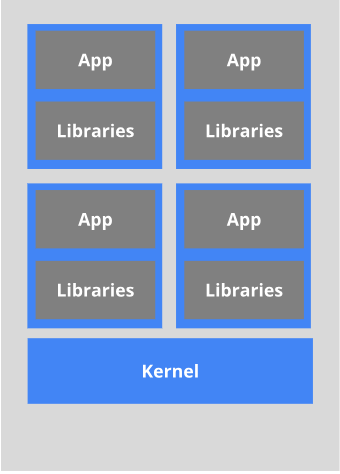

Docker简介

* 是什么？

  Docker是基于Go语言实现的云开源项目。

  Docker的主要目标是“Build，Ship and Run Any App,Anywhere”，也就是通过对应用组件的封装、分发、部署、运行等生命周期的管理，使用户的APP（可以是一个WEB应用或数据库应用等等）及其运行环境能够做到“一次封装，到处运行”。

  

<!-- more -->

* 能用来做什么？

  Linux 发展出了另一种虚拟化技术：Linux 容器（Linux Containers，缩写为 LXC）。

  Linux 容器不是模拟一个完整的操作系统，而是对进程进行隔离。有了容器，就可以将软件运行所需的所有资源打包到一个隔离的容器中。容器与虚拟机不同，不需要捆绑一整套操作系统，只需要软件工作所需的库资源和设置。系统因此而变得高效轻量并保证部署在任何环境中的软件都能始终如一地运行。

  

   比较了 Docker 和传统虚拟化方式的不同之处： 

   传统虚拟机技术是虚拟出一套硬件后，在其上运行一个完整操作系统，在该系统上再运行所需应用进程； 

   而容器内的应用进程直接运行于宿主的内核，容器内没有自己的内核，而且也没有进行硬件虚拟。因此容器要比传统虚拟机更为轻便。 

   每个容器之间互相隔离，每个容器有自己的文件系统 ，容器之间进程不会相互影响，能区分计算资源。 

  开发/运维（DevOps）一次性构建、随处运行

  更快速的应用交付和部署

  更便捷的升级和维护

  更简单的系统运维

  更高效的计算资源利用

* 在哪里下载？

  官网：http://www.docker.com

  仓库：https://hub.docker.com

## Docker 安装步骤

### CentOS6.8安装Docker

1. yum install -y epel-release

   Docker使用EPEL发布，RHEL系的OS首先要确保已经持有EPEL仓库，否则先检查OS的版本，然后安装相应的EPEL包

2. yum install -y docker-io
3. 安装后查看配置文件内容：cat /etc/sysconfig/docker
4. 启动Docker后台服务：service docker start
5. 查看Docker版本：docker version

### CentOS7安装Docker

官网示例： https://docs.docker.com/engine/install/centos/ 

确定你是CentOS7及以上版本：

```shell
cat /etc/redhat-release
```

确认CentOS7能连上外网，yum安装gcc相关:

```shell
sudo yum -y install gcc
sudo yum -y install gcc-c++
```

卸载旧版本的Docker:

```shell
sudo yum -y remove docker docker-common docker-selinux docker-engine
```

官网卸载命令：

```shell
sudo yum remove docker \
                  docker-client \
                  docker-client-latest \
                  docker-common \
                  docker-latest \
                  docker-latest-logrotate \
                  docker-logrotate \
                  docker-engine
```

安装需要的软件包:

```shell
sudo yum install -y yum-utils device-mapper-persistent-data lvm2
```

设置stable镜像仓库:

```shell
#推荐使用
sudo yum-config-manager --add-repo http://mirrors.aliyun.com/docker-ce/linux/centos/docker-ce.repo 
#官网仓库
sudo yum-config-manager --add-repo https://download.docker.com/linux/centos/docker-ce.repo
```

更新yum软件包索引：

```shell
yum makecache fast
```

安装DOCKER CE:

```shell
yum -y install docker-ce
```

启动Docker：

```shell
systemctl start docker
```

测试：

```shell
docker version
docker run hello-world
```

配置镜像加速：

```shell
mkdir -p /etc/docker
vim  /etc/docker/daemon.json
#网易云{"registry-mirrors": ["http://hub-mirror.c.163.com"] }
#阿里云{"registry-mirrors": ["https://｛自已的编码｝.mirror.aliyuncs.com"]}
systemctl daemon-reload
systemctl restart docke
```

卸载：

```shell
systemctl stop docker 
yum -y remove docker-ce
rm -rf /var/lib/docke
```

### hello World 测试

配置阿里云镜像加速：https://cr.console.aliyun.com/cn-hangzhou

获取加速器地址：


配置本机Docker运行镜像加速器：我使用的是阿里云的本人自己账号的镜像地址(需要自己注册有一个属于你自己的)：   https://xxxx.mirror.aliyuncs.com

```shell
sudo mkdir -p /etc/docker
sudo tee /etc/docker/daemon.json <<-'EOF'
{
  "registry-mirrors": ["https://xxxdx.mirror.aliyuncs.com"]
}
EOF
sudo systemctl daemon-reload #加载配置文件
sudo systemctl restart docker #重启DOcker
```

Linux 系统下配置完加速器需要检查是否生效，用 `docker info` 命令进行查看：


网易云加速，基本同上述阿里云。

启动Docker后台容器(测试运行 hello-world): `docker run hello-world`


图中绿色的框圈中的内容意思是，由于本地没有 hello-world 这个镜像，所以会下载一个 hello-world 的镜像，并在容器内运行。

docker run 的启动流程：


Docker 底层原理，Docker 是怎么工作的？

Docker是一个Client-Server结构的系统，Docker守护进程运行在主机上， 然后通过Socket连接从客户端访问，守护进程从客户端接受命令并管理运行在主机上的容器。 `容器，是一个运行时环境，就是我们前面说到的集装箱。`


为什么Docker比较比VM快？

1. docker有着比虚拟机更少的抽象层。由亍docker不需要Hypervisor实现硬件资源虚拟化,运行在docker容器上的程序直接使用的都是实际物理机的硬件资源。因此在CPU、内存利用率上docker将会在效率上有明显优势。

2. docker利用的是宿主机的内核,而不需要Guest OS。因此,当新建一个容器时,docker不需要和虚拟机一样重新加载一个操作系统内核。仍而避免引寻、加载操作系统内核返个比较费时费资源的过程,当新建一个虚拟机时,虚拟机软件需要加载Guest OS,返个新建过程是分钟级别的。而docker由于直接利用宿主机的操作系统,则省略了返个过程,因此新建一个docker容器只需要几秒钟。

 


