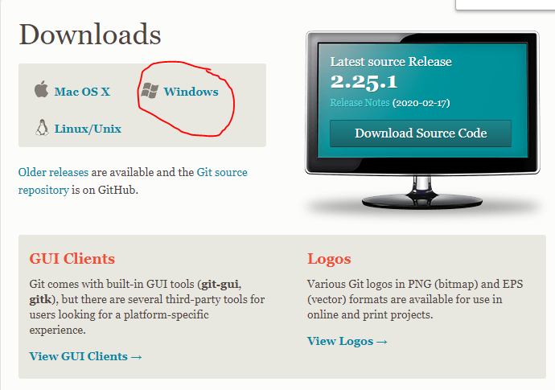
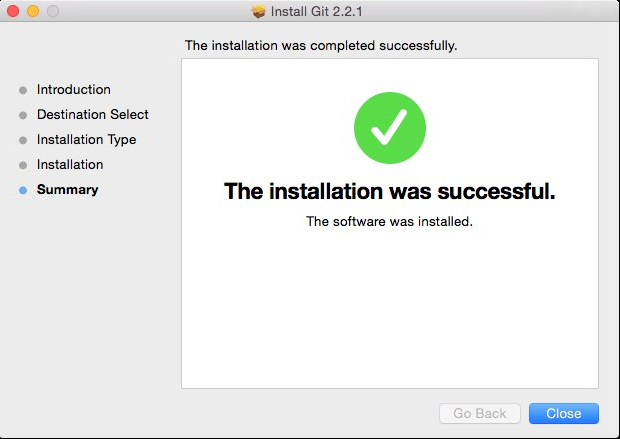
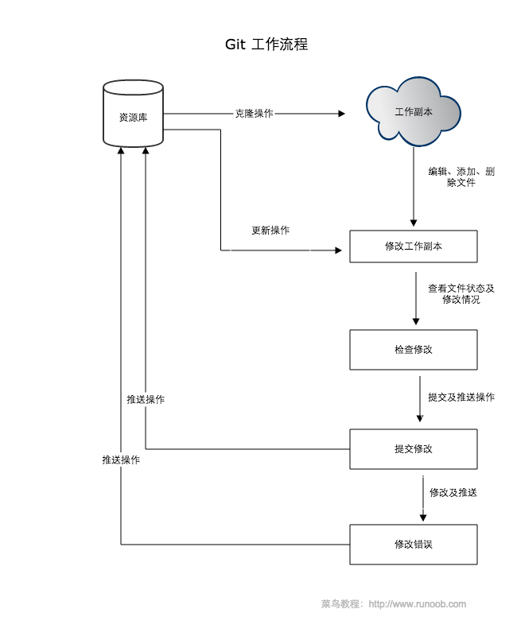
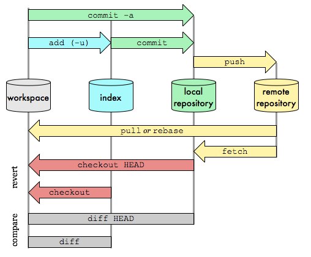

在使用Git前我们需要先安装 Git。Git 目前支持 Linux/Unix、Solaris、Mac和 Windows 平台上运行。
Git 各平台安装包下载地址为：http://git-scm.com/downloads

<!--  more -->

### Linux 平台上安装 

Git 的工作需要调用 curl，zlib，openssl，expat，libiconv 等库的代码，所以需要先安装这些依赖工具。
在有 yum 的系统上（比如 Fedora）或者有 apt-get 的系统上（比如 Debian 体系），可以用下面的命令安装：
各 Linux 系统可以很简单多使用其安装包管理工具进行安装：

### Debian/Ubuntu

Debian/Ubuntu Git 安装命令为：

```
$ apt-get install libcurl4-gnutls-dev libexpat1-dev gettext \
  libz-dev libssl-dev

$ apt-get install git-core

$ git --version
git version 1.8.1.2
```

### Centos/RedHat

如果你使用的系统是 Centos/RedHat 安装命令为：

```shell
$ yum install curl-devel expat-devel gettext-devel \
  openssl-devel zlib-devel

$ yum -y install git-core

$ git --version
git version 1.7.1
```

------

### Windows 平台上安装

在 Windows 平台上安装 Git 同样轻松，有个叫做 msysGit 的项目提供了安装包，可以到 GitHub 的页面上下载 exe 安装文件并运行：
安装包下载地址：https://git-scm.com/downloads



完成安装之后，就可以使用命令行的 git 工具（已经自带了 ssh 客户端）了，另外还有一个图形界面的 Git 项目管理工具。
在开始菜单里找到"Git"->"Git Bash"，会弹出 Git 命令窗口，你可以在该窗口进行 Git 操作。

在 Mac 平台上安装 Git 最容易的当属使用图形化的 Git 安装工具，下载地址为：

http://sourceforge.net/projects/git-osx-installer/
安装界面如下所示：



### Git 配置

Git 提供了一个叫做 git config 的工具，专门用来配置或读取相应的工作环境变量。
这些环境变量，决定了 Git 在各个环节的具体工作方式和行为。这些变量可以存放在以下三个不同的地方：
/etc/gitconfig 文件：系统中对所有用户都普遍适用的配置。若使用 git config 时用 --system 选项，读写的就是这个文件。
~/.gitconfig 文件：用户目录下的配置文件只适用于该用户。若使用 git config 时用 --global 选项，读写的就是这个文件。
当前项目的 Git 目录中的配置文件（也就是工作目录中的 .git/config 文件）：这里的配置仅仅针对当前项目有效。每一个级别的配置都会覆盖上层的相同配置，所以 .git/config 里的配置会覆盖 /etc/gitconfig 中的同名变量。
在 Windows 系统上，Git 会找寻用户主目录下的 .gitconfig 文件。主目录即 $HOME 变量指定的目录，一般都是 C:\Documents and Settings$USER。
此外，Git 还会尝试找寻 /etc/gitconfig 文件，只不过看当初 Git 装在什么目录，就以此作为根目录来定位。

### 用户信息

配置个人的用户名称和电子邮件地址：

```shell
$ git config --global user.name "lxf"
$ git config --global user.email lxf@php.cn
```

如果用了 --global 选项，那么更改的配置文件就是位于你用户主目录下的那个，以后你所有的项目都会默认使用这里配置的用户信息。
如果要在某个特定的项目中使用其他名字或者电邮，只要去掉 `--global` 选项重新配置即可，新的设定保存在当前项目的 .git/config 文件里。

### 文本编辑器

设置Git默认使用的文本编辑器, 一般可能会是 Vi 或者 Vim。如果你有其他偏好，比如 Emacs 的话，可以重新设置：
`$ git config --global core.editor emacs`

### 差异分析工具

还有一个比较常用的是，在解决合并冲突时使用哪种差异分析工具。比如要改用 vimdiff 的话：

`$ git config --global merge.tool vimdiff`

Git 可以理解 kdiff3，tkdiff，meld，xxdiff，emerge，vimdiff，gvimdiff，ecmerge，和 opendiff 等合并工具的输出信息。

当然，你也可以指定使用自己开发的工具

### 查看配置信息

要检查已有的配置信息，可以使用`git config --list` 命令：

```shell
$ git config --list
http.postbuffer=2M
user.name=lxf
user.email=lxf@java.cn
```

有时候会看到重复的变量名，那就说明它们来自不同的配置文件（比如 /etc/gitconfig 和 ~/.gitconfig），不过最终 Git 实际采用的是最后一个。

这些配置我们也可以在 ~/.gitconfig 或 /etc/gitconfig 看到

如下所示：
`vim ~/.gitconfig`

显示内容如下所示：

```shell
[http]
    postBuffer = 2M
[user]
    name = lxf
    email = lxf@java.cn
```

也可以直接查阅某个环境变量的设定，只要把特定的名字跟在后面即可，像这样：

```shell
$ git config user.name  lxf
```

<h1>Git 工作流程</h1>
本节我们将为大家介绍Git的工作流程。

一般工作流程如下：

1.克隆Git 资源为工作目录。

2.在克隆的资源上添加或者是修改文件。

3.如果其他人修改了，你可以更新资源。

4.在提交修改前查看修改。

5.提交修改。

6.在修改完成后，如果发现错误，可以撤回提交并再次修改并体骄傲。

<h2>下图展示了Git 的工作流程：</h2>




<h1>Git 快速设置</h1>
简易的命令行入门教程:

<h2>Git 全局设置</h2>
```shell
git config --global user.name "用户名"
git config --global user.email "邮箱"
```

<h2>创建 git 仓库：</h2>
```
mkdir tuolaji
cd tuolaji
git init
touch README.md
git add README.md  //提交单个文件，如果想直接上传所有文件，请将'README.md改'为'.'
git commit -m "first commit"
git remote add origin https://gitee.com/liqingbo/test.git
git push -u origin master
```

## 已有项目?

```
cd existing_git_repo
git remote add origin https://gitee.com/liqingbo/test.git
git push -u origin master
```

<h1>创建仓库</h1>
<h2>初始化</h2>
方式一：进入当前根目录初始化

```
git init
```

 方式二：指定目录作为Git 仓库

```
git init newrepo
```

初始化后，会在 newrepo 目录下会出现一个名为 .git 的目录，所有 Git 需要的数据和资源都存放在这个目录中。

Git 使用 `git init` 命令初始化一个 Git 仓库，Git的很多命令都需要 Git 的仓库中运行，所以 `git init` 是使用 Git 的一个命令。

在执行完 `git init` 命令后，Git 仓库会生成一个 .git 目录，该目录包含了资源的所有元数据，其他的项目目录保持不变（不像 SVN 会在每个子目录生成 .svn 目录，Git 只在仓库的根目录生成 .git 目录）。

<h2>提交</h2>
如果当前目录下有几个文件想要纳入版本控制，需要先用 `git add` 命令告诉 Git 开始对这些文件进行跟踪，然后提交：

```shell
$ git add *.c
$ git add README
$ git commit -m '初始化项目版本'
```

以上命令将目录下以 .c 结尾及 README 文件提交到仓库中。

```shell
git clone
```

我们使用 `git clone` 从现有 Git 仓库中拷贝项目（类似 svn checkout)。

克隆仓库的命令格式为：

```shell
git clone <repo>
```

如果我们需要克隆到指定的目录，可以使用以下命令格式：

```shell
git clone <repo> <directory>
```

**参数说明**：

| **参数**  | **说明** |
| --------- | -------- |
| repo      | Git 仓库 |
| directory | 本地目录 |

如：

```shell
$ git clone git://github.com/schacon/grit.git
```

执行该命令后，会在当前目录下创建一个名为 grit 的目录，其中包含一个 .git 的目录，用于保存下载下来的所有版本记录。

如果要自己定义要新建的项目目录名称，可以在上面的命令末尾指定新的名字：

```
$ git clone git://github.com/schacon/grit.git lxfgrit

```

