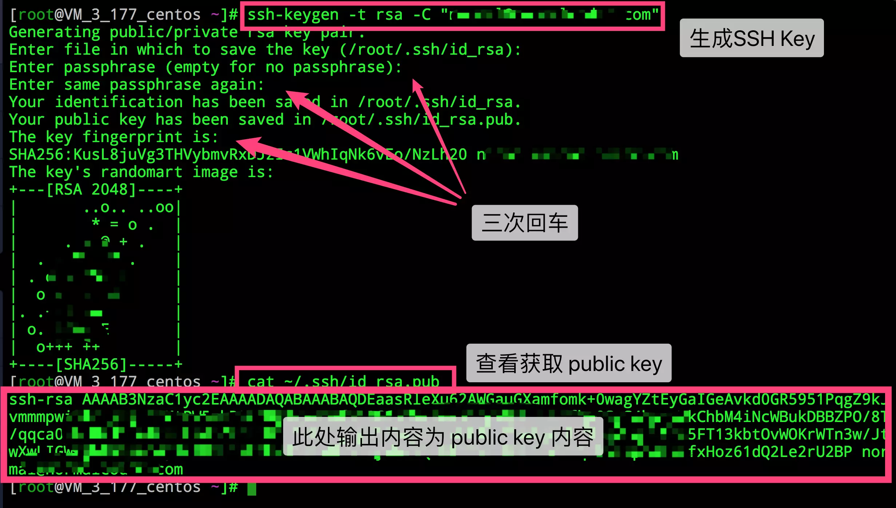
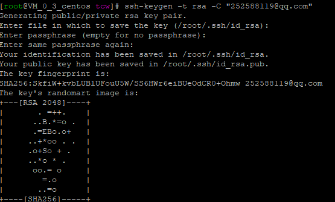
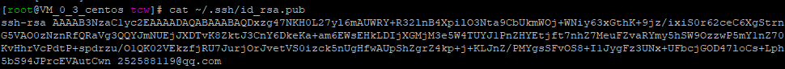
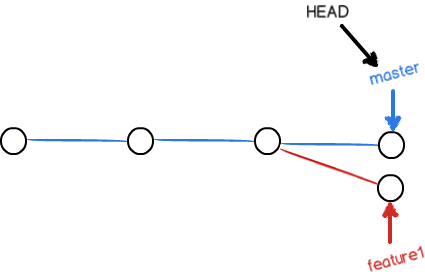

Git 远程仓库地址变更

> 以下均以项目git_test为例：

```
老地址：http://192.168.1.12:9797/john/git_test.git 
新地址：http://192.168.100.235:9797/john/git_test.git 
```

远程仓库名称： origin

<!-- more -->

## 方法一 通过命令直接修改远程地址

进入git_test根目录
**git remote** 查看所有远程仓库， **git remote xxx** 查看指定远程仓库地址

```shell
git remote set-url origin http://192.168.100.235:9797/john/git_test.git
```

## 方法二 通过命令先删除再添加远程仓库

进入git_test根目录

```shell
git remote 查看所有远程仓库， git remote xxx 查看指定远程仓库地址
git remote rm origin
git remote add origin http://192.168.100.235:9797/john/git_test.git
```

## 方法三 直接修改配置文件

进入git_test/.git
vim config

```shell
[core] 
repositoryformatversion = 0 
filemode = true 
logallrefupdates = true 
precomposeunicode = true 
[remote "origin"] 
url = http://192.168.100.235:9797/shimanqiang/assistant.git 
fetch = +refs/heads/*:refs/remotes/origin/* 
[branch "master"] 
remote = origin 
merge = refs/heads/master
```

修改 [remote “origin”]下面的url即可

## 方法四 通过第三方git客户端修改。

以SourceTree为例，点击 仓库 -> 仓库配置 -> 远程仓库 即可管理此项目中配置的所有远程仓库， 而且这个界面最下方还可以点击编辑配置文件，同样可以完成方法三。

# git回滚到任意版本

**回滚到指定的版本**

```shell
git reset --hard e377f60e28c8b84158
```

**强制提交**

```shell
git push -f origin master
```

完美
ba87f5b62d581d3a109a78982ca478643c4c6800

------

先显示提交的log

```shell
$ git log -3
commit 4dc08bb8996a6ee02f
Author: Mark <xxx@xx.com>
Date:   Wed Sep 7 08:08:53 2016 +0800

    xxxxx

commit 9cac9ba76574da2167
Author: xxx<xx@qq.com>
Date:   Tue Sep 6 22:18:59 2016 +0800

    improved the requst

commit e377f60e28c8b84158
Author: xxx<xxx@qq.com>
Date:   Tue Sep 6 14:42:44 2016 +0800

    changed the password from empty to max123
```

# Git pull 强制覆盖本地文件

**远程获取最新版本到本地**

```shell
# git fetch --all  
```

> 相当于是从远程获取最新版本到本地，不会自动merge
> 只是下载远程的库的内容，不做任何的合并

**彻底回退到某个版本，本地的源码也会变为上一个版本的内容，此命令 \*慎用\* ！**

```shell
# git reset --hard origin/master 
```

> 删除所有git add的文件（当然这不包括未置于版控制下的文件 untracked files）
> 把HEAD指向刚刚下载的最新的版本

# Git pull 强制覆盖本地文件

**强制覆盖远程分支**

```shell
git push origin branch-name --force
```

**Git 强制推送方法**

```shell
$ git push -u origin master -f
```

> （一般不建议使用）

# git丢弃本地修改的所有文件（新增、删除、修改）

本地修改了许多文件，其中有些是新增的，因为开发需要这些都不要了，想要丢弃掉，可以使用如下命令：

**本地所有修改的。没有的提交的，都返回到原来的状态**

```shell
git checkout . 
```

**把所有没有提交的修改暂存到stash里面。可用git stash pop回复。**

```shell
git stash #
```

**返回到某个节点，不保留修改。**

```shell
git reset --hard HASH
```

**返回到某个节点。保留修改**

```shell
git reset --soft HASH
```

**返回到某个节点**

```shell
git clean -df
```

**git clean**

```shell
    -n 显示 将要 删除的 文件 和  目录
    -f 删除 文件
    -df 删除 文件 和 目录
```

也可以使用：

```shell
git checkout . && git clean -xdf
```

**把所有没有提交的修改暂存到stash里面。可用git stash pop回复。**

```
git stash #
```

**返回到某个节点，不保留修改。**

```
git reset --hard HASH
```

**返回到某个节点。保留修改**

```
git reset --soft HASH
```

**返回到某个节点**

```
git clean -df
```

**git clean**

```
    -n 显示 将要 删除的 文件 和  目录
    -f 删除 文件
    -df 删除 文件 和 目录
```

也可以使用：

```shell
git checkout . && git clean -xdf
```

# 配置仓库的SSH公钥

你可以按如下命令来生成 sshkey:

```shell
ssh-keygen -t rsa -C "xxxxx@xxxxx.com"  
# Generating public/private rsa key pair...
```

复制

> 按照提示完成三次回车，即可生成 ssh key。

通过查看`~/.ssh/id_rsa.pub`文件内容，获取到你的 public key

```shell
cat ~/.ssh/id_rsa.pub
# ssh-rsa AAAAB3NzaC1yc2EAAAADAQABAAABAQC6eNtGpNGwstc....
```



# 码云上添加SSH公钥

## 一、打开终端输入

```shell
ssh-keygen -t rsa -C "xxxxx@xxxxx.com"  
#Generating public/private rsa key pair...
```

三次回车即可生成 ssh key



## 二、查看你的 public key

```shell
cat ~/.ssh/id_rsa.pub
# ssh-rsa AAAAB3NzaC1yc2EAAAADAQABAAABAQC6eNtGpNGwstc....
```



## 三、码云上添加个人公钥

复制以上公钥，添加到马云的个人私钥里面

## 四、查看状态

**添加后，在终端（Terminal）中输入**

```shell
ssh -T git@gitee.com
```

若返回以下信息，则证明添加成功。

```shell
Hi liqingbo! You've successfully authenticated, but GITEE.COM does not provide shell access.
```


## 五、配置git pull/push 免密码

进入项目根目录，也就是.git所在目录
终端输入

```shell
vi .git/config
```

文件代码

```shell
[core]
        repositoryformatversion = 0
        filemode = true
        bare = false
        logallrefupdates = true
[remote "origin"]
        url = git@gitee.com:liqingbo/项目.git
        fetch = +refs/heads/*:refs/remotes/origin/*
[branch "master"]
        remote = origin
        merge = refs/heads/master
```

修改配置文件

HTTPS传输的地址，你需要改成SSH的传输地址

```shell
url = https://@gitee.com/liqingbo/项目.git
```

改成

```shell
url = git@gitee.com:liqingbo/项目.git
```

复制

> 注：[https://改成git和gitee.com](https://xn--gitgitee-1c2ne59hijh.com/)，后面的“/”改成“:”

这样使用命令 git pull/push 就不用输入密码了，这是因为刚才在生成公钥时，没有输入密码，所以当你选择SSH地址传输时，就可免密码使用命令 git pull/push。

# 解决冲突

人生不如意之事十之八九，合并分支往往也不是一帆风顺的。

准备新的feature1分支，继续我们的新分支开发：

```shell
$ git checkout -b feature1
Switched to a new branch 'feature1'
```

修改readme.txt最后一行，改为：

```shell
Creating a new branch is quick AND simple.
```

在feature1分支上提交：

```shell
$ git add readme.txt

$ git commit -m "AND simple"
[feature1 14096d0] AND simple 1 file changed, 1 insertion(+), 1 deletion(-)
```

切换到master分支：

```shell
$ git checkout master
Switched to branch 'master'
Your branch is ahead of 'origin/master' by 1 commit.
  (use "git push" to publish your local commits)
```

Git还会自动提示我们当前master分支比远程的master分支要超前1个提交。

在master分支上把readme.txt文件的最后一行改为：

```shell
Creating a new branch is quick & simple.
```

提交：

```shell
$ git add readme.txt 
$ git commit -m "& simple"
[master 5dc6824] & simple
 1 file changed, 1 insertion(+), 1 deletion(-)
```

现在，master分支和feature1分支各自都分别有新的提交，变成了这样：



这种情况下，Git无法执行“快速合并”，只能试图把各自的修改合并起来，但这种合并就可能会有冲突，我们试试看：

```shell
$ git merge feature1

Auto-merging readme.txt
CONFLICT (content): Merge conflict in readme.txt
Automatic merge failed; fix conflicts and then commit the result.
```

果然冲突了！Git告诉我们，readme.txt文件存在冲突，必须手动解决冲突后再提交。git status也可以告诉我们冲突的文件：

```shell
$ git status

On branch master
Your branch is ahead of 'origin/master' by 2 commits.
  (use "git push" to publish your local commits)

You have unmerged paths.
  (fix conflicts and run "git commit")
  (use "git merge --abort" to abort the merge)

Unmerged paths:
  (use "git add <file>..." to mark resolution)

    both modified:   readme.txt

no changes added to commit (use "git add" and/or "git commit -a")
```

我们可以直接查看readme.txt的内容：

```shell
Git is a distributed version control system.
Git is free software distributed under the GPL.
Git has a mutable index called stage.
Git tracks changes of files.
<<<<<<< HEAD
Creating a new branch is quick & simple.
=======
Creating a new branch is quick AND simple.
>>>>>>> feature1
```

Git用<<<<<<<，=======，>>>>>>>标记出不同分支的内容，我们修改如下后保存：

```shell
Creating a new branch is quick and simple.
```

再提交：

```shell
$ git add readme.txt 

$ git commit -m "conflict fixed"

[master cf810e4] conflict fixed
```

现在，master分支和feature1分支变成了下图所示：


用带参数的git log也可以看到分支的合并情况：

```shell
$ git log --graph --pretty=oneline --abbrev-commit
*   cf810e4 (HEAD -> master) conflict fixed
|\  
| * 14096d0 (feature1) AND simple
* | 5dc6824 & simple
|/  
* b17d20e branch test
* d46f35e (origin/master) remove test.txt
* b84166e add test.txt
* 519219b git tracks changes
* e43a48b understand how stage works
* 1094adb append GPL
* e475afc add distributed
* eaadf4e wrote a readme file
```

最后，删除feature1分支：

```shell
$ git branch -d feature1
Deleted branch feature1 (was 14096d0).
```

## 小结

当Git无法自动合并分支时，就必须首先解决冲突。解决冲突后，再提交，合并完成。

解决冲突就是把Git合并失败的文件手动编辑为我们希望的内容，再提交。

用git log --graph命令可以看到分支合并图。

感觉本站内容不错，读后有收获？