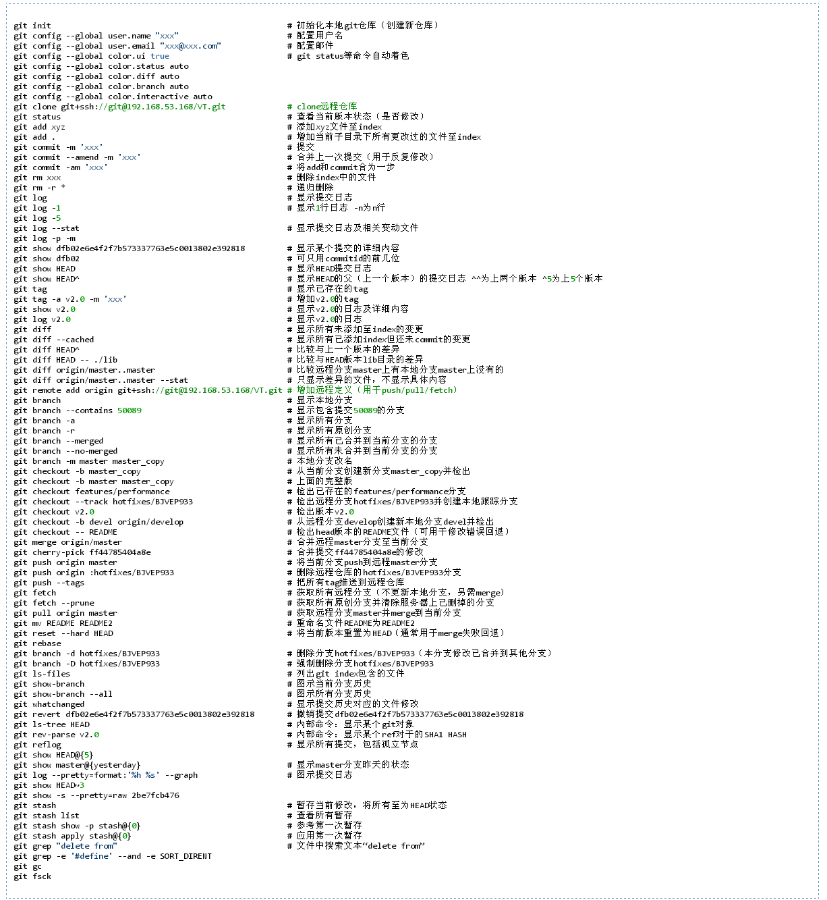
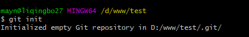
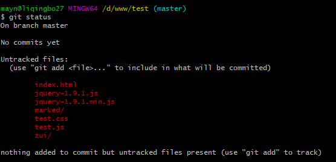

Git 常用命令速查

```shell
git branch 查看本地所有分支
git status 查看当前状态 
git commit 提交 
git branch -a 查看所有的分支
git branch -r 查看远程所有分支
git commit -am "init" 提交并且加注释 
git remote add origin git@192.168.1.119:ndshow
git push origin master 将文件给推到服务器上 
git remote show origin 显示远程库origin里的资源 
git push origin master:develop
git push origin master:hb-dev 将本地库与服务器上的库进行关联 
git checkout --track origin/dev 切换到远程dev分支
git branch -D master develop 删除本地库develop
git checkout -b dev 建立一个新的本地分支dev
```

<!-- more -->

```shell
git add .
git rm 文件名(包括路径) 从git中删除指定文件
git clone git://github.com/schacon/grit.git 从服务器上将代码给拉下来
git config --list 看所有用户
git ls-files 看已经被提交的
git rm [file name] 删除一个文件
git commit -a 提交当前repos的所有的改变
git add [file name] 添加一个文件到git index
git commit -v 当你用－v参数的时候可以看commit的差异
git commit -m "This is the message describing the commit" 添加commit信息
git commit -a -a是代表add，把所有的change加到git index里然后再commit
git commit -a -v 一般提交命令
git log 看你commit的日志
git diff 查看尚未暂存的更新
git rm a.a 移除文件(从暂存区和工作区中删除)
git rm --cached a.a 移除文件(只从暂存区中删除)
git commit -m "remove" 移除文件(从Git中删除)
git rm -f a.a 强行移除修改后文件(从暂存区和工作区中删除)
git diff --cached 或 $ git diff --staged 查看尚未提交的更新
git stash push 将文件给push到一个临时空间中
git stash pop 将文件从临时空间pop下来

git remote add origin git@github.com:username/Hello-World.git
git push origin master 将本地项目给提交到服务器中

git pull 本地与服务器端同步

git push (远程仓库名) (分支名) 将本地分支推送到服务器上去。
git push origin serverfix:awesomebranch

git fetch 相当于是从远程获取最新版本到本地，不会自动merge
git commit -a -m "log_message" (-a是提交所有改动，-m是加入log信息) 本地修改同步至服务器端 ：
git branch branch_0.1 master 从主分支master创建branch_0.1分支
git branch -m branch_0.1 branch_1.0 将branch_0.1重命名为branch_1.0
git checkout branch_1.0/master 切换到branch_1.0/master分支
du -hs
git branch 删除远程branch
git push origin :branch_remote_name
git branch -r -d branch_remote_name
```

**初始化版本库，并提交到远程服务器端**

```shell
mkdir WebApp
cd WebApp
git init 本地初始化
touch README
git add README 添加文件
git commit -m 'first commit'
git remote add origin git@github.com:lixuanfengs/WebApp.git 增加一个远程服务器端
```

上面的命令会增加URL地址为'git@github.com:lixuanfengs/WebApp.git'，名称为origin的远程服务器库，以后提交代码的时候只需要使用 origin别名即可

## 1、常用的Git命令

| 命令                   | 简要说明                                 |
| :--------------------- | :--------------------------------------- |
| git add                | 添加至暂存区                             |
| git add–interactive    | 交互式添加                               |
| git apply              | 应用补丁                                 |
| git am                 | 应用邮件格式补丁                         |
| git annotate           | 同义词，等同于 git blame                 |
| git archive            | 文件归档打包                             |
| git bisect             | 二分查找                                 |
| git blame              | 文件逐行追溯                             |
| git branch             | 分支管理                                 |
| git cat-file           | 版本库对象研究工具                       |
| git checkout           | 检出到工作区、切换或创建分支             |
| git cherry-pick        | 提交拣选                                 |
| git citool             | 图形化提交，相当于 git gui 命令          |
| git clean              | 清除工作区未跟踪文件                     |
| git clone              | 克隆版本库                               |
| git commit             | 提交                                     |
| git config             | 查询和修改配置                           |
| git describe           | 通过里程碑直观地显示提交ID               |
| git diff               | 差异比较                                 |
| git difftool           | 调用图形化差异比较工具                   |
| git fetch              | 获取远程版本库的提交                     |
| git format-patch       | 创建邮件格式的补丁文件。参见 git am 命令 |
| git grep               | 文件内容搜索定位工具                     |
| git gui                | 基于Tcl/Tk的图形化工具，侧重提交等操作   |
| git help               | 帮助                                     |
| git init               | 版本库初始化                             |
| git init-db*           | 同义词，等同于 git init                  |
| git log                | 显示提交日志                             |
| git merge              | 分支合并                                 |
| git mergetool          | 图形化冲突解决                           |
| git mv                 | 重命名                                   |
| git pull               | 拉回远程版本库的提交                     |
| git push               | 推送至远程版本库                         |
| git rebase             | 分支变基                                 |
| git rebase–interactive | 交互式分支变基                           |
| git reflog             | 分支等引用变更记录管理                   |
| git remote             | 远程版本库管理                           |
| git repo-config*       | 同义词，等同于 git config                |
| git reset              | 重置改变分支“游标”指向                   |
| git rev-parse          | 将各种引用表示法转换为哈希值等           |
| git revert             | 反转提交                                 |
| git rm                 | 删除文件                                 |
| git show               | 显示各种类型的对象                       |
| git stage*             | 同义词，等同于 git add                   |
| git stash              | 保存和恢复进度                           |
| git status             | 显示工作区文件状态                       |
| git tag                | 里程碑管理                               |

## 2、对象库操作相关命令

| 命令             | 简要说明                             |
| :--------------- | :----------------------------------- |
| git commit-tree  | 从树对象创建提交                     |
| git hash-object  | 从标准输入或文件计算哈希值或创建对象 |
| git ls-files     | 显示工作区和暂存区文件               |
| git ls-tree      | 显示树对象包含的文件                 |
| git mktag        | 读取标准输入创建一个里程碑对象       |
| git mktree       | 读取标准输入创建一个树对象           |
| git read-tree    | 读取树对象到暂存区                   |
| git update-index | 工作区内容注册到暂存区及暂存区管理   |
| git unpack-file  | 创建临时文件包含指定 blob 的内容     |
| git write-tree   | 从暂存区创建一个树对象               |

## 3、引用操作相关命令

| 命令                 | 简要说明                       |
| :------------------- | :----------------------------- |
| git check-ref-format | 检查引用名称是否符合规范       |
| git for-each-ref     | 引用迭代器，用于shell编程      |
| git ls-remote        | 显示远程版本库的引用           |
| git name-rev         | 将提交ID显示为友好名称         |
| git peek-remote*     | 过时命令，请使用 git ls-remote |
| git rev-list         | 显示版本范围                   |
| git show-branch      | 显示分支列表及拓扑关系         |
| git show-ref         | 显示本地引用                   |
| git symbolic-ref     | 显示或者设置符号引用           |
| git update-ref       | 更新引用的指向                 |
| git verify-tag       | 校验 GPG 签名的Tag             |

## 4、版本库管理相关命令

| 命令               | 简要说明                               |
| :----------------- | :------------------------------------- |
| git count-objects  | 显示松散对象的数量和磁盘占用           |
| git filter-branch  | 版本库重构                             |
| git fsck           | 对象库完整性检查                       |
| git fsck-objects*  | 同义词，等同于 git fsck                |
| git gc             | 版本库存储优化                         |
| git index-pack     | 从打包文件创建对应的索引文件           |
| git lost-found*    | 过时，请使用 git fsck –lost-found 命令 |
| git pack-objects   | 从标准输入读入对象ID，打包到文件       |
| git pack-redundant | 查找多余的 pack 文件                   |
| git pack-refs      | 将引用打包到 .git/packed-refs 文件中   |
| git prune          | 从对象库删除过期对象                   |
| git prune-packed   | 将已经打包的松散对象删除               |
| git relink         | 为本地版本库中相同的对象建立硬连接     |
| git repack         | 将版本库未打包的松散对象打包           |
| git show-index     | 读取包的索引文件，显示打包文件中的内容 |
| git unpack-objects | 从打包文件释放文件                     |
| git verify-pack    | 校验对象库打包文件                     |

## 4、版本库管理相关命令

| 命令               | 简要说明                               |
| :----------------- | :------------------------------------- |
| git count-objects  | 显示松散对象的数量和磁盘占用           |
| git filter-branch  | 版本库重构                             |
| git fsck           | 对象库完整性检查                       |
| git fsck-objects*  | 同义词，等同于 git fsck                |
| git gc             | 版本库存储优化                         |
| git index-pack     | 从打包文件创建对应的索引文件           |
| git lost-found*    | 过时，请使用 git fsck –lost-found 命令 |
| git pack-objects   | 从标准输入读入对象ID，打包到文件       |
| git pack-redundant | 查找多余的 pack 文件                   |
| git pack-refs      | 将引用打包到 .git/packed-refs 文件中   |
| git prune          | 从对象库删除过期对象                   |
| git prune-packed   | 将已经打包的松散对象删除               |
| git relink         | 为本地版本库中相同的对象建立硬连接     |
| git repack         | 将版本库未打包的松散对象打包           |
| git show-index     | 读取包的索引文件，显示打包文件中的内容 |
| git unpack-objects | 从打包文件释放文件                     |
| git verify-pack    | 校验对象库打包文件                     |

## 6、邮件相关命令

| 命令             | 简要说明                                        |
| :--------------- | :---------------------------------------------- |
| git imap-send    | 将补丁通过 IMAP 发送                            |
| git mailinfo     | 从邮件导出提交说明和补丁                        |
| git mailsplit    | 将 mbox 或 Maildir 格式邮箱中邮件逐一提取为文件 |
| git request-pull | 创建包含提交间差异和执行PULL操作地址的信息      |
| git send-email   | 发送邮件                                        |

## 7、协议相关命令

| 命令                   | 简要说明                                    |
| :--------------------- | :------------------------------------------ |
| git daemon             | 实现Git协议                                 |
| git http-backend       | 实现HTTP协议的CGI程序，支持智能HTTP协议     |
| git instaweb           | 即时启动浏览器通过 gitweb 浏览当前版本库    |
| git shell              | 受限制的shell，提供仅执行Git命令的SSH访问   |
| git update-server-info | 更新哑协议需要的辅助文件                    |
| git http-fetch         | 通过HTTP协议获取版本库                      |
| git http-push          | 通过HTTP/DAV协议推送                        |
| git remote-ext         | 由Git命令调用，通过外部命令提供扩展协议支持 |
| git remote-fd          | 由Git命令调用，使用文件描述符作为协议接口   |
| git remote-ftp         | 由Git命令调用，提供对FTP协议的支持          |
| git remote-ftps        | 由Git命令调用，提供对FTPS协议的支持         |
| git remote-http        | 由Git命令调用，提供对HTTP协议的支持         |
| git remote-https       | 由Git命令调用，提供对HTTPS协议的支持        |
| git remote-testgit     | 协议扩展示例脚本                            |

## 8、版本库转换和交互相关命令

| 命令                | 简要说明                                     |
| :------------------ | :------------------------------------------- |
| git archimport      | 导入Arch版本库到Git                          |
| git bundle          | 提交打包和解包，以便在不同版本库间传递       |
| git cvsexportcommit | 将Git的一个提交作为一个CVS检出               |
| git cvsimport       | 导入CVS版本库到Git。或者使用 cvs2git         |
| git cvsserver       | Git的CVS协议模拟器，可供CVS命令访问Git版本库 |
| git fast-export     | 将提交导出为 git-fast-import 格式            |
| git fast-import     | 其他版本库迁移至Git的通用工具                |
| git svn             | Git 作为前端操作 Subversion                  |

## 、合并相关的辅助命令

| 命令                | 简要说明                                                     |
| :------------------ | :----------------------------------------------------------- |
| git merge-base      | 供其他脚本调用，找到两个或多个提交最近的共同祖先             |
| git merge-file      | 针对文件的两个不同版本执行三向文件合并                       |
| git merge-index     | 对index中的冲突文件调用指定的冲突解决工具                    |
| git merge-octopus   | 合并两个以上分支。参见 git merge 的octopus合并策略           |
| git merge-one-file  | 由 git merge-index 调用的标准辅助程序                        |
| git merge-ours      | 合并使用本地版本，抛弃他人版本。参见 git merge 的ours合并策略 |
| git merge-recursive | 针对两个分支的三向合并。参见 git merge 的recursive合并策略   |
| git merge-resolve   | 针对两个分支的三向合并。参见 git merge 的resolve合并策略     |
| git merge-subtree   | 子树合并。参见 git merge 的 subtree 合并策略                 |
| git merge-tree      | 显式三向合并结果，不改变暂存区                               |
| git fmt-merge-msg   | 供执行合并操作的脚本调用，用于创建一个合并提交说明           |
| git rerere          | 重用所记录的冲突解决方案                                     |

## 10、 杂项

| 命令                  | 简要说明                                            |
| :-------------------- | :-------------------------------------------------- |
| git bisect–helper     | 由 git bisect 命令调用，确认二分查找进度            |
| git check-attr        | 显示某个文件是否设置了某个属性                      |
| git checkout-index    | 从暂存区拷贝文件至工作区                            |
| git cherry            | 查找没有合并到上游的提交                            |
| git diff-files        | 比较暂存区和工作区，相当于 git diff –raw            |
| git diff-index        | 比较暂存区和版本库，相当于 git diff –cached –raw    |
| git diff-tree         | 比较两个树对象，相当于 git diff –raw A B            |
| git difftool–helper   | 由 git difftool 命令调用，默认要使用的差异比较工具  |
| git get-tar-commit-id | 从 git archive 创建的 tar 包中提取提交ID            |
| git gui–askpass       | 命令 git gui 的获取用户口令输入界面                 |
| git notes             | 提交评论管理                                        |
| git patch-id          | 补丁过滤行号和空白字符后生成补丁唯一ID              |
| git quiltimport       | 将Quilt补丁列表应用到当前分支                       |
| git replace           | 提交替换                                            |
| git shortlog          | 对 git log 的汇总输出，适合于产品发布说明           |
| git stripspace        | 删除空行，供其他脚本调用                            |
| git submodule         | 子模组管理                                          |
| git tar-tree          | 过时命令，请使用 git archive                        |
| git var               | 显示 Git 环境变量                                   |
| git web–browse        | 启动浏览器以查看目录或文件                          |
| git whatchanged       | 显示提交历史及每次提交的改动                        |
| git-mergetool–lib     | 包含于其他脚本中，提供合并/差异比较工具的选择和执行 |
| git-parse-remote      | 包含于其他脚本中，提供操作远程版本库的函数          |
| git-sh-setup          | 包含于其他脚本中，提供 shell 编程的函数库           |



# git init

初始化仓库



# git status

git-status - Show the working tree status



# git checkout

`git checkout`命令用于切换分支或恢复工作树文件。
`git checkout`是git最常用的命令之一，同时也是一个很危险的命令，因为这条命令会重写工作区。

**使用语法**

```shell
git checkout [-q] [-f] [-m] [<branch>]
git checkout [-q] [-f] [-m] --detach [<branch>]
git checkout [-q] [-f] [-m] [--detach] <commit>
git checkout [-q] [-f] [-m] [[-b|-B|--orphan] <new_branch>] [<start_point>]
git checkout [-f|--ours|--theirs|-m|--conflict=<style>] [<tree-ish>] [--] <paths>…
git checkout [-p|--patch] [<tree-ish>] [--] [<paths>…]
```

## 描述

更新工作树中的文件以匹配索引或指定树中的版本。如果没有给出路径`git checkout`还会更新`HEAD`，将指定的分支设置为当前分支。

### 示例

#### 示例-1

以下顺序检查主分支，将Makefile还原为两个修订版本，错误地删除hello.c，并从索引中取回。

```shell
$ git checkout master             #(1)
$ git checkout master~2 Makefile  #(2)
$ rm -f hello.c
$ git checkout hello.c            #(3)
```

(1) 切换分支
(2) 从另一个提交中取出文件
(3)从索引中恢复`hello.c`

如果想要检出索引中的所有C源文件，可以使用以下命令 -

```
$ git checkout -- '*.c'
```

注意:*.c是使用引号的。 文件hello.c也将被检出，即使它不再在工作树中，因为文件globbing用于匹配索引中的条目(而不是在shell的工作树中)。

如果有一个分支也命名为hello.c，这一步将被混淆为一个指令切换到该分支。应该写：

```
$ git checkout -- hello.c
```

**示例-2**

在错误的分支工作后，想切换到正确的分支，则使用：

```
$ git checkout mytopic
```

但是，您的"错误"分支和正确的"mytopic"分支可能会在在本地修改的文件中有所不同，在这种情况下，上述检出将会失败：

$ git checkout mytopic
error: You have local changes to 'frotz'; not switching branches.

可以将-m标志赋给命令，这将尝试三路合并：

$ git checkout -m mytopic
Auto-merging frotz

在这种三路合并之后，本地的修改没有在索引文件中注册，所以git diff会显示从新分支的提示之后所做的更改。

**示例-3**

当使用-m选项切换分支时发生合并冲突时，会看到如下所示：

```
$ git checkout -m mytopic
Auto-merging frotz
ERROR: Merge conflict in frotz
fatal: merge program failed
```

此时，git diff会显示上一个示例中干净合并的更改以及冲突文件中的更改。 编辑并解决冲突，并用常规方式用git add来标记它：

```
$ edit frotz # 编辑 frotz 文件中内容，然后重新添加
$ git add frotz
```

**其它示例**

git checkout的主要功能就是迁出一个分支的特定版本。默认是迁出分支的HEAD版本
一此用法示例：

```
$ git checkout master     #//取出master版本的head。
$ git checkout tag_name    #//在当前分支上 取出 tag_name 的版本
$ git checkout  master file_name  #//放弃当前对文件file_name的修改
$ git checkout  commit_id file_name  #//取文件file_name的 在commit_id是的版本。commit_id为 git commit 时的sha值。
```

$ git checkout -b dev/1.5.4 origin/dev/1.5.4

# 从远程dev/1.5.4分支取得到本地分支/dev/1.5.4

```
$ git checkout -- hello.rb
#这条命令把hello.rb从HEAD中签出.
$ git checkout .
#这条命令把 当前目录所有修改的文件 从HEAD中签出并且把它恢复成未修改时的样子.
#注意：在使用 git checkout 时，如果其对应的文件被修改过，那么该修改会被覆盖掉。
```

# git reset -–hard

```
$ git reset --hard HEAD^         回退到上个版本
$ git reset --hard HEAD~3        回退到前3次提交之前，以此类推，回退到n次提交之前
$ git reset --hard commit_id     退到/进到 指定commit的sha码
```

**git reset -–hard**
彻底回退到某个版本，本地的源码也会变为上一个版本的内容，此命令 **慎用**！

**git fsck --lost-found**
这个命令可以恢复git add过的文件

## 相关命令

- git reset --mixed：此为默认方式，不带任何参数的git reset，即时这种方式，它回退到某个版本，只保留源码，回退commit和index信息
- git reset --soft：回退到某个版本，只回退了commit的信息，不会恢复到index file一级。如果还要提交，直接commit即可

# git log

```
$ git log
```

------

```
commit 88afe0e02adcdfea6844bb627de97da21eb10af1
Merge: 14b4dca d7e7346
Author: w3cschool <w3c@w3cschool.cc>
Date:   Sun Mar 1 15:03:42 2015 +0800

    Merge branch 'change_site'
    
    Conflicts:
        test.txt

commit 14b4dcadbdc847207651d5a9fae0d315057f346e
Author: w3cschool <w3c@w3cschool.cc>
Date:   Sun Mar 1 14:53:15 2015 +0800

    新增加一行

commit d7e734640da06055e107eaf29cf350b3f1de1c2c
Author: w3cschool <w3c@w3cschool.cc>
Date:   Sun Mar 1 14:48:57 2015 +0800

    changed the site

commit 556f0a0637978097b82287ac665a717623b21f3f
Author: w3cschool <w3c@w3cschool.cc>
Date:   Sun Mar 1 14:40:34 2015 +0800

    removed test2.txt
```

## --oneline

查看历史记录的简洁的版本。

```
$ git log --oneline
88afe0e Merge branch 'change_site'
14b4dca 新增加一行
d7e7346 changed the site
556f0a0 removed test2.txt
2e082b7 add test2.txt
048598f add test.txt
85fc7e7 test comment from w3cschool.cc
```

这告诉我们的是，此项目的开发历史。
我们还可以用 ``选项，查看历史中什么时候出现了分支、合并。

## --graph

查看历史中什么时候出现了分支、合并。

```
$ git log --oneline --graph
*   88afe0e Merge branch 'change_site'
|\  
| * d7e7346 changed the site
* | 14b4dca 新增加一行
|/  
* 556f0a0 removed test2.txt
* 2e082b7 add test2.txt
* 048598f add test.txt
* 85fc7e7 test comment from w3cschool.cc
```

现在我们可以更清楚明了地看到何时工作分叉、又何时归并。
你也可以用 `--reverse`参数来逆向显示所有日志。

```
$ git log --reverse --oneline
85fc7e7 test comment from w3cschool.cc
048598f add test.txt
2e082b7 add test2.txt
556f0a0 removed test2.txt
d7e7346 changed the site
14b4dca 新增加一行
88afe0e Merge branch 'change_site'
```

如果只想查找指定用户的提交日志可以使用命令：`git log --author`
例如，比方说我们要找 Git 源码中 Linus 提交的部分：

```
$ git log --author=Linus --oneline -5
81b50f3 Move 'builtin-*' into a 'builtin/' subdirectory
3bb7256 make "index-pack" a built-in
377d027 make "git pack-redundant" a built-in
b532581 make "git unpack-file" a built-in
112dd51 make "mktag" a built-in
```

如果你要指定日期，可以执行几个选项：`--since` 和 `--before`，但是你也可以用 `--until` 和 `--after`。
例如，如果我要看 Git 项目中三周前且在四月十八日之后的所有提交，我可以执行这个（我还用了 --no-merges 选项以隐藏合并提交）：

```
$ git log --oneline --before={3.weeks.ago} --after={2010-04-18} --no-merges
5469e2d Git 1.7.1-rc2
d43427d Documentation/remote-helpers: Fix typos and improve language
272a36b Fixup: Second argument may be any arbitrary string
b6c8d2d Documentation/remote-helpers: Add invocation section
5ce4f4e Documentation/urls: Rewrite to accomodate transport::address
00b84e9 Documentation/remote-helpers: Rewrite description
03aa87e Documentation: Describe other situations where -z affects git diff
77bc694 rebase-interactive: silence warning when no commits rewritten
636db2c t3301: add tests to use --format="%N"
```

更多 git log 命令可查看：http://git-scm.com/docs/git-log