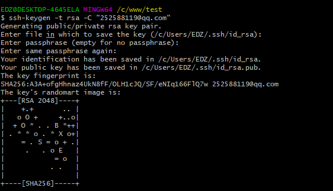
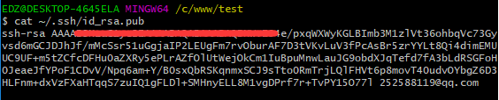

Centos,win10,阿里云上搭建自己的git服务器.

<!-- more -->

# Centos 搭建git服务器

## 1、安装Git

```shell
$ yum install curl-devel expat-devel gettext-devel openssl-devel zlib-devel perl-devel
```

```shell 
$ yum install git
```

创建一个git用户组和用户，用来运行git服务：

```shell
$ groupadd git
```

复制

```shell
$ adduser git -g git
```

# win10生成SSH keys

SSH key 可以让你在你的电脑和Code服务器之间建立安全的加密连接。

先执行以下语句来判断是否已经存在本地公钥：

```shell
cat ~/.ssh/id_rsa.pub
```

如果出现类似一下字符串，表示你还没创建ssh key


如果你看到一长串以 ssh-rsa或 ssh-dsa开头的字符串, 你可以跳过 ssh-keygen的步骤。

> 提示: 最好的情况是一个密码对应一个ssh key，但是那不是必须的。你完全可以跳过创建密码这个步骤。请记住设置的密码并不能被修改或获取。

## 生成ssh key

在git窗口输入

```shell
ssh-keygen -t rsa -C "1183895890@qq.com"
```

然后一直回车
这个指令会要求你提供一个位置和文件名去存放键值对和密码，你可以点击Enter键去使用默认值。
如图：



**查看生成的公钥**

```shell
cat ~/.ssh/id_rsa.pub
```



复制这个公钥放到你的个人设置中的SSH/My SSH Keys下
请完整拷贝从ssh-开始直到你的用户名和主机名为止的内容。

到这里的时候，你的公钥已经创建成功了

## 扩展

通过下面方法可以拷贝你的公钥到你的粘贴板下
请参考你的操作系统使用以下的命令：
**Windows:**

```shell
clip < ~/.ssh/id_rsa.pub
```

**Mac:**

```shell
pbcopy < ~/.ssh/id_rsa.pub
```

**GNU/Linux (requires xclip):**

```shell
xclip -sel clip < ~/.ssh/id_rsa.pub
```

Applications

Eclipse：
如何在Eclipse中添加ssh key: https://wiki.eclipse.org/EGit/User_Guide#Eclipse_SSH_Configuration
Tip: Non-default OpenSSH key file names or locations

如果，不管你有什么理由，当你决定去用一个非默认的位置或文件名去存放你的ssh key。你必须配置好你的ssh客户端以找到你的ssh私钥去连接Code服务器，对于OpenSSH客户端，这个通常是在~/.ssh/config类似的位置配置的：

```shell
#
# Our company's internal GitLab server
#
Host my-git.company.com
RSAAuthentication yes
IdentityFile ~/my-ssh-key-directory/company-com-private-key-filename
```