字符串相关的类，String 类及常用方法 StringBuffer、StringBuilder。JDK 8.0 之前的日期 API, System 静态方法，Date 类，calendar 类，SimpleDateFormat 类。JDK 8.0 中的时间 API, LocalDate、LocalTime、LocalDateTime、Instant、DateTimeFormat、其它类。Java 比较器，Comparable 接口，Comparator 接口，System 类，Math 类，BigInteger 与 BigDecimal。

<!-- more -->

## 字符串相关的类

### String 的特性

* **String 类：**代表字符串。Java 程序中的所有字符串字面值（如”abc“）都作为此类的示的实例实现
* String 是一个final 类，代表不可变的字符序列
* 字符串是常量，用双引号引起来表示。它们的值在创建之后不能更改
* String对象的字符内容是存储在一个字符数组 value[] 中的

```java
public final class String
implements java.io.Serializable, Comparable<String>, CharSequence {
/** The value is used for character storage. */
private final char value[];

/** Cache the hash code for the string */
private int hash; // Default to 0

```

String s1 = **"abc"**;**//**字面量的定义方式

String s2 = **"abc"**;

s1 = **"hello"**;

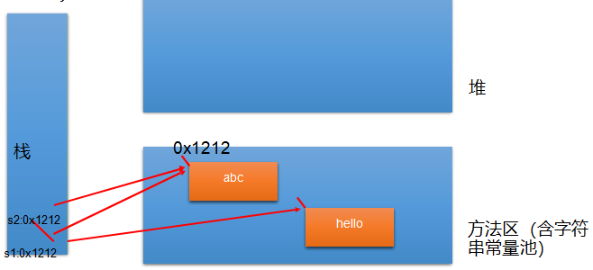

**String 对象的创建**

```java
String str = "hello";
//本质上this.value = new char[0];
String	s1 = new String();

//this.value = original.value;
String	s2 = new String(String original);

//this.value = Arrays.copyOf(value, value.length);
String	s3 = new String(char[] a);

String	s4 = new String(char[] a,int startIndex,int count);
```

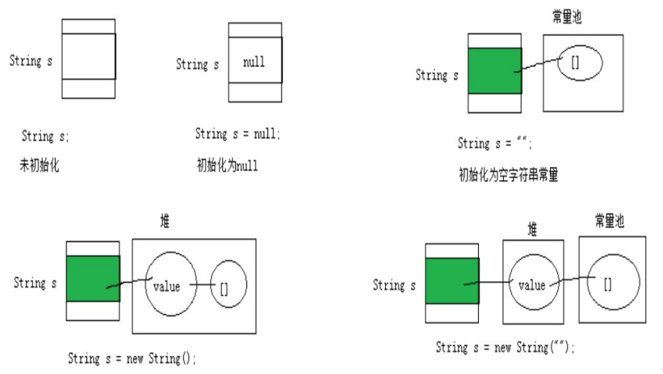

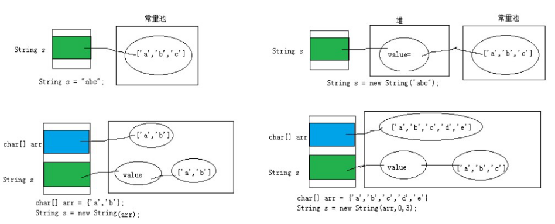

**String str1 = "abc"；与 String str2 = new String(”abc“); 的区别？**

* **str1 ** 字符串常量存储在字符串常量池， 目的是共享
* **str2**  字符串非常量对象存储在堆中

**字符串对象是如何存储的**

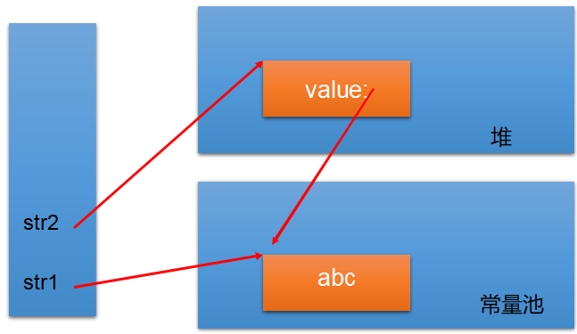

**练习1**

```java
String s1 = "javaEE";
String s2 = "javaEE";
String s3 = new String("javaEE");
String s4 = new String("javaEE");
System.out.println(s1 == s2);//true
System.out.println(s1 == s3);//false
System.out.println(s1 == s4);//false 
System.out.println(s3 == s4);//false
```


**练习2**

```java
Person p1 = new Person(); 
p1.name = "xianrenqiu";
Person p2 = new Person(); 
p2.name = "xianrenqiu";

System.out.println(p1.name .equals( p2.name)); // true
System.out.println(p1.name == p2.name); // true
System.out.println(p1.name == "xianrenqiu"); // true

String s1 = new String("bcde");
String s2 = new String("bcde");
System.out.println(s1==s2); //false
```

```java
Person p1 = new Person("Tom",12);
Person p2 = new Person("Tom",12);

System.out.println(p1.name == p2.name);//true
```

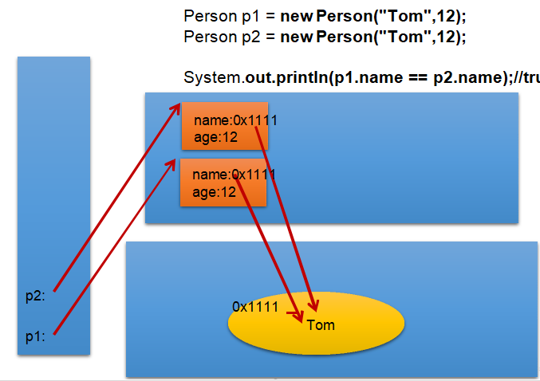

**字符串的特性** 

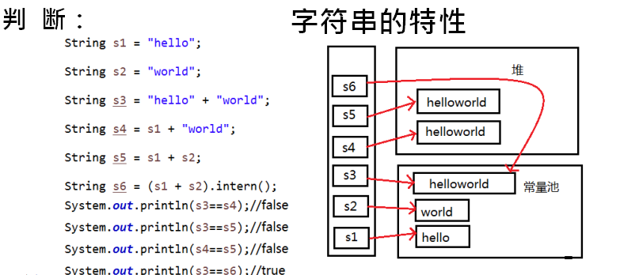

**结论：**

* 常量与常量的拼接结果在常量池。且常量池中不会存在相同内容的常量
* 只要其中有一个是变量，结果就在堆中
* 如果拼接的结果调用intern()方法，返回值就在常量池中

**String 使用的陷阱**

* **String s1 = "a";**
  * 说明：在字符串常量池中创建了一个字面量是 “a”的字符串

* **s1 = s1 + "b";**
  * 说明：实际上原来的“a”字符对象已经丢弃了，现在在堆空间中产生了一个字符串 s1 + "b"(也就是“ab”)。如果多次执行这些改变串内容的操作，会导致大量副本字符串对象存留在内存中，降低效率。如果这样的操作放到循环中，会极大影响程序的性能

* **String s2 = "ab";**
  * 说明：直接在字符串常量池中创建一个字面量为“ab”的字符串

* **String s3 = "a" + "b";**
  * 说明：s3指向字符串常量池中已经创建的“ab”的字符串

* **String s4 = s1.intern();**
  * 说明：堆空间的s1对象在调用intern()之后，会将常量池中已经存在的“ab” 字符串赋值给s4

**练习3**

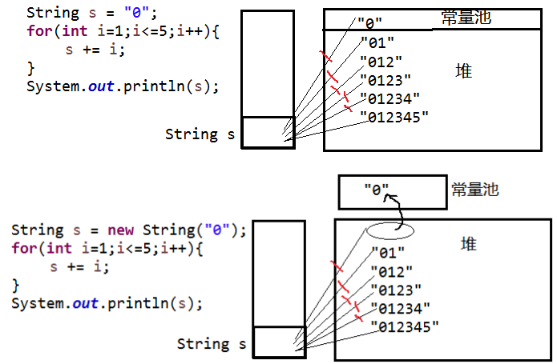

**【面试题】**

下列程序运行的结果：

```java
public class StringTest {

String str = new String("good");
char[] ch = { 't', 'e', 's', 't' };

public void change(String str, char ch[]) {
	str = "test ok";
	ch[0] = 'b';
}
public static void main(String[] args) { 
    StringTest ex = new StringTest(); 				
    ex.change(ex.str, ex.ch); 
    System.out.print(ex.str + " and ");// good and
    System.out.println(ex.ch); //
   }
}
```

**String 常用方法1**

* int length()：返回字符串的长度： return value.length
* char charAt(int index)： 返回某索引处的字符return value[index]
* boolean isEmpty()：判断是否是空字符串：return value.length == 0
* String toLowerCase()：使用默认语言环境，将 String 中的所有字符转换为小写
* String toUpperCase()：使用默认语言环境，将 String 中的所有字符转换为大写
* String trim()：返回字符串的副本，忽略前导空白和尾部空白
* boolean equals(Object obj)：比较字符串的内容是否相同
* boolean equalsIgnoreCase(String anotherString)：与equals方法类似，忽略大小写
* String concat(String str)：将指定字符串连接到此字符串的结尾。 等价于用“+”
* int compareTo(String anotherString)：比较两个字符串的大小
* String	substring(int beginIndex)： 返回一个新的字符串， 它是此字符串的从beginIndex开始截取到最后的一个子字符串。
* String substring(int beginIndex, int endIndex) ：返回一个新字符串，它是此字符串从beginIndex开始截取到endIndex(不包含)的一个子字符串

**String常用方法2**

* boolean endsWith(String suffix)：测试此字符串是否以指定的后缀结束
* boolean startsWith(String prefix)：测试此字符串是否以指定的前缀开始
* boolean startsWith(String prefix, int toffset)：测试此字符串从指定索引开始的子字符串是否以指定前缀开始
* boolean contains(CharSequence s)：当且仅当此字符串包含指定的 char 值序列时，返回 true
* int indexOf(String str)：返回指定子字符串在此字符串中第一次出现处的索引
* int indexOf(String str, int fromIndex)：返回指定子字符串在此字符串中第一次出现处的索引，从指定的索引开始
* int lastIndexOf(String str)：返回指定子字符串在此字符串中最右边出现处的索引
* int lastIndexOf(String str, int fromIndex)：返回指定子字符串在此字符串中最后一次出现处的索引，从指定的索引开始反向搜索

> 注：indexOf和lastIndexOf方法如果未找到都是返回-1

**String常用方法3**

* String replace(char oldChar, char newChar)：返回一个新的字符串，它是通过用 newChar 替换此字符串中出现的所有 oldChar 得到的。
* String replace(CharSequence target, CharSequence replacement)： 使用指定的字面值替换序列替换此字符串所有匹配字面值目标序列的子字符串。
* String	replaceAll(String	regex,	String	replacement) ： 使用给定的replacement 替换此字符串所有匹配给定的正则表达式的子字符串。
* String	replaceFirst(String	regex,	String	replacement) ： 使用给定的replacement 替换此字符串匹配给定的正则表达式的第一个子字符串。
* boolean matches(String regex)：告知此字符串是否匹配给定的正则表达式。
* String[] split(String regex)：根据给定正则表达式的匹配拆分此字符串。
* String[] split(String regex, int limit)：根据匹配给定的正则表达式来拆分此字符串，最多不超过limit个，如果超过了，剩下的全部都放到最后一个元素中。

```java
String str = "12hello34world5java7891mysql456";
//把字符串中的数字替换成,，如果结果中开头和结尾有，的话去掉
String string = str.replaceAll("\\d+", ",").replaceAll("^,|,$", "");
System.out.println(string);

String str = "12345";
//判断str字符串中是否全部有数字组成，即有1-n个数字组成
boolean matches = str.matches("\\d+");
System.out.println(matches); String tel = "0571-4534289";
//判断这是否是一个杭州的固定电话
boolean result = tel.matches("0571-\\d{7,8}");
System.out.println(result);


String str = "hello|world|java"; 
String[] strs = str.split("\\|");
for (int i = 0; i < strs.length; i++) {
	System.out.println(strs[i]);
}
System.out.println();
String str2 = "hello.world.java"; 
String[] strs2 = str2.split("\\.");
for (int i = 0; i < strs2.length; i++) {
	System.out.println(strs2[i]);
}
```

**String与基本数据类型转换**

* **字符串 -> 基本数据类型、包装类**

  * integer包装类的public static int **parseInt(String s)**：可以将由“数字”字符组成的字符串转换为整型。

  * 类似地,使用java.lang包中的Byte、Short、Long、Float、Double类调相应

    的类方法可以将由“数字”字符组成的字符串，转化为相应的基本数据类型。

* **基本数据类型、包装类 -> 字符串**
  * 调用String类的public String **valueOf(int n)**可将int型转换为字符串
  * 相应的valueOf(byte b)、valueOf(long l)、valueOf(float f)、valueOf(double d)、valueOf(boolean b)可由参数的相应类型到字符串的转换

* **字符串数组 -> 字符串**
  * String 类的构造器：String(char[]) 和 String(char[], int offset, int length)分别用字符数组中的全部字符和部分字符创建字符串对象。

* **字符串 -> 字符串数组**
  * public char[] toCharArray(): 将字符串中的全部字符存放在一个字符数组中的方法。
  * public void getChars(int srcBegin, int srcEnd, char[] dst, int dstBegin): 提供了将指定索引范围内的字符串存放到数组中的方法。

* **字节数组 -> 字符串**
  * String(byte[]): 通过使用平台的默认字符集解码指定的byte数组，构造一个新的 String。
  * String(byte[], int offset, int length): 用指定的字节数组的一部分， 即从数组起始位置offset开始取length个字节构造一个字符串对象。 

* **字符串 -> 字节数组**
  * public byte[] getBytes(): 使用平台的默认字符集将此 String 编码为byte 序列，并将结果存储到一个新的 byte 数组中。
  * public byte[] getBytes(String charsetName): 使用指定的字符集将此String 编码到 byte 序列，并将结果存储到新的 byte 数组。

**练习4**

```java
String str = "中";
System.out.println(str.getBytes("ISO8859-1").length);// -128~127
System.out.println(str.getBytes("GBK").length); 
System.out.println(str.getBytes("UTF-8").length);

System.out.println(new String(str.getBytes("ISO8859-1"),"ISO8859-1"));// 乱码，表示不了中文
System.out.println(new String(str.getBytes("GBK"), "GBK"));
System.out.println(new String(str.getBytes("UTF-8"), "UTF-8"));
```

**练习5：常见算法题目**

**1.** **模拟一个trim方法，去除字符串两端的空格。**

**2.** **将一个字符串进行反转。将字符串中指定部分进行反转。比如“abcdefg”反转为”abfedcg”**

```java
public class StringDemo {

    /*
    将一个字符串进行反转。将字符串中指定部分进行反转。比如“abcdefg”反转为”abfedcg”

    方式一：转换为char[]
     */
    public String reverse(String str,int startIndex,int endIndex){

        if(str != null){
            char[] arr = str.toCharArray();
            for(int x = startIndex,y = endIndex;x < y;x++,y--){
                char temp = arr[x];
                arr[x] = arr[y];
                arr[y] = temp;
            }

            return new String(arr);
        }
        return null;
    }

    //方式二：使用String的拼接
    public String reverse1(String str,int startIndex,int endIndex){
        if(str != null){
            //第1部分
            String reverseStr = str.substring(0,startIndex);
            //第2部分
            for(int i = endIndex;i >= startIndex;i--){
                reverseStr += str.charAt(i);
            }
            //第3部分
            reverseStr += str.substring(endIndex + 1);

            return reverseStr;

        }
        return null;
    }
    //方式三：使用StringBuffer/StringBuilder替换String
    public String reverse2(String str,int startIndex,int endIndex){
        if(str != null){
            StringBuilder builder = new StringBuilder(str.length());

            //第1部分
            builder.append(str.substring(0,startIndex));
            //第2部分
            for(int i = endIndex;i >= startIndex;i--){

                builder.append(str.charAt(i));
            }
            //第3部分
            builder.append(str.substring(endIndex + 1));

            return builder.toString();
        }
        return null;

    }

    @Test
    public void testReverse(){
        String str = "abcdefg";
        String reverse = reverse(str, 2, 5);
        System.out.println(reverse);
    }

}
```

**3.** **获取一个字符串在另一个字符串中出现的次数。**

**比如：获取“ ab”在“abkkcadkabkebfkabkskab”中出现的次数**

```java
public class StringDemo1 {
    /*
    获取一个字符串在另一个字符串中出现的次数。
      比如：获取“ab”在 “abkkcadkabkebfkaabkskab” 中出现的次数

     */

    /**
     * 获取subStr在mainStr中出现的次数
     * @param mainStr
     * @param subStr
     * @return
     */
    public int getCount(String mainStr,String subStr){
        int mainLength = mainStr.length();
        int subLength = subStr.length();
        int count = 0;
        int index = 0;
        if(mainLength >= subLength){
            //方式一：
//            while((index = mainStr.indexOf(subStr)) != -1){
//                count++;
//                mainStr = mainStr.substring(index + subStr.length());
//            }
            //方式二：对方式一的改进
            while((index = mainStr.indexOf(subStr,index)) != -1){
                count++;
                index += subLength;
            }

            return count;
        }else{
            return 0;
        }
    }

    @Test
    public void testGetCount(){
        String mainStr = "abkkcadkabkebfkaabkskab";
        String subStr = "ab";
        int count = getCount(mainStr, subStr);
        System.out.println(count);
    }
}
```

**4.** **获取两个字符串中最大相同子串。比如：**

**str1 = "abcwerthelloyuiodef“;str2 = "cvhellobnm"**

> 提示：将短的那个串进行长度依次递减的子串与较长的串比较。

```java
public class StringDemo2 {
    /*
    获取两个字符串中最大相同子串。比如：
   str1 = "abcwerthelloyuiodefabcdef";str2 = "cvhellobnm"
   提示：将短的那个串进行长度依次递减的子串与较长的串比较。

     */
    //前提：两个字符串中只有一个最大相同子串
    public String getMaxSameString(String str1,String str2){
        if(str1 != null && str2 != null){
            String maxStr = (str1.length() >= str2.length())? str1 : str2;
            String minStr = (str1.length() < str2.length())? str1 : str2;
            int length = minStr.length();

            for(int i = 0;i < length;i++){
                for(int x = 0,y = length - i;y <= length;x++,y++){
                    String subStr = minStr.substring(x,y);
                    if(maxStr.contains(subStr)){
                        return subStr;
                    }

                }
            }

        }
        return null;
    }

    // 如果存在多个长度相同的最大相同子串
    // 此时先返回String[]，后面可以用集合中的ArrayList替换，较方便
    public String[] getMaxSameString1(String str1, String str2) {
        if (str1 != null && str2 != null) {
            StringBuffer sBuffer = new StringBuffer();
            String maxString = (str1.length() > str2.length()) ? str1 : str2;
            String minString = (str1.length() > str2.length()) ? str2 : str1;

            int len = minString.length();
            for (int i = 0; i < len; i++) {
                for (int x = 0, y = len - i; y <= len; x++, y++) {
                    String subString = minString.substring(x, y);
                    if (maxString.contains(subString)) {
                        sBuffer.append(subString + ",");
                    }
                }
//                System.out.println(sBuffer);
                if (sBuffer.length() != 0) {
                    break;
                }
            }
            String[] split = sBuffer.toString().replaceAll(",$", "").split("\\,");
            return split;
        }

        return null;
    }

    @Test
    public void testGetMaxSameString(){
        String str1 = "abcwerthello1yuiodefabcdef";
        String str2 = "cvhello1bnmabcdef";
        String[] maxSameStrings = getMaxSameString1(str1, str2);
        System.out.println(Arrays.toString(maxSameStrings));

    }

}
```

**5.** **对字符串中字符进行自然顺序排序。**

> 提示：
>
> 1）字符串变成字符数组。      
>
> 2）对数组排序，选择，冒泡，Arrays.sort(); 
>
> 3）将排序后的数组变成字符串

### StringBuffer类

* java.lang.StringBuffer代表**可变的字符序列**，JDK1.0中声明，可以对字符串内容进行增删，此时不会产生新的对象。
* 很多方法与String相同。
* 作为参数传递时，方法内部可以改变值。

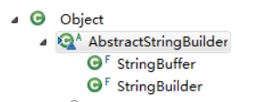

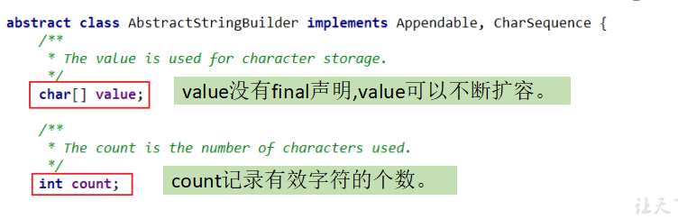

* **StringBuffer 类不同于String，其对象必须使用构造器生成。有三个构造器：**
  * StringBuffer(): 初始容量为16的字符串缓冲区
  * StringBuffer(int size): 构造指定容量的字符缓冲区
  * StringBufer(String str): 将内容初始化为指定字符串内容

```java
String s = new String("我喜欢学习");
StringBuffer buffer = new StringBuffer("我喜欢学习");
buffer.append("数学");
```

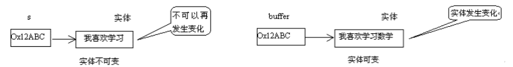

**StringBuffer类的常用方法**

StringBuffer append(xxx): 提供了很多的append()方法，用于进行字符串拼接

StringBuffer delete(int start, int end): 删除指定位置的内容

StringBuffer raplace(int start, int end, String str): 把(start,end)位置替换为str

StringBuffer insert(int offset, xxx): 在指定位置插入 xxx

StringBuffer reverse(): 把当前字符序列逆转

* 当append和insert时，如果原来value数组长度不够，可扩容。
* 如上这些方法支持方法链操作。
* 方法链的原理：

**此外，还定义了如下的方法：**

public int **indexOf**(String str)

public String **substring**(int start,int end)

public int **length**()

public char **charAt**(int n )

public void **setCharAt**(int n ,char ch)

### StringBuilder类

* StringBuilder 和 StringBuffer 北厂类似，均代表可变的字符序列，而且提供相关功能的方法也一样
* 面试题：对比String、StringBuffer、StringBuilder
  * String(JDK1.0)：不可变字符序列
  * StringBuffer(JDK1.0)：可变字符序列、效率低、线程安全
  * StringBuilder(JDK 5.0)：可变字符序列、效率高、线程不安全

> 注意：作为参数传递的话，方法内部 String 不会改变其值，StringBuffer 和 StringBuilder会改变其值 

**三者效率测试**

```java
//初始设置
long startTime = 0L;
long endTime = 0L;
String text = "";
StringBuffer buffer = new StringBuffer("");
StringBuilder builder = new StringBuilder("");
//开始对比
startTime = System.currentTimeMillis();
for (int i = 0; i < 20000; i++) {
	buffer.append(String.valueOf(i));
}
endTime = System.currentTimeMillis();
System.out.println("StringBuffer的执行时间：" + (endTime - startTime));
startTime = System.currentTimeMillis();
for (int i = 0; i < 20000; i++) {
	builder.append(String.valueOf(i));
}
endTime = System.currentTimeMillis();
System.out.println("StringBuilder的执行时间：" + (endTime - startTime));
startTime = System.currentTimeMillis();
for (int i = 0; i < 20000; i++) {
	text = text + i;
}
endTime = System.currentTimeMillis(); 
System.out.println("String的执行时间：" + (endTime - startTime));

```

**【面试题】 程序输出：**

```java
String str = null;
StringBuffer sb = new StringBuffer();
sb.append(str); 
System.out.println(sb.length());// 4
System.out.println(sb);// null
StringBuffer sb1 = new StringBuffer(str);
System.out.println(sb1);// java.lang.NullPointerException
```

**【面试题2】程序输出：**

```java
@Test
public void testString (){
    String a = "123";
    String b = "123";
    String c = new String("123");
    String d = new String("123");
    System.out.println(a.equals(b)); //true
    System.out.println(a == b); //true
    System.out.println(c.equals(d)); //true
    System.out.println(c == d); //false
}
```

## JDK8 之前日期时间 API

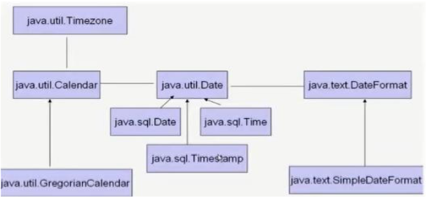

1. java.lang.System 类

   System 类提供的 public static long currentTimeMillis())用来返回当前时间与1970年1月1日0时0分0秒之间以毫秒为单位的时间差。

   * 此方法适于计算时间差。

* 计算世界时间的主要标准有：
  * UTC(Coordinated Universal Time)
  * GMT(Greenwich Mean Time)
  * CST(Central Standard Time)

2. java.util.Date 类

   表示特定的瞬间，精确到毫秒

* 构造器：
  * Date(): 使用无参构造器创建的对象可以获取本地当前时间
  * Date(long date)

* 常用方法
  * **getTime():** 返回自 1970 年 1 月 1 日 00:00:00 GMT 以来此 Date 对象表示的毫秒数。
  * **toString():** 把此 Date 对象转换为以下形式的 String： dow mon dd hh:mm:ss zzz yyyy 其中： dow 是一周中的某一天 (Sun, Mon, Tue, Wed, Thu, Fri, Sat)，zzz是时间标准。
  * 其它很多方法都过时了。

```java
Date date = new Date();
System.out.println(date);

System.out.println(System.currentTimeMillis());
System.out.println(date.getTime()); 
Date date1 = new Date(date.getTime());
System.out.println(date1.getTime()); 
System.out.println(date1.toString());
```

3. java.text.SimpleDateFormat 类

* Date类的API不易于国际化，大部分被废弃了，**java.text.SimpleDateFormat** 类是一个不与语言环境有关的方式来格式化和解析日期的具体类。
* 它允许进行格式化：日期 -> 文本、解析：文本 -> 日期
* 格式化：
  * SimpleDateFormat(): 默认的模式和语言环境创建对象
  * public SimpleDateFormat(String pattern): 该构方法可以用参数 pattern指定的格式创建一个对象，该对象调用：
  * public String format(Date date): 方法格式化时间对象 date

* 解析：
  * public Date parse(String source): 从给定字符串的开始解析文本，以生成一个日期。

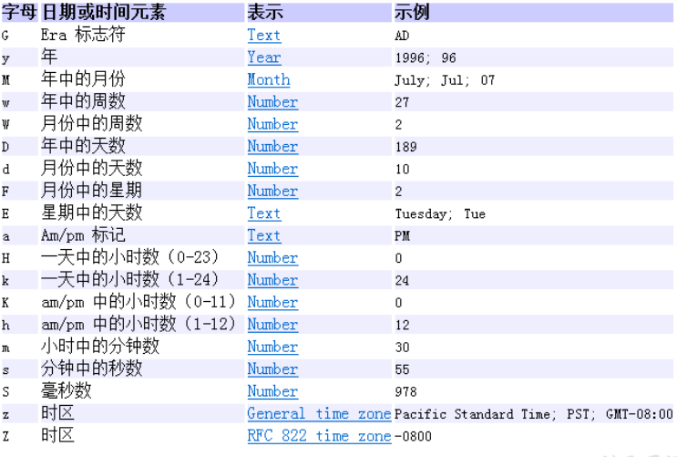

```java
Date date = new Date(); // 产生一个Date实例
// 产生一个formater格式化的实例
SimpleDateFormat formater = new SimpleDateFormat();
System.out.println(formater.format(date));// 打印输出默认的格式
SimpleDateFormat formater2 = new SimpleDateFormat("yyyy年MM月dd日EEEHH:mm:ss");
System.out.println(formater2.format(date));
try {
    // 实例化一个指定的格式对象
    Date date2 = formater2.parse("2008年08月08日 星期一 08:08:08");
    // 将指定的日期解析后格式化按指定的格式输出
	System.out.println(date2.toString());
} catch (ParseException e) {
	e.printStackTrace();
}

```

4. java.util.Calendar(日历) 类

* Calendar 是一个抽象基类，主要用于完成日期字段之间的相互操作的功能。
* 获取 Calendar 实例的方法
  * 使用 Calendar.getInstance() 方法
  * 调用它的子类 GregorianCalendar 的构造器

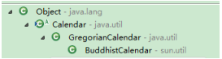

* 一个 Calendar 的实例是系统时间的抽象表示，通过get(int field) 方法来取得想要的时间信息。比如l 比如YEAR、MONTH、DAY_OF_WEEK、HOUR_OF_DAY 、MINUTE、SECOND
  * public void set(int field,int value)
  * public void add(int field,int amount)
  * public final Date getTime()
  * public final void setTime(Date date)

* 注意：
  * 获取月份时：一月是0，二月是1，以此类推，12月是11
  * 获取星期时：周日是1，周二是2 ， 。。。。周六是7

```java
Calendar calendar = Calendar.getInstance();
// 从一个 Calendar 对象中获取 Date 对象
Date date = calendar.getTime();
// 使用给定的 Date 设置此 Calendar 的时间
date = new Date(234234235235L);
calendar.setTime(date);
calendar.set(Calendar.DAY_OF_MONTH, 8);
System.out.println("当前时间日设置为8后,时间是:" + calendar.getTime());
calendar.add(Calendar.HOUR, 2);
System.out.println("当前时间加2小时后,时间是:" + calendar.getTime());
calendar.add(Calendar.MONTH, -2);
System.out.println("当前日期减2个月后,时间是:" + calendar.getTime());
```

## JDK8 中新日期时间 API

**新日期时间API出现的背景**

如果我们可以跟别人说：“我们在1502643933071见面，别晚了！”那么就再简单不过了。但是我们希望时间与昼夜和四季有关，于是事情就变复杂了。JDK 1.0中包含了一个java.util.Date类，但是它的大多数方法已经在JDK 1.1引入Calendar类之后被弃用了。而Calendar并不比Date好多少。它们面临的问题是：

可变性：像日期和时间这样的类应该是不可变的。

偏移性：Date中的年份是从1900开始的，而月份都从0开始。格式化：格式化只对Date有用，Calendar则不行。

此外，它们也不是线程安全的；不能处理闰秒等。

> 总结：对日期和时间的操作一直是Java程序员最痛苦的地方之一。

### 新时间日期 API

* 第三次引入的 API 是成功的，并且Java 8中引入的java.time API 已经纠正了过去的缺陷，将来很长一段时间内它都会为我们服务。

* Java 8 吸收了 Joda-Time 的精华，以一个新的开始为 Java 创建优秀的 API。新的 java.time 中包含了有关于本地日期（LocalDate）、本地时间（LocalTime）、本地日期时间（LocalDateTime）、时区（ZonedDateTime） 和持续时间（Duration）的类。历史悠久的 Date 类新增了 toInstant() 方法， 用于把 Date 转换成新的表示形式。这些新增的本地化时间日期 API 大大简化了日期时间和本地化的管理。

  

  <font color=black size=5>java.time - 包含值对象的基础包</font>

  java.time.chrono - 提供对不同的日历系统访问

  java.time.format - 格式化和解析时间和日期

  <font color=black size=5 >java.time.temporal - 包括底层框架和扩展特性</font>

  java.time.zone - 包含时区支持类

> 说明：大多数开发者只会用到基础包和format包，也可能会用到temporal包。因此，尽管有68个新的公开类型，大多数开发者，大概将只会用到其中的三分之一。

* LocalDate、LocalTime、LocalDateTime 类是其中较重要的几个类，它们的实例是不可变的对象，分别表示使用 ISO-8601日历系统的日期、时间、日期和时间。它们提供了简单的本地日期或时间，并不包含当前的时间信息，也不包含与时区相关的信息。
  * LocalDate代表IOS格式（yyyy-MM-dd）的日期,可以存储 生日、纪念日等日期。
  * LocalTime表示一个时间，而不是日期。
  * LocalDateTime是用来表示日期和时间的，这是一个最常用的类之一。

> <font color=red>注：ISO-8601日历系统是国际标准化组织制定的现代公民的日期和时间的表示法，也就是公历。</font>


| 方法                                                         | 描述                                                         |
| ------------------------------------------------------------ | ------------------------------------------------------------ |
| now() / * now(ZoneId zone)                                   | 静态方法，根据当前时间创建对象/指定时区的对象                |
| of()                                                         | 静态方法，根据指定日期/时间创建对象                          |
| getDayOfMonth()/getDayOfYear()                               | 获得月份天数(1-31) /获得年份天数(1-366)                      |
| getDayOfWeek()                                               | 获得星期几(返回一个 DayOfWeek 枚举值)                        |
| getMonth()                                                   | 获得月份, 返回一个 Month 枚举值                              |
| getMonthValue() / getYear()                                  | 获得月份(1-12) /获得年份                                     |
| getHour()/getMinute()/getSecond()                            | 获得当前对象对应的小时、分钟、秒                             |
| withDayOfMonth()/withDayOfYear()<br/>/withMonth()/withYear() | 将月份天数、年份天数、月份、年份修改为指定的值并返回新的对象 |
| plusDays(),plusWeeks(),plusMonths(),<br/>plusYears(),plusHours() | 向当前对象添加几天、几周、几个月、几年、几小时               |
| minusMonths()/minusWeeks()<br/>/minusDays()/minusYears()/minusHours() | 从当前对象减去几月、几周、几天、几年、几小时                 |

**瞬时：Instant**

*  Instant：时间线上的一个瞬时点。 这可能被用来记录应用程序中的事件时间戳。
* 在处理时间和日期的时候，我们通常会想到年,月,日,时,分,秒。然而，这只是 时间的一个模型，是面向人类的。第二种通用模型是面向机器的，或者说是连续的。在此模型中，时间线中的一个点表示为一个很大的数，这有利于计算机处理。在UNIX中，这个数从1970年开始，以秒为的单位；同样的，在Java中， 也是从1970年开始，但以毫秒为单位。
* java.time包通过值类型Instant提供机器视图，不提供处理人类意义上的时间单位。Instant表示时间线上的一点，而不需要任何上下文信息，例如，时区。概念上讲，它只是简单的表示自1970年1月1日0时0分0秒（UTC）开始的秒数。因为java.time包是基于纳秒计算的，所以Instant的精度可以达到纳秒级。
* (1 ns = 10 ^-9 s)	1秒 = 1000毫秒 =10^6微秒=10^9纳秒

| 方法                          | 描述                                                         |
| ----------------------------- | ------------------------------------------------------------ |
| now()                         | 静态方法，返回默认UTC时区的Instant类的对象                   |
| ofEpochMilli(long epochMilli) | 静态方法，返回在1970-01-01 00:00:00基础上加上指定毫秒数之后的Instant类的对象 |
| atOffset(ZoneOffset offset)   | 结合即时的偏移来创建一个 OffsetDateTime                      |
| toEpochMilli()                | 返回1970-01-01 00:00:00到当前时间的毫秒数，即为时间戳        |

> <font color=red size=4>时间戳是指格林威治时间1970年01月01日00时00分00秒(北京时间1970年01月01
> 日08时00分00秒)起至现在的总秒数。</font>

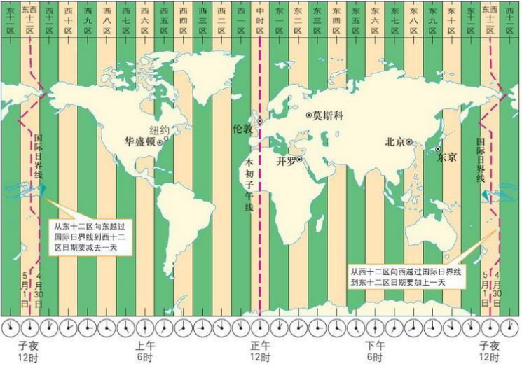

**格式化与解析日期或时间**

java.time.format.DateTimeFormatter 类：该类提供了三种格式化方法：

* 预定义的标准格式。如：ISO_LOCAL_DATE_TIME;ISO_LOCAL_DATE;ISO_LOCAL_TIME
* 本地化相关的格式。如：ofLocalizedDateTime(FormatStyle.LONG)
* 自定义的格式。如：ofPattern(“yyyy-MM-dd hh:mm:ss”)

|            方法            |                         描述                         |
| :------------------------: | :--------------------------------------------------: |
| ofPattern(String pattern)  | 静态方法 ，返回一个指定字符串格式的DateTimeFormatter |
| format(TemporalAccessor t) |           格式化一个日期、时间，返回字符串           |
|  parse(CharSequence text)  |       将指定格式的字符序列解析为一个日期、时间       |

**其它 API**

* ZoneId：该类中包含了所有的时区信息，一个时区的ID，如 Europe/Paris
* ZonedDateTime：一个在ISO-8601日历系统时区的日期时间，如 2007-12-03T10:15:30+01:00 Europe/Paris。
  * 其中每个时区都对应着ID，地区ID都为“{区域}/{城市}”的格式，例如：Asia/Shanghai等

* Clock：使用时区提供对当前即时、日期和时间的访问的时钟。
* 持续时间：Duration，用于计算两个“时间”间隔
* 日期间隔：Period，用于计算两个“日期”间隔
* TemporalAdjuster : 时间校正器。有时我们可能需要获取例如：将日期调整到“下一个工作日”等操作。
* TemporalAdjusters : 该类通过静态方法(firstDayOfXxx()/lastDayOfXxx()/nextXxx())提供了大量的常用TemporalAdjuster 的实现。

```java
//ZoneId:类中包含了所有的时区信息
// ZoneId的getAvailableZoneIds():获取所有的ZoneId
Set<String> zoneIds = ZoneId.getAvailableZoneIds();
for (String s : zoneIds) {
System.out.println(s);
}
// ZoneId的of():获取指定时区的时间
LocalDateTime localDateTime = LocalDateTime.now(ZoneId.of("Asia/Tokyo"));
System.out.println(localDateTime.format(DateTimeFormatter.ofPattern("yyyy年MM月dd日EEEHH:mm:ss")));
//ZonedDateTime:带时区的日期时间
// ZonedDateTime的now():获取本时区的ZonedDateTime对象
ZonedDateTime zonedDateTime = ZonedDateTime.now();
System.out.println(zonedDateTime);
// ZonedDateTime的now(ZoneId id):获取指定时区的ZonedDateTime对象
ZonedDateTime zonedDateTime1 = ZonedDateTime.now(ZoneId.of("Asia/Tokyo"));
System.out.println(zonedDateTime1);
```

```java
//Duration:用于计算两个“时间”间隔，以秒和纳秒为基准
LocalTime localTime = LocalTime.now();
LocalTime localTime1 = LocalTime.of(15, 23, 32);
//between():静态方法，返回Duration对象，表示两个时间的间隔
Duration duration = Duration.between(localTime1, localTime);
System.out.println(duration);

System.out.println(duration.getSeconds());
System.out.println(duration.getNano());

LocalDateTime localDateTime = LocalDateTime.of(2016, 6, 12, 15, 23, 32);
LocalDateTime localDateTime1 = LocalDateTime.of(2017, 6, 12, 15, 23, 32);

Duration duration1 = Duration.between(localDateTime1, localDateTime);
System.out.println(duration1.toDays());
```

```java
// TemporalAdjuster:时间校正器
// 获取当前日期的下一个周日是哪天？
TemporalAdjuster temporalAdjuster = TemporalAdjusters.next(DayOfWeek.SUNDAY);
LocalDateTime localDateTime = LocalDateTime.now().with(temporalAdjuster); System.out.println(localDateTime);
// 获取下一个工作日是哪天？
LocalDate localDate = LocalDate.now().with(new TemporalAdjuster() {
@Override
public Temporal adjustInto(Temporal temporal) {
    LocalDate date = (LocalDate) temporal;
        if (date.getDayOfWeek().equals(DayOfWeek.FRIDAY)) {
            return date.plusDays(3);
        } else if (date.getDayOfWeek().equals(DayOfWeek.SATURDAY)) { return 					date.plusDays(2);
        } else {
            return date.plusDays(1);
        }
    }
});
System.out.println("下一个工作日是：" + localDate);
```

```java
/**
 * jdk 8中日期时间API的测试
 */
public class JDK8DateTimeTest {

    @Test
    public void testDate(){
        //偏移量
        Date date1 = new Date(2020 - 1900,9 - 1,8);
        System.out.println(date1);//Tue Sep 08 00:00:00 GMT+08:00 2020
    }

    /*
    LocalDate、LocalTime、LocalDateTime 的使用
    说明：
        1.LocalDateTime相较于LocalDate、LocalTime，使用频率要高
        2.类似于Calendar
     */
    @Test
    public void test1(){
        //now():获取当前的日期、时间、日期+时间
        LocalDate localDate = LocalDate.now();
        LocalTime localTime = LocalTime.now();
        LocalDateTime localDateTime = LocalDateTime.now();

        System.out.println(localDate);
        System.out.println(localTime);
        System.out.println(localDateTime);

        //of():设置指定的年、月、日、时、分、秒。没有偏移量
        LocalDateTime localDateTime1 = LocalDateTime.of(2020, 10, 6, 13, 23, 43);
        System.out.println(localDateTime1);


        //getXxx()：获取相关的属性
        System.out.println(localDateTime.getDayOfMonth());
        System.out.println(localDateTime.getDayOfWeek());
        System.out.println(localDateTime.getMonth());
        System.out.println(localDateTime.getMonthValue());
        System.out.println(localDateTime.getMinute());

        //体现不可变性
        //withXxx():设置相关的属性
        LocalDate localDate1 = localDate.withDayOfMonth(22);
        System.out.println(localDate);
        System.out.println(localDate1);


        LocalDateTime localDateTime2 = localDateTime.withHour(4);
        System.out.println(localDateTime);
        System.out.println(localDateTime2);

        //不可变性
        LocalDateTime localDateTime3 = localDateTime.plusMonths(3);
        System.out.println(localDateTime);
        System.out.println(localDateTime3);

        LocalDateTime localDateTime4 = localDateTime.minusDays(6);
        System.out.println(localDateTime);
        System.out.println(localDateTime4);
    }

    /*
    Instant的使用
    类似于 java.util.Date类

     */
    @Test
    public void test2(){
        //now():获取本初子午线对应的标准时间
        Instant instant = Instant.now();
        System.out.println(instant);//2019-02-18T07:29:41.719Z

        //添加时间的偏移量
        OffsetDateTime offsetDateTime = instant.atOffset(ZoneOffset.ofHours(8));
        System.out.println(offsetDateTime);//2019-02-18T15:32:50.611+08:00

        //toEpochMilli():获取自1970年1月1日0时0分0秒（UTC）开始的毫秒数  ---> Date类的getTime()
        long milli = instant.toEpochMilli();
        System.out.println(milli);

        //ofEpochMilli():通过给定的毫秒数，获取Instant实例  -->Date(long millis)
        Instant instant1 = Instant.ofEpochMilli(1550475314878L);
        System.out.println(instant1);
    }

    /*
    DateTimeFormatter:格式化或解析日期、时间
    类似于SimpleDateFormat

     */

    @Test
    public void test3(){
//        方式一：预定义的标准格式。如：ISO_LOCAL_DATE_TIME;ISO_LOCAL_DATE;ISO_LOCAL_TIME
        DateTimeFormatter formatter = DateTimeFormatter.ISO_LOCAL_DATE_TIME;
        //格式化:日期-->字符串
        LocalDateTime localDateTime = LocalDateTime.now();
        String str1 = formatter.format(localDateTime);
        System.out.println(localDateTime);
        System.out.println(str1);//2019-02-18T15:42:18.797

        //解析：字符串 -->日期
        TemporalAccessor parse = formatter.parse("2019-02-18T15:42:18.797");
        System.out.println(parse);

//        方式二：
//        本地化相关的格式。如：ofLocalizedDateTime()
//        FormatStyle.LONG / FormatStyle.MEDIUM / FormatStyle.SHORT :适用于LocalDateTime
        DateTimeFormatter formatter1 = DateTimeFormatter.ofLocalizedDateTime(FormatStyle.LONG);
        //格式化
        String str2 = formatter1.format(localDateTime);
        System.out.println(str2);//2019年2月18日 下午03时47分16秒


//      本地化相关的格式。如：ofLocalizedDate()
//      FormatStyle.FULL / FormatStyle.LONG / FormatStyle.MEDIUM / FormatStyle.SHORT : 适用于LocalDate
        DateTimeFormatter formatter2 = DateTimeFormatter.ofLocalizedDate(FormatStyle.MEDIUM);
        //格式化
        String str3 = formatter2.format(LocalDate.now());
        System.out.println(str3);//2019-2-18


//       重点： 方式三：自定义的格式。如：ofPattern(“yyyy-MM-dd hh:mm:ss”)
        DateTimeFormatter formatter3 = DateTimeFormatter.ofPattern("yyyy-MM-dd hh:mm:ss");
        //格式化
        String str4 = formatter3.format(LocalDateTime.now());
        System.out.println(str4);//2019-02-18 03:52:09

        //解析
        TemporalAccessor accessor = formatter3.parse("2019-02-18 03:52:09");
        System.out.println(accessor);

    }
```

| 类                                                        | To 遗留类                             | From 遗留类                 |
| --------------------------------------------------------- | ------------------------------------- | --------------------------- |
| java.time.Instant与java.util.Date                         | Date.from(instant)                    | date.toInstant()            |
| java.time.Instant与java.sql.Timestamp                     | Timestamp.from(instant)               | timestamp.toInstant()       |
| java.time.ZonedDateTime与<br/>java.util.GregorianCalendar | GregorianCalendar.from(zonedDateTime) | cal.toZonedDateTime()       |
| java.time.LocalDate与java.sql.Time                        | Date.valueOf(localDate)               | date.toLocalDate()          |
| java.time.LocalTime与java.sql.Time                        | Date.valueOf(localDate)               | date.toLocalTime()          |
| time.LocalDateTime与<br/>java.sql.Timestamp               | Timestamp.valueOf(localDateTime)      | timestamp.toLocalDateTime() |
| java.time.ZoneId与java.util.TimeZone                      | Timezone.getTimeZone(id)              | timeZone.toZoneId()         |
| java.time.format.DateTimeFormatter与java.text.DateFormat  | formatter.toFormat()                  | 无                          |

## Java 比较器

* 在Java中经常会涉及到对象数组的排序问题，那么就涉及到对象之间的比较问题。
* Java实现对象排序的方式有两种：
  * 自然排序：java.lang.Comparable
  * 定制排序：java.lang.Comparator

### 方式一：自然排序：java.lang.Comparable

* Comparable 接口强行对实现它的每个类的对象进行整体排序。这种排序被称为类的自然排序。
* **实现 Comparable 的类必须实现 compareTo(Object object) 方法**，两个对象即通过 compareTo(Object obj) 方法的返回值来比较大小。如果当前对象 this 大于形参对象 Obj, 则返回正整数，如果当前对象 this 小于形参对象obj, 则返回负整数，如果当前对象 this 等于形参对象 obj, 则返回零
* 实现Comparable接口的对象列表（和数组）可以通过 Collections.sort 或Arrays.sort进行自动排序。实现此接口的对象可以用作有序映射中的键或有序集合中的元素，无需指定比较器。
* 对于类 C 的每一个 e1 和 e2 来说，当且仅当 e1.compareTo(e2) == 0 与e1.equals(e2) 具有相同的 boolean 值时，类 C 的自然排序才叫做与 equals 一致。建议（虽然不是必需的）最好使自然排序与 equals 一致。

* Comparable 的典型实现：（默认都是从小都大排列的）

```java
public class ComparableTest{
    public static void main(String[] args) {

        Goods[] all = new Goods[4];
        all[0]	=	new Goods("《红楼梦》", 100);
        all[1]	=	new Goods("《西游记》", 80);
        all[2]	=	new Goods("《三国演义》", 140);
        all[3]	=	new Goods("《水浒传》", 120);

    	Arrays.sort(all); System.out.println(Arrays.toString(all));
    }

}
```

### 方式二：定制排序：java.util.Comparator

* <font color=blue>当元素的类型没有实现 java.lang.Comparable 接口而又不方便修改代码，或者实现了 java.lang.Comparable 接口 的排序规则不适合当前操作，那么考虑使用 Comparator 的对象来排序，</font>强行对多个对象进行整体排序的比较。
* 重写compare(Object o1,Object o2)方法，比较o1和o2的大小：<font color=blue>如果方法返回正整数，则表示o1大于o2；如果返回0，表示相等；返回负整数，表示o1小于o2。</font>
* 可以将 Comparator 传递给 sort 方法（如 Collections.sort 或 Arrays.sort），从而允许在排序顺序上实现精确控制。
* 还可以使用 Comparator 来控制某些数据结构（如有序 set或有序映射）的顺序，或者为那些没有自然顺序的对象 collection 提供排序。

```java
public class Goods implements  Comparable{

    private String name;
    private double price;

    public Goods() {
    }

    public Goods(String name, double price) {
        this.name = name;
        this.price = price;
    }

    public String getName() {
        return name;
    }

    public void setName(String name) {
        this.name = name;
    }

    public double getPrice() {
        return price;
    }

    public void setPrice(double price) {
        this.price = price;
    }

    @Override
    public String toString() {
        return "Goods{" +
                "name='" + name + '\'' +
                ", price=" + price +
                '}';
    }

    //指明商品比较大小的方式:按照价格从低到高排序,再按照产品名称从高到低排序
    @Override
    public int compareTo(Object o) {
//        System.out.println("**************");
        if(o instanceof Goods){
            Goods goods = (Goods)o;
            //方式一：
            if(this.price > goods.price){
                return 1;
            }else if(this.price < goods.price){
                return -1;
            }else{
//                return 0;
               return -this.name.compareTo(goods.name);
            }
            //方式二：
//           return Double.compare(this.price,goods.price);
        }
//        return 0;
        throw new RuntimeException("传入的数据类型不一致！");
    }

```

```java
/**
 * 一、说明：Java中的对象，正常情况下，只能进行比较：==  或  != 。不能使用 > 或 < 的
 *          但是在开发场景中，我们需要对多个对象进行排序，言外之意，就需要比较对象的大小。
 *          如何实现？使用两个接口中的任何一个：Comparable 或 Comparator
 *
 * 二、Comparable接口与Comparator的使用的对比：
 *    Comparable接口的方式一旦一定，保证Comparable接口实现类的对象在任何位置都可以比较大小。
 *    Comparator接口属于临时性的比较。
 */
public class CompareTest {
    /*
    Comparable接口的使用举例：  自然排序
    1.像String、包装类等实现了Comparable接口，重写了compareTo(obj)方法，给出了比较两个对象大小的方式。
    2.像String、包装类重写compareTo()方法以后，进行了从小到大的排列
    3. 重写compareTo(obj)的规则：
        如果当前对象this大于形参对象obj，则返回正整数，
        如果当前对象this小于形参对象obj，则返回负整数，
        如果当前对象this等于形参对象obj，则返回零。
    4. 对于自定义类来说，如果需要排序，我们可以让自定义类实现Comparable接口，重写compareTo(obj)方法。
       在compareTo(obj)方法中指明如何排序
     */
    @Test
    public void test1(){
        String[] arr = new String[]{"AA","CC","KK","MM","GG","JJ","DD"};
        //
        Arrays.sort(arr);

        System.out.println(Arrays.toString(arr));

    }

    @Test
    public void test2(){
        Goods[] arr = new Goods[5];
        arr[0] = new Goods("lenovoMouse",34);
        arr[1] = new Goods("dellMouse",43);
        arr[2] = new Goods("xiaomiMouse",12);
        arr[3] = new Goods("huaweiMouse",65);
        arr[4] = new Goods("microsoftMouse",43);

        Arrays.sort(arr);

        System.out.println(Arrays.toString(arr));
    }

    /*
    Comparator接口的使用：定制排序
    1.背景：
    当元素的类型没有实现java.lang.Comparable接口而又不方便修改代码，
    或者实现了java.lang.Comparable接口的排序规则不适合当前的操作，
    那么可以考虑使用 Comparator 的对象来排序
    2.重写compare(Object o1,Object o2)方法，比较o1和o2的大小：
    如果方法返回正整数，则表示o1大于o2；
    如果返回0，表示相等；
    返回负整数，表示o1小于o2。

     */
    @Test
    public void test3(){
        String[] arr = new String[]{"AA","CC","KK","MM","GG","JJ","DD"};
        Arrays.sort(arr,new Comparator(){

            //按照字符串从大到小的顺序排列
            @Override
            public int compare(Object o1, Object o2) {
                if(o1 instanceof String && o2 instanceof  String){
                    String s1 = (String) o1;
                    String s2 = (String) o2;
                    return -s1.compareTo(s2);
                }
//                return 0;
                throw new RuntimeException("输入的数据类型不一致");
            }
        });
        System.out.println(Arrays.toString(arr));
    }

    @Test
    public void test4(){ //定制排序
        Goods[] arr = new Goods[6];
        arr[0] = new Goods("lenovoMouse",34);
        arr[1] = new Goods("dellMouse",43);
        arr[2] = new Goods("xiaomiMouse",12);
        arr[3] = new Goods("huaweiMouse",65);
        arr[4] = new Goods("huaweiMouse",224);
        arr[5] = new Goods("microsoftMouse",43);

        Arrays.sort(arr, new Comparator() {
            //指明商品比较大小的方式:按照产品名称从低到高排序,再按照价格从高到低排序
            @Override
            public int compare(Object o1, Object o2) {
                if(o1 instanceof Goods && o2 instanceof Goods){
                    Goods g1 = (Goods)o1;
                    Goods g2 = (Goods)o2;
                    if(g1.getName().equals(g2.getName())){
                        return -Double.compare(g1.getPrice(),g2.getPrice());
                    }else{
                        return g1.getName().compareTo(g2.getName());
                    }
                }
                throw new RuntimeException("输入的数据类型不一致");
            }
        });

        System.out.println(Arrays.toString(arr));
    }

}
```

## System 类

* System类代表系统，系统级的很多属性和控制方法都放置在该类的内部。该类位于java.lang包。
* 由于该类的构造器是private的，所以无法创建该类的对象，也就是无法实例化该类。其内部的成员变量和成员方法都是static的，所以也可以很方便的进行调用。
* 成员变量
  * System 类内部包含 in、out 和 err 三个成员变量，分别代表标准输入流（键盘输入），标准输出流（显示器）和标准错误输出流（显示器）。

* 成员方法

  * native long currentTimeMillis(): 该方法的作用是返回当前的计算机时间，时间的表达式格式为当前计算机时间和 GMT时间（格林威治时间）1970年1月1号0时0分0秒所差的毫秒数。

  * void exit(int status): 该方法的作用时退出程序。其中 status 的值为 0 代表正常退出，非零代表异常退出。<font color=blue>使用该方法可以在图形界面编程中实现程序的退出共功能等。</font>

  * void gc(): 该方法的作用是请求系统进行垃圾回收。至于系统是否立即回收，则取决于系统中垃圾回收算法的实现以及系统执行时的情况。

  * String getProperty(String key): 该方法的作用是获取系统中属性名为 key 的属性对应的值。系统中常见的属性名以及属性的作用如下表所示：

    | 属性名       | 属性说明            |
    | ------------ | ------------------- |
    | java.version | java 运行时环境版本 |
    | java.home    | java 安装目录       |
    | os.name      | 操作系统的名称      |
    | os.version   | 操作系统的版本      |
    | user.name    | 用户的账户名称      |
    | user.home    | 用户的主目录        |
    | user.dir     | 用户的当前工作目录  |

```java
@Test
public void test1() {
    String javaVersion = System.getProperty("java.version");
    System.out.println("java的version:" + javaVersion);

    String javaHome = System.getProperty("java.home");
    System.out.println("java的home:" + javaHome);

    String osName = System.getProperty("os.name");
    System.out.println("os的name:" + osName);

    String osVersion = System.getProperty("os.version");
    System.out.println("os的version:" + osVersion);

    String userName = System.getProperty("user.name");
    System.out.println("user的name:" + userName);

    String userHome = System.getProperty("user.home");
    System.out.println("user的home:" + userHome);

    String userDir = System.getProperty("user.dir");
    System.out.println("user的dir:" + userDir);
}
```

## Math 类

java.lang.Math 提供了一系列静态方法用于科学计算。其方法的参数和返回值类型一般为 double 型。

| 方法                      | 描述                                     |
| ------------------------- | ---------------------------------------- |
| abs                       | 绝对值                                   |
| acos, asin, cos, sin, tan | 三角函数                                 |
| sqrt                      | 平方根                                   |
| pow(double a,double b)    | a的b次幂                                 |
| log                       | 自然对数                                 |
| exp                       | e为底指数                                |
| max(double a, double b)   | 求两个数中的最大的值                     |
| min(double a, double b)   | 求两个数中的最小的值                     |
| random()                  | 返回0.0 到1.0的随机数                    |
| long round(double a）     | double 型数据a转换为long类型（四舍五入） |
| toDegrees(double angrad)  | 弧度 -> 角度                             |
| toRadians(double angdeg)  | 角度 -> 弧度                             |

## BigInteger 与 BigDecimal

* Integer类作为int的包装类，能存储的最大整型值为2的31次方-1，Long类也是有限的， 最大为2的63次方-1。如果要表示再大的整数，不管是基本数据类型还是他们的包装类都无能为力，更不用说进行运算了。
* java.math包的<font color=red size=4 >BigInteger 可以表示不可变的任意精度的整数。</font>BigInteger 提供所有 Java 的基本整数操作符的对应物，并提供 java.lang.Math 的所有相关方法。另外，BigInteger 还提供以下运算：模算术、GCD 计算、质数测试、素数生成、位操作以及一些其他操作。
* 构造器
  * BigInteger(String val): 根据字符串构建 BigInteger对象

* 常用方法
  * public BigInteger <font color=red>abs()：</font>返回此 BigInteger 的绝对值的 BigInteger。
  * BigInteger <font color=red>add(BigInteger val) ：</font>返回其值为 (this + val) 的 BigInteger。
  * BigInteger <font color=red>subtract(BigInteger val) ：</font>返回其值为 (this - val) 的 BigInteger。
  * BigInteger <font color=red>multiply(BigInteger val) ：</font>返回其值为 (this * val) 的 BigInteger。
  * BigInteger <font color=red>divide(BigInteger val) ：</font>返回其值为 (this / val) 的 BigInteger。整数相除只保留整数部分。
  * BigInteger <font color=red>remainder(BigInteger val) ：</font>返回其值为 (this % val) 的 BigInteger。
  * BigInteger[]  <font color=red>divideAndRemainde r(BigInteger val)：</font>返回包含 (this / val) 后跟 (this % val) 的两个 BigInteger 的数组。
  * BigInteger pow(int exponent) ：返回其值为 (this^exponent) 的 BigInteger。

**BigDecimal**

* 一般的Float类和Double类可以用来做科学计算或工程计算，但在商业计算中， 要求数字精度比较高，故用到java.math.BigDecimal类。
* BigDecimal类支持不可变的、任意精度的有符号十进制定点数。
* 构造器
  * public BigDecimal(double val)
  * public BigDecimal(String val)

* 常用方法
  * public BigDecimal add(BigDecimal augend)
  * public BigDecimal subtract(BigDecimal subtrahend)
  * public BigDecimal multiply(BigDecimal multiplicand)
  * public BigDecimal divide(BigDecimal divisor, int scale, int roundingMode)

```java
@Test
public void test2() {
    BigInteger bi = new BigInteger("1243324112234324324325235245346567657653");
    BigDecimal bd = new BigDecimal("12435.351");
    BigDecimal bd2 = new BigDecimal("11");
    System.out.println(bi);
    System.out.println(bd.divide(bd2));
    System.out.println(bd.divide(bd2, BigDecimal.ROUND_HALF_DOWN));
    System.out.println(bd.divide(bd2, 25, BigDecimal.ROUND_HALF_DOWN));
}
```