本章节主要介绍线程的基本概念， 线程的创建和使用 ，线程的生命周期 ，线程的同步 ，线程的通信以及 JDK5.0 新增线程创建方式。

<!-- more -->

## 基本概念：程序、进程、线程

### 程序

程序（program）是为完成特定任务、用某种语言编写的一组指令的集合。即指一段静态的代码，静态对象。

### 进程

进程（process）是程序的一次执行过程，或者是正在运行的一个程序。是一个动态的过程：有它本身的产生、存在和消亡的过程。——生命周期

* 运行中的QQ，运行中的MP3播放器
* 程序是静态的，进程是动态的
* 进程作为资源分配单位，系统在运行时会为每个进程分配不同的内存区域

### 线程

线程（thread）进程可以进一步细化为线程，是一个程序内部测一条执行路径。

* 若一个进程同一时间并行执行多个线程，就是支持多线程的
* 线程作为调度和执行的单位，每个线程拥有独立的运行栈和从程序计数器（pc），线程切换的开销小
* 一个进程中的多个线程共享相同的内存单元/内存地址空间 ——》它们从堆中分配对象，可以访问相同变量和对象。这就使得线程间通信更简单、高效。但多个线程操作共享的系统资源可能就会带来安全隐患。

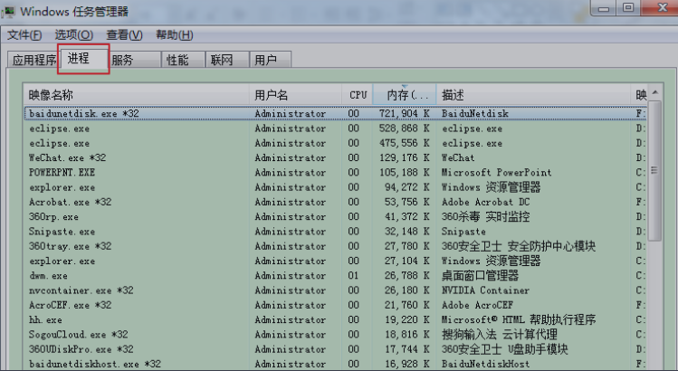

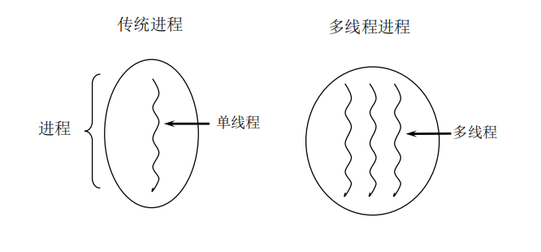

### 单核CPU和多核CPU的理解

* 单核CPU，其实是一种假的多线程，因为在一个时间单元内，也只能执行一个线程的任务。例如：虽然有多车道，但是收费站只有一个工作人员在收费，只有收了费才能通过，那么CPU就好比收费人员。如果有某个人不想交钱，那么收费人员可以把他“挂起”（晾着他，等他想通了，准备好了钱，再去收费）。但是因为CPU时间单元特别短，因此感觉不出来。
*  如果是多核的话，才能更好的发挥多线程的效率。（现在的服务器都是多核的）
* 一个Java应用程序java.exe，其实至少有三个线程：main()主线程，gc() 垃圾回收线程，异常处理线程。当然如果发生异常，会影响主线程。

### 并行与并发

* 并行：多个CPU同时执行多个任务。比如：多个人同时做不同的事。
* 并发：一个CPU(采用时间片)同时执行多个任务。比如：秒杀、多个人做同一件事。

### 使用多线程的优点

背景：以单核CPU为例，只使用单个线程先后完成多个任务（调用多个方法），肯定比用多个线程来完成用的时间更短，为何仍需多线程呢？

多线程程序的优点：

1.提高应用程序的响应。对图形化界面更有意义，可以增强用户体验。

2.提高计算机系统CPU的利用率。

3.改善程序结构。将既长又复杂的进程分为多个线程，独立运行，利于理解和修改

### 何时需要多线程？

* 程序需要同时执行两个或多个任务。
* 程序需要实现一些需要等待的任务时，如果用户输入、文件读写操作、网络操作、搜索等。
* 需要一些后台运行的程序时。

## 线程的创建和使用

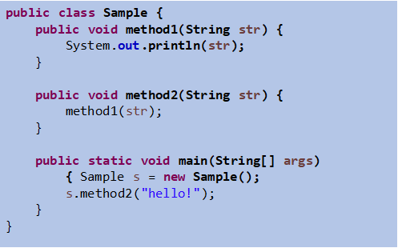

> **注意** ：上图里的程序不是多线程！

### 线程的创建和启动

* Java语言的JVM允许程序运行多个线程，它通过 java.lang.Thread 类来体现。
* Thread 类的特性
  * 每个线程都是通过某个特定 Thread 对象的 Run() 方法来完成操作的，经常把 run() 方法的主体称为**线程体**
  * 通过该 Thread 对象的 start() 方法来启动这个线程，而非直接调用 run()

### Thread类

* 构造器
  * Thread(): 创建新的 Thread 对象
  * Thread(String threadname): 创建线程并指定线程的实例名
  * Thread(Runnable target): 指定创建线程的目标对象，它实现了 Runnable 接口中的 run 方法
  * Thread(Runnable target,String name): 创建新的 Thread 对象

### API 中创建线程的两种方式

* JDK 1.5 之前创建新执行线程有两种方法：
  * 继承 Thread 类的方式
  * 实现 Runnable 接口的方式

* 方式一：继承 Thread 类

  * 定义子类继承 Thread 类

  * 子类中重写 Thread 类中的 run 方法

  * 创建 Thread 子类对象，即创建了线程对象

  * 调用线程对象 start 方法：启动线程，调用 run 方法

  
  **MyThread 子线程的创建和启动过程**

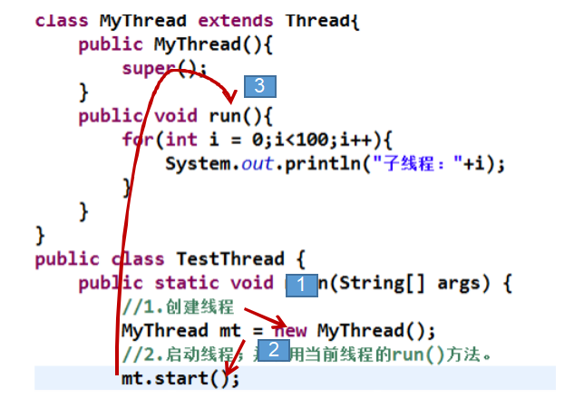

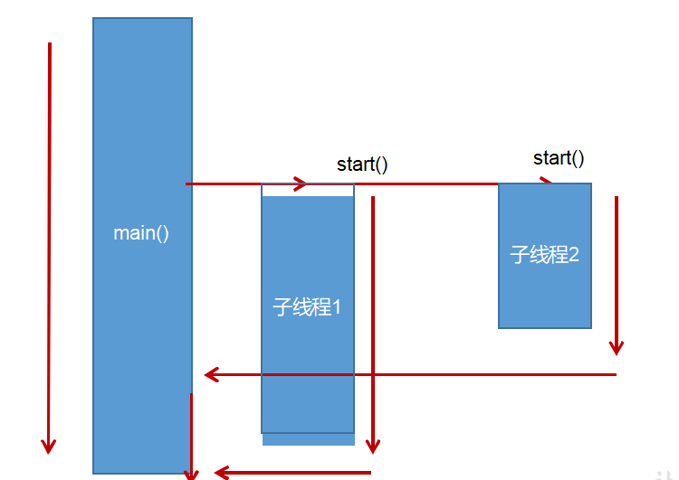

* 注意点：
  * 如果自己手动调用 run() 方法，那么就只是普通方法，没有启动多线程模式。
  * run() 方法是油 JVM 调用，什么时候调用，执行的过程控制都有操作系统 CPU 调度决定。
  * 想要启动多线程，必须调用 start 方法。
  * 一个线程对象只能调用一次 start() 方法启动，如果重复调用了，则将抛出异常 “IllegalThreadStateException”。

* 方式二：实现 Runnable 接口
  * 定义子类，实现 Runnable 接口。
  * 子类中重写 Runnable 接口中的 run 方法。
  * 通过 Thread 类含参构造器创建线程对象。
  * 将 Runnable 接口的子类对象作为实际参数传递给 Thread 类的构造器中。
  * 调用 Thread 类中的 start 方法：开启线程，调用 Runnable 子类接口的 run 方法。

**继承方式和实现方式的联系与区别**

public class Thread extends Object implements Runnable 

* 区别
  * 继承Thread: 线程代码存放Thread子类run方法中。
  * 实现Runnable：线程代码存在接口的子类的run方法。

* 实现方式的好处
  * 避免了单继承的局限性
  * 多个线程可以共享同一个接口实现类的对象，非常适合多个相同线程来处理同一份资源。

**Thread类的有关方法**

* <span color:red>void start():</span> 启动线程，并执行对象的run()方法
* run(): 线程在被调度时执行的操作
* String getName(): 返回线程的名称
* void setName(String name): 设置该线程名称
* static Thread currentThread(): 返回当前线程。在Thread子类中就是this，通常用于主线程和Runnable实现类


**Thread类的有关方法（2）**

* static void yield(): 线程让步
  * 暂停当前正在执行的线程，把执行机会让给优先级相同或更高的线程
  * 若对列中没有同优先级的线程，忽略此方法
* join(): 当某个程序执行流中调用其他线程的 join() 方法时，调用线程将被阻塞，直到 join() 方法加入的 join 线程执行完为止
  * 低优先级的线程也可以获得执行
* static void sleep(long millis): (指定时间：毫秒)
  * 令当前活动线程在指定的时间段内放弃对 CPU 控制，使其他线程有机会被执行，时间到后重排队。
  * 抛出 InterruptedException 异常
* stop(): 强制线程生命期结束，不推荐使用
* boolean isAlive(): 返回 boolean ,判断线程是否还活着

**线程的调度**

* 调度策略

  * 时间片

    

  * 抢占式：高优先级的线程抢占 CPU

* Java 的调度方法
  * 同优先级线程组成先进先出队列（先到先服务），使用时间片策略
  * 对高优先级，使用优先调度的抢占式策略

**线程的优先级**

* 线程的优先等级
  * MAX_PRIORITY: 10
  * MIN_PRIORITY: 1
  * NORM_PRIORITY: 5

* 涉及的方法
  * getPriority(): 返回线程优先值
  * setPriority(int newPriority): 改变线程的优先级

* 说明
  * 线程创建时继承父线程的优先级
  * 低优先级只是获得调度的概率低，并非一定是在高优先级线程之后才被调用

**补充：线程的分类**

Java中的线程分为两类：一种是**守护线程**，一种是**用户线程**。

* 它们在几乎每个方面都是相同的，唯一的区别是判断JVM何时离开。
* 守护线程是用来服务用户线程的，通过在start()方法前调用**thread.setDaemon(true)**可以把一个用户线程变成一个守护线程。
* **Java** 垃圾回收就是一个典型的守护线程。
* 若 JVM 中都是守护线程，当前JVM将退出。
* 形象理解：兔死狗烹，鸟尽弓藏

```java
/**
 * 测试Thread中的常用方法：
 * 1. start():启动当前线程；调用当前线程的run()
 * 2. run(): 通常需要重写Thread类中的此方法，将创建的线程要执行的操作声明在此方法中
 * 3. currentThread():静态方法，返回执行当前代码的线程
 * 4. getName():获取当前线程的名字
 * 5. setName():设置当前线程的名字
 * 6. yield():释放当前cpu的执行权
 * 7. join():在线程a中调用线程b的join(),此时线程a就进入阻塞状态，直到线程b完全执行完以后，线程a才
 *           结束阻塞状态。
 * 8. stop():已过时。当执行此方法时，强制结束当前线程。
 * 9. sleep(long millitime):让当前线程“睡眠”指定的millitime毫秒。在指定的millitime毫秒时间内，当前线程是阻塞状态。
 * 10. isAlive():判断当前线程是否存活
 *
 *
 * 线程的优先级：
 * 1.
 * MAX_PRIORITY：10
 * MIN _PRIORITY：1
 * NORM_PRIORITY：5  -->默认优先级
 * 2.如何获取和设置当前线程的优先级：
 *   getPriority():获取线程的优先级
 *   setPriority(int p):设置线程的优先级
 *
 *   说明：高优先级的线程要抢占低优先级线程cpu的执行权。但是只是从概率上讲，高优先级的线程高概率的情况下
 *   被执行。并不意味着只有当高优先级的线程执行完以后，低优先级的线程才执行。
 *
 */
```


## 线程的生命周期

### JDK 中用 Thread.State 类定义了线程的几种状态

要想实现多线程，必须在主线程中创建新的线程对象。Java语言使用Thread类及其子类的对象来表示线程，在它的一个完整的生命周期中通常要经历如下的**五中状态：**

* 新建：当一个Thread类或其子类的对象被声明并创建时，新生的线程对象处于新建状态
* 就绪：处于新建状态的线程被start()后，将进入线程队列等待CPU时间片，此时它已具备了运行的条件，只是没分配到CPU资源
* 运行：当就绪的线程被调度并获得CPU资源时,便进入运行状态， run()方法定义了线程的操作和功能
* 堵塞：在某种特殊情况下，被人为挂起或执行输入输出操作时，让出 CPU 并临时中止自己的执行，进入阻塞状态
* 死亡：线程完成了它的全部工作或线程被提前强制性地中止或出现异常导致结束

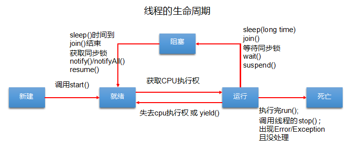

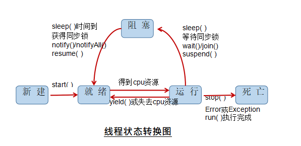

## 线程的同步

* 问题提出

  * 多个线程执行的不确定性引起执行结果的不稳定

  * 多个线程对账本的共享，会造成操作的不完整性，会破坏数据

    

**例题**

**模拟火车站售票程序，开启三个窗口售票。**

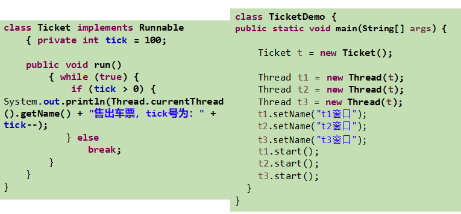

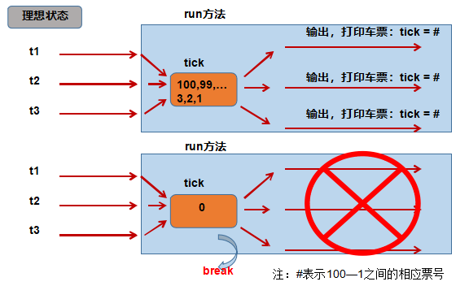

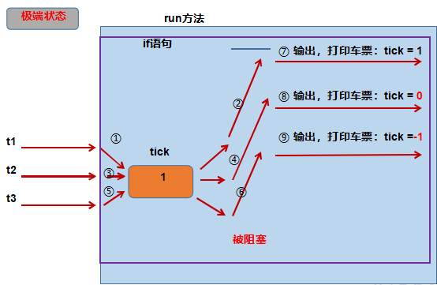

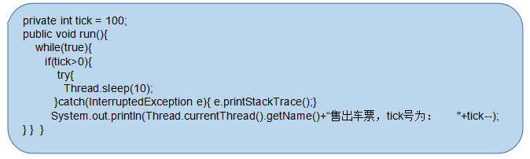

1. 多线程出现安全问题

2. **问题原因：**

   当多条语句在操作同一个线程共享数据时，一个线程对多条语句只执行了一部分，还没有执行完，另一个线程参与进来执行。导致共享数据的错误。

3. 解决办法

   对多条操作共享数据的语句，只能让一个线程都执行完，在执行过程中，其他线程不可以参与执行。

### Synchronized 的使用方法

* JAVA 对于多线程的安全问题提供了专业的解决方式：同步机制

  * 同步代码块

    **synchronized(对象){**

    ​		**//需要被同步的代码**

    **}**

  * synchronized 还可以放在方法声明中，表示整个方法为**同步方法**例如：

    **public synchronized void show (String name){**

    ​		**...**

    **}**

**分析同步原理**

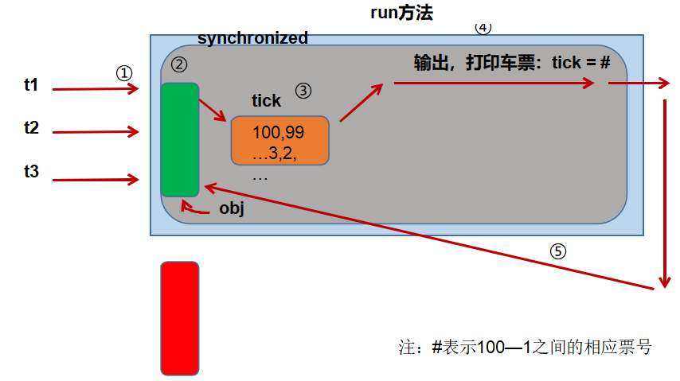

**同步机制中的锁**

* **同步锁机制：**

  在《Thinking in Java》中，是这么说的：对于并发工作，你需要某种方式来防止两个任务访问相同的资源（其实就是共享资源竞争）。 防止这种冲突的方法就是当资源被一个任务使用时，在其上加锁。第一个访问某项资源的任务必须锁定这项资源，使其他任务在其被解锁之前，就无法访问它了，而在其被解锁之时，另一个任务就可以锁定并使用它了。

* **synchronized 的锁是什么？**
  *  任意对象都可以作为同步锁。所有对象都自动含有单一的锁（监视器）。
  * 同步方法的锁：静态方法（类名.class）、非静态方法（this）
  *  同步代码块：自己指定，很多时候也是指定为this或类名.class

* **注意：**
  * 必须确保使用同一个资源的**多个线程共用一把锁**，这个非常重要，否则就无法保证共享资源的安全
  * 一个线程类中的所有静态方法共用同一把锁（类名.class），所有非静态方法共用同一把锁（this) ,同步代码块（指定需谨慎）

**同步范围**

* **如何找问题，即代码是否存在线程安全？(非常重要)**
  * 明确哪些代码是多线程运行的代码
  * 明确多个线程是否有共享数据
  * 明确多线程运行代码中是否有多条语句操作共享数据

* **如何解决呢？（非常重要）**

  对多条操作共享数据的语句，只能让一个线程都执行完，在执行过程中，其他线程不可以参与执行。即所有操作共享数据的这些语句都要放在同步范围中。

* **切记：**
  * 范围太小：没锁住所有有安全问题的代码
  * 范围太大：没发挥多线程的功能

**释放锁操作**

* 当前线程的同步方法、同步代码块执行结束。
* 当前线程在同步代码块、同步方法中遇到break、return终止了该代码块、该方法的继续执行。
* 当前线程在同步代码块、同步方法中出现了未处理的Error或Exception，导致异常结束。
* 当前线程在同步代码块、同步方法中执行了线程对象的**wait()**方法，当前线程暂停，并释放锁

**不会释放锁的操作**

* 线程执行同步代码块或同步方法时，程序调用**Thread.sleep()、Thread.yield()**方法暂停当前线程的执行
* 线程执行同步代码块时，其他线程调用了该线程的suspend()方法将该线程挂起，该线程不会释放锁（同步监视器）。
  * 应尽量避免使用suspend()和resume()来控制线程

**单例设计模式之懒汉式（线程安全）**

```java
class Singleton {
	private static Singleton instance = null;
	private Singleton(){}
	public static Singleton getInstance(){
		if(instance == null){
			synchronized(Singleton.Class){
				if(instance == null){
					instance = new Singleton();
				}
			}
		}
	}
}
public calss SingletonTest{
	public static void main(String[] args){
		Singleton s1 = Singleton.getInstance();
		Singleton s2 = Singleton.getInstance();
		System.out.printIn(s1 == s2);
	}
}
```

**线程的死锁问题**

* 死锁
  * 不同线程分别占用对方需要的同步资源不放弃，都在等待对方放弃自己需要的同步资源，就形成了线程的死锁
  * 出现死锁后，不会出现异常，不会出现提示，只是所有的线程都出处于阻塞状态，无法继续

* 解决方法
  * 专门的算法、原则
  * 尽量减少同步资源的定义
  * 尽量避免嵌套同步

```java
package com.example.demo.test;

class A {
    public synchronized void foo(B b) {
        System.out.println("当前线程名: " + Thread.currentThread().getName()
                + " 进入了A实例的foo方法"); // ①
        try {
            Thread.sleep(200);
        } catch (InterruptedException ex) {
            ex.printStackTrace();
        }
        System.out.println("当前线程名: " + Thread.currentThread().getName()
                + " 企图调用B实例的last方法"); // ③
        b.last();
    }

    public synchronized void last() {
        System.out.println("进入了A类的last方法内部");
    }
}

class B {
    public synchronized void bar(A a) {
        System.out.println("当前线程名: " + Thread.currentThread().getName()
                + " 进入了B实例的bar方法"); // ②
        try {
            Thread.sleep(200);
        } catch (InterruptedException ex) {
            ex.printStackTrace();
        }
        System.out.println("当前线程名: " + Thread.currentThread().getName()
                + " 企图调用A实例的last方法"); // ④
        a.last();
    }

    public synchronized void last() {
        System.out.println("进入了B类的last方法内部");
    }
}

public class DeadLock implements Runnable {
    A a = new A();
    B b = new B();

    public void init() {
        Thread.currentThread().setName("主线程");
        // 调用a对象的foo方法
        a.foo(b);
        System.out.println("进入了主线程之后");
    }

    public void run() {
        Thread.currentThread().setName("副线程");
        // 调用b对象的bar方法
        b.bar(a);
        System.out.println("进入了副线程之后");
    }

    public static void main(String[] args) {
        DeadLock dl = new DeadLock();
        new Thread(dl).start();
        dl.init();
    }
}
```

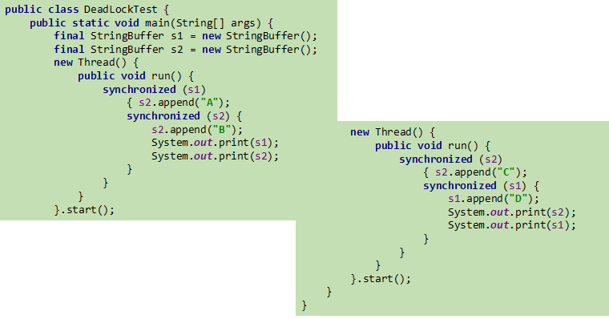

### Lock(锁)

```javascript
Class A{
	private final ReentrantLock lock = new ReentrantLock();
	public void m(){
		lock.lock();
		try{
			//保证线程安全代码；
		} finally {
			lock.unlock();
		}
	}
}
```

> 注意：如果同步代码有异常，要将 unlock() 写入 finally 语句块

**Synchronized 与 Lock 的对比**

* Lock 是显式锁（手动开启和关闭锁，别忘记关闭锁），synchronized是  隐式锁，出了作用域自动释放
* Lock只有代码块锁，synchronized有代码块锁和方法锁
* 使用Lock锁，JVM将花费较少的时间来调度线程，性能更好。并且具有更好的扩展性（提供更多的子类）

**优先使用顺序：**

**Lock -> 同步代码块（已经进入了方法体，分配了相应资源）-> 同步方法（在方法体之外）**

**练习**

**银行有一个账户。有两个储户分别向同一个账户存3000元，每次存1000，存3次。每次存完打印账户余额。**

问题：该程序是否有安全问题，如果有，如何解决？

【提示】

1. 明确哪些代码式多线程运行代码，须写入 run() 方法
2. 明确什么是共享数据
3. 明确多线程运行代码中那些语句是操作共享数据的

```java
/**
 * 银行有一个账户。
   有两个储户分别向同一个账户存3000元，每次存1000，存3次。每次存完打印账户余额。

 分析：
 1.是否是多线程问题？ 是，两个储户线程
 2.是否有共享数据？ 有，账户（或账户余额）
 3.是否有线程安全问题？有
 4.需要考虑如何解决线程安全问题？同步机制：有三种方式。

 * @author shkstart
 * @create 2019-02-15 下午 3:54
 */
class Account{
    private double balance;

    public Account(double balance) {
        this.balance = balance;
    }

    //存钱
    public synchronized void deposit(double amt){
        if(amt > 0){
            balance += amt;

            try {
                Thread.sleep(1000);
            } catch (InterruptedException e) {
                e.printStackTrace();
            }

            System.out.println(Thread.currentThread().getName() + ":存钱成功。余额为：" + balance);
        }
    }
}

class Customer extends  Thread{

    private Account acct;

    public Customer(Account acct) {
        this.acct = acct;
    }

    @Override
    public void run() {

        for (int i = 0; i < 3; i++) {
            acct.deposit(1000);
        }

    }
}

public class AccountTest {

    public static void main(String[] args) {
        Account acct = new Account(0);
        Customer c1 = new Customer(acct);
        Customer c2 = new Customer(acct);

        c1.setName("甲");
        c2.setName("乙");

        c1.start();
        c2.start();
    }
}
```


> 拓展问题：可否实现两个储户交替存钱操作

## 线程的通信

例题：使用两个线程打印 1-100。线程1，线程2交替打印

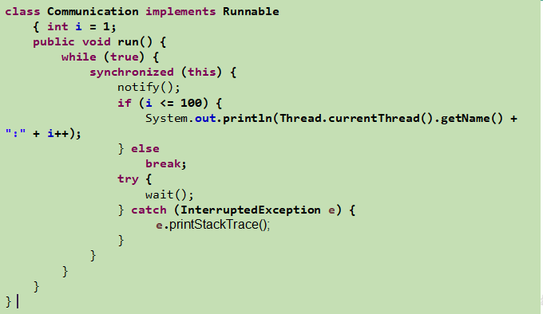

* wait() 与 notify() 和 notifyAll()
  * wait(): 令当前线程挂起并放弃CPU、同步资源并等待，使别的线程可访问并修改共享资源，而当前线程排队等候其他线程调用 notify（）或者 notifyAll（）方法唤醒，唤醒后等待重新获得对监视器的所有权后才能继续执行。
  * notify(): 唤醒正在排队等待同步资源的线程中优先级最高者结束等待。
  * notifyAll(): 唤醒正在排队等待资源的所有线程结束等待。
  * 这三个方法只有在 synchronized 方法或 synchronized 代码块中才能使用，否则会报 java.lang.IllegalMonitorStateException 异常。
  * 因为这三个方法必须有锁对象调用，而任意对象都可以作为synchronized的同步锁， 因此这三个方法只能在Object类中声明。

**wait() 方法**

* 在当前线程中调用方法：对象名.wait()
* 使当前线程进入等待（某对象）状态，直到另一线程对该对象发出 notify (或者是 notifyAll) 为止
* 调用方法的必要条件：当前线程必须具有对该对象的监控权（加锁）
* **调用此方法后，当前线程将释放对象监控权，然后进入等待**
* 在当前线程被notify后，要重新获得监控权，然后从断点处继续代码的执行

**notify() / notifyAll()**

* 在当前线程中调用方法：对象名.notify()
* 功能：唤醒等待该对象监控权的一个 / 所有线程
* 调用方法的必要条件：当前线程必须具有对该对象的监控权（加锁）

**经典例题：生产者 / 消费者问题**

* 生产者(Productor)将产品交给店员(Clerk)，而消费者(Customer)从店员处取走产品，店员一次只能持有固定数量的产品(比如:20），如果生产者试图生产更多的产品，店员会叫生产者停一下，如果店中有空位放产品了再通知生产者继续生产；如果店中没有产品了，店员会告诉消费者等一下，如果店中有产品了再通知消费者来取走产品。
* 这里可能出现两个问题：
  * 生产者比消费者快时，消费者会漏掉一些数据没有取到
  * 消费者比生产者快时，消费者会取相同的数据。

```java
package com.example.demo.test;
class Clerk { //售货员
    private int product = 0;
    public synchronized void addProduct() {
        if(product >= 20) {
            try {
                wait();
            } catch (InterruptedException e) {
                e.printStackTrace();
            }
        } else {
            product++;
            System.out.println("生产者生产了第" + product + "个产品");
            notifyAll();
        }
    }

    public synchronized void getProduct() {
        if(this.product <= 0) {
            try {
                wait();
            } catch (InterruptedException e) {
                e.printStackTrace();
            }
        } else {
            System.out.println("消费者取走了第" +product + "个产品");
            product--;
            notifyAll();
        }
    }
}
class Productor implements Runnable { //生产者
    Clerk clerk;

    public Productor(Clerk clerk) {
        this.clerk = clerk;
    }
    public void run() {
        System.out.println("生产者开始生产产品。。。");
        while (true) {
            try {
                Thread.sleep((int)Math.random() * 1000);
            } catch (InterruptedException e) {
                e.printStackTrace();
            }
            clerk.addProduct();
        }
    }

}
class Consumer implements Runnable {//消费者
    Clerk clerk;
    public Consumer(Clerk clerk) {
        this.clerk = clerk;
    }
    public void run() {
        System.out.println("消费者开始取走产品");
        while (true) {
            try {
                Thread.sleep((int)Math.random() * 1000);
            } catch (InterruptedException e) {
                e.printStackTrace();
            }
            clerk.getProduct();
        }
    }

}
public class BankTest {
    public static void main(String[] args) {
        Clerk clerk = new Clerk();
        Thread productorThread = new Thread(new Productor(clerk));
        Thread consumerThread = new Thread(new Consumer(clerk));
        productorThread.start();
        consumerThread.start();
    }
}
```

**练习**

**模拟银行取钱问题**

1.  定义一个Account类
   1. 该Account类封装了账户编号（String）和余额（double）两个属性
   2. 设置相应属性的getter和setter方法
   3. 提供无参和有两个参数的构造器
   4. 系统根据账号判断与用户是否匹配，需提供hashCode()和equals()方法的重写

2. 提供两个取钱的线程类：小明、小明’s wife
   1. 提供了Account类的account属性和double类的取款额的属性
   2. 提供带线程名的构造器
   3. run()方法中提供取钱的操作
3. 在主类中创建线程进行测试，考虑线程安全问题

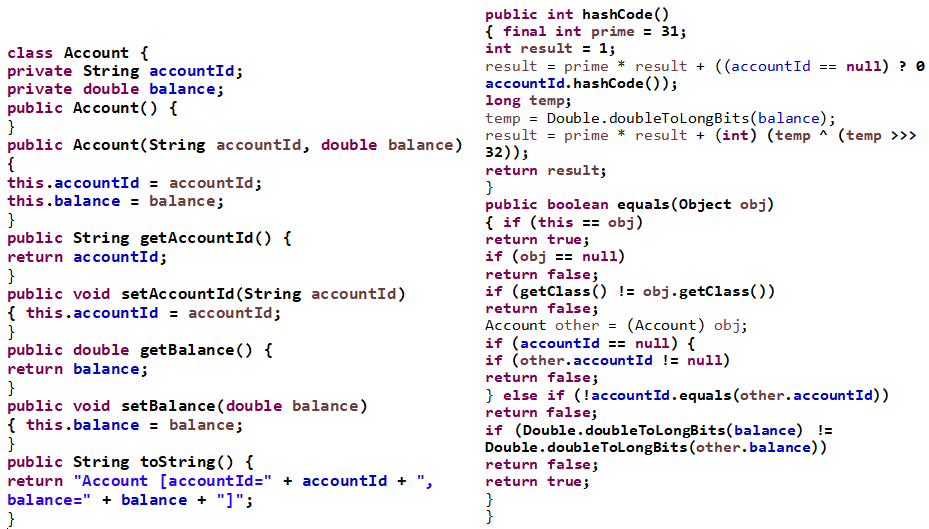

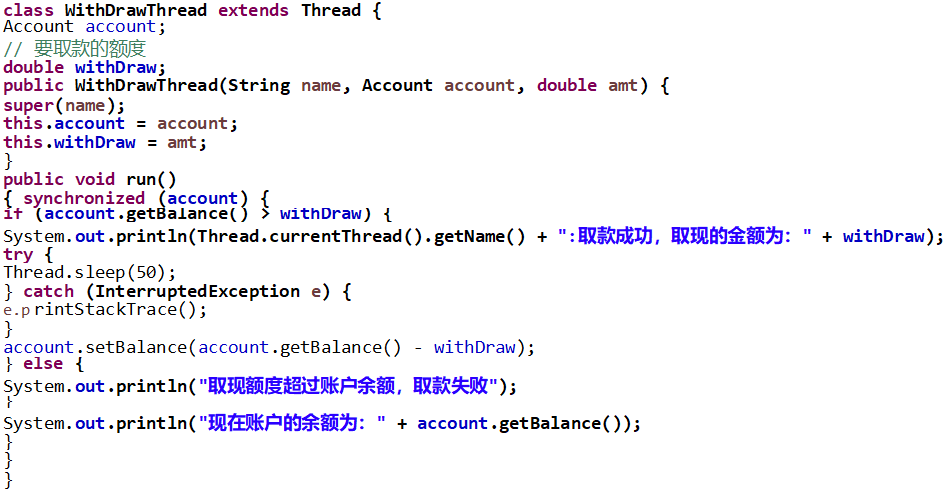


## JDK5.0 新增线程创建方式

**新增方式一：实现 Callable 接口**

* 与使用Runnable相比， Callable功能更强大些
  * 相比run()方法，可以有返回值
  * 方法可以抛出异常
  * 支持泛型的返回值
  * 需要借助FutureTask类，比如获取返回结果

* Future 接口
  * 可以对具体Runnable、Callable任务的执行结果进行取消、查询是  否完成、获取结果等
  * FutrueTask是Futrue接口的唯一的实现类
  * FutureTask 同时实现了Runnable, Future接口。它既可以作为Runnable被线程执行，又可以作为Future得到Callable的返回值

**新增方式二：使用线程池**

* **背景：**经常创建和销毁、使用量特别大的资源，比如并发情况下的线程， 对性能影响很大
* **思路：**提前创建好多个线程，放入线程池中，使用时直接获取，使用完放回池中。可以避免频繁创建毁、实现重复利用。类似生活中的公共交通工具。
* **好处：**
  * 提高响应速度（减少了创建新线程的时间）
  * 降低资源消耗（重复利用线程池中线程，不需要每次都创建）
  * 便于线程管理
    * corePoolSize：核心池的大小
    * maximumPoolSize：最大线程数
    * keepAliveTime：线程没有任务时最多保持多长时间后会终止
    * ...

**线程池 API**

* JDK 5.0 起提供了线程池相关API：ExecutorService 和 Executors
* ExecutorService: 真正的线程池接口。常见子类ThreadPoolExecutor
  * void execute(Runnable command) ：执行任务/命令，没有返回值，一般用来执行 Runnable
  *  <T> Future<T> submit(Callable<T> task)：执行任务，有返回值，一般用来执行Callable
  * void shutdown() ：关闭连接池

* Executors：工具类、线程池的工厂类，用于创建并返回不同类型的线程池
  * Executors.newCachedThreadPool()：创建一个可根据需要创建新线程的线程池
  * Executors.newFixedThreadPool(n); 创建一个可重用固定线程数的线程池
  * Executors.newSingleThreadExecutor() ：创建一个只有一个线程的线程池
  * Executors.newScheduledThreadPool(n)：创建一个线程池，它可安排在给定延迟后运行命令或者定期地执行。