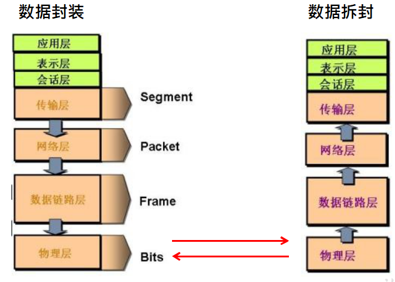
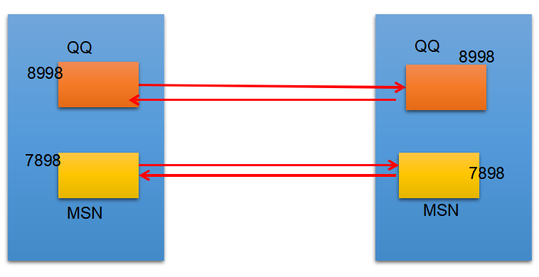
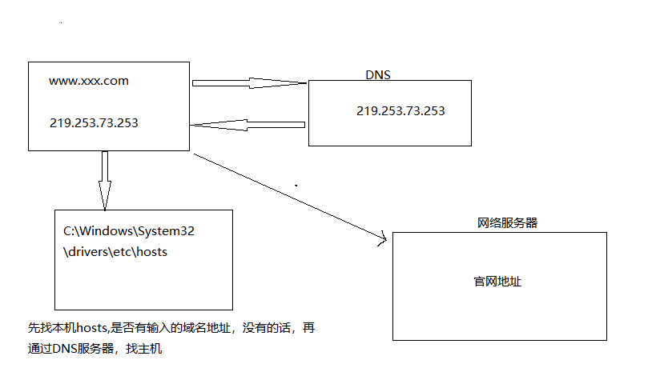
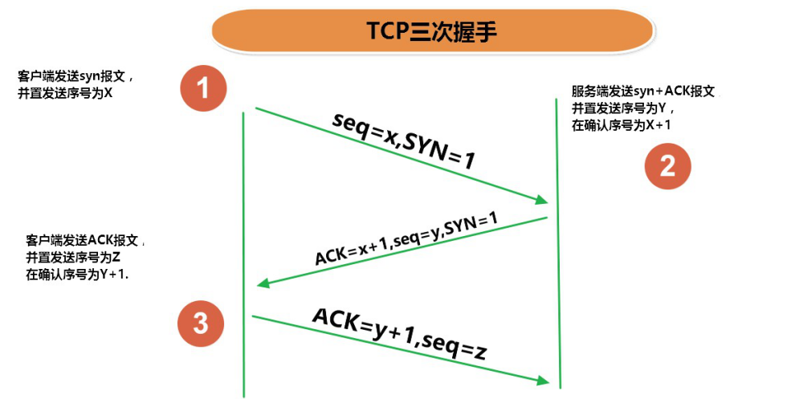
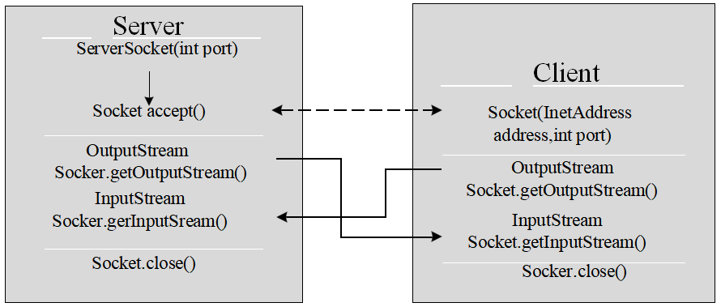
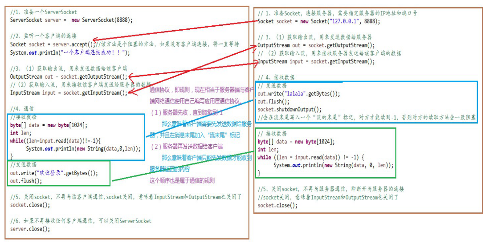
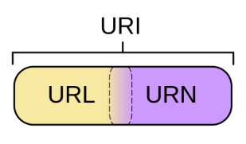

​	Java是 Internet 上的语言，它从语言级上提供了对网络应用程序的支持，程序员能够很容易开发常见的网络应用程序。Java提供的网络类库，可以实现无痛的网络连接，联网的底层细节被隐藏在 Java 的本机安装系统里，由 JVM 进行控制。并且 Java 实现了一个跨平台的网络库，程序员面对的是一个统一
的网络编程环境。

<!-- more -->

**网络基础**

* 计算机网络：
  * 把分布在不同地理区域的计算机与专门的外部设备用通信线路互连成一个规模大、功能强的网络系统，从而使众多的计算机可以方便地互相传递信息、共享硬件、软件、数据信息等资源。

* 网络编程的目的：
  * 直接或间接地通过网络协议与其它计算机实现数据交换，进行通讯。
  * 网络编程中有两个主要的问题：
  * 如何准确地定位网络上一台或多台主机；定位主机上的特定的应用
  * 找到主机后如何可靠高效地进行数据传输

## 网络通信要素概述

* IP和端口号
* 网络通信协议

**如何实现网络中的主机互相通信**

* 通信双方地址
  * IP
  * 端口号

* 一定规则（即：网络通信协议。有两套参考模型）
  * OSI 参考模型：模型过去理想化，未能在因特网上进行广泛推广
  * TCP/IP 参考模型（或TCP/IP）协议：事实上的国际标准

**网络通信协议**

| **参考模型** | **TCP/IP参考模型** | TCP/IP参考模型各层对应协议 |
| ------------ | ------------------ | -------------------------- |
| 应用层       | 应用层             | HTTP、FTP、Telnet、DNS…    |
| 表示层       | 应用层             | HTTP、FTP、Telnet、DNS…    |
| 会话层       | 应用层             | HTTP、FTP、Telnet、DNS…    |
| 传输层       | 传输层             | TCP、UDP、…                |
| 网络层       | 网络层             | IP、ICMP、ARP…             |
| 数据链路层   | 物理+数据链路层    | Link                       |



## 通信要素1：IP和端口号

* IP 地址：InetAddress
  * 唯一的标识 Internet 上的计算机（通信实体）
  * 本地回环地址(hostAddress)：127.0.0.1	主机名(hostName)：localhost
  * IP地址分类方式1：**IPV4** 和 **IPV6**
    * IPV4：4个字节组成，4个0-255。大概42亿，30亿都在北美，亚洲4亿。2011年初已经用尽。以点分十进制表示，如192.168.0.1
    * IPV6：128位（16个字节），写成8个无符号整数，每个整数用四个十六进制位表示，  数之间用冒号（：）分开，如：3ffe:3201:1401:1280:c8ff:fe4d:db39:1984

* 特点：不宜记忆
* **端口号**标识正在计算机上运行的进程（程序）
  * 不同的进程有不同的端口号
  * 被规定为一个 16 位的整数 0~65535。
  * 端口分类：
    * 公认端口：0~1023。被预先定义的服务通信占用（如：HTTP占用端口80，FTP占用端口21，Telnet占用端口23
    * 注册端口：1024~49151。分配给用户进程或应用程序。（如：Tomcat占用端口8080，MySQL占用端口3306，Oracle占用端口1521等）。
    * 动态/私有端口：49152~65535。

* 端口号与IP地址的组合得出一个网络套接字：Socket。



### InetAddress 类

* Internet上的主机有两种方式表示地址：
  * 域名(hostName)：www.xxx.com
  * IP 地址(hostAddress)：202.108.35.210

* InetAddress类主要表示IP地址，两个子类：Inet4Address、Inet6Address。
* InetAddress	类对象含有一个	Internet	主机地址的域名和 IP 地址：www.xxx.com 和  202.108.35.210。
* 域名容易记忆，当在连接网络时输入一个主机的域名后，域名服务器(DNS)负责将域名转化成IP地址，这样才能和主机建立连接。	**域名解析**



* InetAddress类没有提供公共的构造器，而是提供了如下几个静态方法来获取 InetAddress实例
  * public static InetAddress getLocalHost()
  * public static InetAddress getByName(String host)

* InetAddress提供了如下几个常用的方法
  * public String getHostAddress()：返回 IP 地址字符串（以文本表现形式）。
  * public String getHostName()：获取此 IP 地址的主机名
  * public boolean isReachable(int timeout)：测试是否可以达到该地址

**【InetAdress 代码示例】**

```java
InetAddress address_1 = InetAddress.getByName("www.xxx.com");

System.out.println(address_1);
// 获取 InetAddress 对象包含域名
System.out.println(address_1.getHostname());
// 获取InetAddress 对象所含的IP地址
System.out.println(address_1.getHostAddress());

// 获取本机的域名和 IP 地址
InetAddress address_2 = InetAddress.getLocalHost();
System.out.println(address_2);
```

## 通信要素2：网络协议

* **网络通信协议**
  * 计算机网络中实现通信必须有一些约定，即通信协议，对速率、传输代码、代码结构、传输控制步骤、出错控制等制定标准。

* **问题：网络协议太复杂**
  * 计算机网络通信涉及内容很多，比如指定源地址和目标地址，加密解密，压缩解压缩，差错控制，流量控制，路由控制，如何实现如此复杂的网络协议呢？

* **通信协议分层的思想**
  * 在制定协议时，把复杂成份分解成一些简单的成份，再将它们复合起来。最常用的复合方式是层次方式，即同层间可以通信、上一层可以调用下一层，而与再下一层不发生关系。各层互不影响，利于系统的开发和扩展。

### TCP/IP协议簇

*  传输层协议中有两个非常重要的协议：
  * 传输控制协议TCP(Transmission Control Protocol)
  * 用户数据报协议UDP(User Datagram Protocol)

* TCP/IP 以其两个主要协议：传输控制协议(TCP)和网络互联协议(IP)而得名，实际上是一组协议，包括多个具有不同功能且互为关联的协议。

* IP(Internet Protocol)协议是网络层的主要协议，支持网间互连的数据通信。
* TCP/IP协议模型从更实用的角度出发，形成了高效的四层体系结构，即物理链路层、IP层、传输层和应用层

### TCP 和 UDP

* **`TCP协议：`**
  * 使用TCP协议前，须先建立TCP连接，形成传输数据通道
  * 传输前，采用“**`三次握手`**”方式，点对点通信，**`是可靠的`**
  * TCP协议进行通信的两个应用进程：客户端、服务端
  * 在连接中可进**`行大数据量的传输`**
  * 传输完毕，需**`释放已建立的连接，效率低`**

* **`UDP协议：`**
  * 将数据、源、目的封装成数据包，**`不需要建立连接`**
  * 每个数据报的大小限制在64K内
  * 发送不管对方是否准备好，接收方收到也不确认，故是不可靠的
  * 可以广播发送
  * 发送数据结束时**`无需释放资源，开销小，速度快`**




### Socket

* 利用套接字(Socket)开发网络应用程序早已被广泛的采用，以至于成为事实上的标准。
* **网络上具有唯一标识的IP地址和端口号组合在一起才能构成唯一能识别的标识符套接字**。
* 通信的两端都要有Socket，是两台机器间通信的端点。
* 网络通信其实就是Socket间的通信。
* Socket允许程序把网络连接当成一个流，数据在两个Socket间通过IO传输。
* 一般主动发起通信的应用程序属客户端，等待通信请求的为服务端。
* Socket分类
  * 流套接字（stream socket）：使用TCP提供可依赖的字节流服务
  * 数据报套接字（datagram socket）：使用UDP提供“尽力而为”的数据报服务

* **Socket类的常用构造器：**
  * public Socket(InetAddress address,int port)创建一个流套接字并将其连接到指定IP 地址的指定端口号。
  * public Socket(String host,int port)创建一个流套接字并将其连接到指定主机上的指定端口号。

* **Socket类的常用方法：**
  * public InputStream getInputStream()返回此套接字的输入流。可以用于接收网络消息
  * public OutputStream getOutputStream()返回此套接字的输出流。可以用于发送网络消息
  * public InetAddress getInetAddress()此套接字连接到的远程 IP 地址；如果套接字是未连接的，则返回 null。
  * public InetAddress getLocalAddress()获取套接字绑定的本地地址。 即本端的IP地址
  * public int getPort()此套接字连接到的远程端口号；如果尚未连接套接字，则返回 0。
  * public int getLocalPort()返回此套接字绑定到的本地端口。 如果尚未绑定套接字，则返回 -1。即本端的端口号。
  * public void close()关闭此套接字。套接字被关闭后，便不可在以后的网络连接中使用（即无法重新连接或重新绑定）。需要创建新的套接字对象。 关闭此套接字也将会关闭该套接字的 InputStream 和OutputStream。
  * public void shutdownInput()如果在套接字上调用 shutdownInput() 后从套接字输入流读取内容，则流将返回EOF（文件结束符）。 即不能在从此套接字的输入流中接收任何数据。
  * public void shutdownOutput()禁用此套接字的输出流。对于 TCP 套接字，任何以前写入的数据都将被发送，并且后跟 TCP 的正常连接终止序列。 如果在套接字上调用 shutdownOutput() 后写入套接字输出流， 则该流将抛出 IOException。 即不能通过此套接字的输出流发送任何数据。

##  TCP网络编程

### 基于Socket的TCP编程

* Java语言的基于套接字编程分为服务端编程和客户端编程，其通信模型如图所示：

* 基于TCP的Socket通信：

  

* 客户端Socket的工作过程包含以下四个基本的步骤：
  * 创建 Socket：根据指定服务端的 IP 地址或端口号构造 Socket 类对象。若服务器端响应，则建立客户端到服务器的通信线路。若连接失败，会出现异常。
  * 打开连接到Socket 的输入/出流： 使用 getInputStream()方法获得输入流，使用getOutputStream()方法获得输出流，进行数据传输。
  * 按照一定的协议对Socket 进行读/写操作：通过输入流读取服务器放入线路的信息（但不能读取自己放入线路的信息），通过输出流将信息写入线程。
  * 关闭 Socket：断开客户端到服务器的连接，释放线路。

### 客户端创建Socket对象

* 客户端程序可以使用Socket 类创建对象，**创建的同时会自动向服务器方发起链接**。Socket 的构造器是：
  * Socket(String host,int port)throws UnknownHostException,IOException：向服务器(域名是host。端口号为port)发起TCP连接，若成功，则创建Socket对象，否则抛出异常。
  * Socket(InetAddress address,int port)throws IOException：根据InetAddress对象所表示的IP地址以及端口号port发起连接。

* 客户端建立socketAtClient对象的过程就是向服务器发出套接字连接请求

```java
Socket s = new Socket(“192.168.1.216”,8888);
OutputStream out = s.getOutputStream();
out.write(" hello".getBytes());
s.close();
```

**基于Socket的TCP编程**

* **服务器程序的工作过程包含以下四个基本的步骤：**
  * 调用 ServerSocket(int port) ：创建一个服务器端套接字，并绑定到指定端口上。用于监听客户端的请求。
  * 调用 accept()：监听连接请求，如果客户端请求连接，则接受连接，返回通信套接字对象。
  * 调用 该Socket类对象的 getOutputStream() 和 getInputStream ()：获取输出流和输入流，开始网络数据的发送和接收。
  * 关闭ServerSocket和Socket对象：客户端访问结束，关闭通信套接字。

### 服务器建立 ServerSocket 对象

* ServerSocket 对象负责等待客户端请求建立套接字连接，类似邮局某个窗口中的业务员。也就是说，**服务器必须事先建立一个等待客户请求建立套接字连接的ServerSocket对象。**

* 所谓“接收”客户的套接字请求，就是accept()方法会返回一个 Socket 对象。

  ```java
  ServerSocket ss = new ServerSocket(8888); 
  Socket s = ss.accept ();
  InputStream in = s.getInputStream(); 
  byte[] buf = new byte[1024];
  int num = in.read(buf);
  String str = new String(buf,0,num); System.out.println(s.getInetAddress().toString()+”:”+str); 
  s.close();
  ss.close();
  ```

**【例题】**

1. 客户端发送内容给服务端，服务端将内容打印到控制台上。

2. 客户端发送文件给服务端，服务端将文件保存在本地。

3. 从客户端发送文件给服务端，服务端保存到本地。并返回“发送成功”给客户端。并关闭相应的连接。



**【练习】**

```java
/**
 * 实现TCP的网络编程
 * 例子1：客户端发送信息给服务端，服务端将数据显示在控制台上
 *
 */
public class TCPTest1 {

    //客户端
    @Test
    public void client()  {
        Socket socket = null;
        OutputStream os = null;
        try {
            //1.创建Socket对象，指明服务器端的ip和端口号
            InetAddress inet = InetAddress.getByName("192.168.14.100");
            socket = new Socket(inet,8899);
            //2.获取一个输出流，用于输出数据
            os = socket.getOutputStream();
            //3.写出数据的操作
            os.write("你好，我是客户端mm".getBytes());
        } catch (IOException e) {
            e.printStackTrace();
        } finally {
            //4.资源的关闭
            if(os != null){
                try {
                    os.close();
                } catch (IOException e) {
                    e.printStackTrace();
                }

            }
            if(socket != null){
                try {
                    socket.close();
                } catch (IOException e) {
                    e.printStackTrace();
                }

            }
        }


    }
    //服务端
    @Test
    public void server()  {

        ServerSocket ss = null;
        Socket socket = null;
        InputStream is = null;
        ByteArrayOutputStream baos = null;
        try {
            //1.创建服务器端的ServerSocket，指明自己的端口号
            ss = new ServerSocket(8899);
            //2.调用accept()表示接收来自于客户端的socket
            socket = ss.accept();
            //3.获取输入流
            is = socket.getInputStream();

            //不建议这样写，可能会有乱码
//        byte[] buffer = new byte[1024];
//        int len;
//        while((len = is.read(buffer)) != -1){
//            String str = new String(buffer,0,len);
//            System.out.print(str);
//        }
            //4.读取输入流中的数据
            baos = new ByteArrayOutputStream();
            byte[] buffer = new byte[5];
            int len;
            while((len = is.read(buffer)) != -1){
                baos.write(buffer,0,len);
            }

            System.out.println(baos.toString());

            System.out.println("收到了来自于：" + socket.getInetAddress().getHostAddress() + "的数据");

        } catch (IOException e) {
            e.printStackTrace();
        } finally {
            if(baos != null){
                //5.关闭资源
                try {
                    baos.close();
                } catch (IOException e) {
                    e.printStackTrace();
                }
            }
            if(is != null){
                try {
                    is.close();
                } catch (IOException e) {
                    e.printStackTrace();
                }
            }
            if(socket != null){
                try {
                    socket.close();
                } catch (IOException e) {
                    e.printStackTrace();
                }
            }
            if(ss != null){
                try {
                    ss.close();
                } catch (IOException e) {
                    e.printStackTrace();
                }
            }

        }
    }
}
```

```java
/**
 *
 * 实现TCP的网络编程
 * 例题2：客户端发送文件给服务端，服务端将文件保存在本地。
 *
 */
public class TCPTest2 {

    /*
    这里涉及到的异常，应该使用try-catch-finally处理
     */
    @Test
    public void client() throws IOException {
        //1.
        Socket socket = new Socket(InetAddress.getByName("127.0.0.1"),9090);
        //2.
        OutputStream os = socket.getOutputStream();
        //3.
        FileInputStream fis = new FileInputStream(new File("beauty.jpg"));
        //4.
        byte[] buffer = new byte[1024];
        int len;
        while((len = fis.read(buffer)) != -1){
            os.write(buffer,0,len);
        }
        //5.
        fis.close();
        os.close();
        socket.close();
    }

    /*
    这里涉及到的异常，应该使用try-catch-finally处理
     */
    @Test
    public void server() throws IOException {
        //1.
        ServerSocket ss = new ServerSocket(9090);
        //2.
        Socket socket = ss.accept();
        //3.
        InputStream is = socket.getInputStream();
        //4.
        FileOutputStream fos = new FileOutputStream(new File("beauty1.jpg"));
        //5.
        byte[] buffer = new byte[1024];
        int len;
        while((len = is.read(buffer)) != -1){
            fos.write(buffer,0,len);
        }
        //6.
        fos.close();
        is.close();
        socket.close();
        ss.close();
    }
}
```

```java
/**
 * 实现TCP的网络编程
 * 例题3：从客户端发送文件给服务端，服务端保存到本地。并返回“发送成功”给客户端。
 * 并关闭相应的连接。
 */
public class TCPTest3 {

    /*
        这里涉及到的异常，应该使用try-catch-finally处理
         */
    @Test
    public void client() throws IOException {
        //1.
        Socket socket = new Socket(InetAddress.getByName("127.0.0.1"),9090);
        //2.
        OutputStream os = socket.getOutputStream();
        //3.
        FileInputStream fis = new FileInputStream(new File("beauty.jpg"));
        //4.
        byte[] buffer = new byte[1024];
        int len;
        while((len = fis.read(buffer)) != -1){
            os.write(buffer,0,len);
        }
        //关闭数据的输出
        socket.shutdownOutput();

        //5.接收来自于服务器端的数据，并显示到控制台上
        InputStream is = socket.getInputStream();
        ByteArrayOutputStream baos = new ByteArrayOutputStream();
        byte[] bufferr = new byte[20];
        int len1;
        while((len1 = is.read(buffer)) != -1){
            baos.write(buffer,0,len1);
        }

        System.out.println(baos.toString());

        //6.
        fis.close();
        os.close();
        socket.close();
        baos.close();
    }

    /*
    这里涉及到的异常，应该使用try-catch-finally处理
     */
    @Test
    public void server() throws IOException {
        //1.
        ServerSocket ss = new ServerSocket(9090);
        //2.
        Socket socket = ss.accept();
        //3.
        InputStream is = socket.getInputStream();
        //4.
        FileOutputStream fos = new FileOutputStream(new File("beauty2.jpg"));
        //5.
        byte[] buffer = new byte[1024];
        int len;
        while((len = is.read(buffer)) != -1){
            fos.write(buffer,0,len);
        }

        System.out.println("图片传输完成");

        //6.服务器端给予客户端反馈
        OutputStream os = socket.getOutputStream();
        os.write("你好，美女，照片我已收到，非常漂亮！".getBytes());

        //7.
        fos.close();
        is.close();
        socket.close();
        ss.close();
        os.close();

    }
}
```

## UDP网络编程

### UDP网络通信

* 类 DatagramSocket 和 DatagramPacket 实现了基于 UDP 协议网络程序。
* UDP数据报通过数据报套接字 DatagramSocket 发送和接收，系统不保证UDP数据报一定能够安全送到目的地，也不能确定什么时候可以抵达。
* DatagramPacket 对象封装了UDP数据报，在数据报中包含了发送端的IP 地址和端口号以及接收端的IP地址和端口号。
* UDP协议中每个数据报都给出了完整的地址信息，因此无须建立发送方和接收方的连接。如同发快递包裹一样。

### DatagramSocket 类的常用方法

* public DatagramSocket(int port)创建数据报套接字并将其绑定到本地主机上的指定端口。套接字将被绑定到通配符地址，IP 地址由内核来选择。
* public DatagramSocket(int port,InetAddress laddr)创建数据报套接字，将其绑定到指定的本地地址。本地端口必须在 0 到 65535 之间（包括两者）。如果 IP 地址为 0.0.0.0，套接字将被绑定到通配符地址，IP 地址由内核选择。
* public void close()关闭此数据报套接字。
* public void send(DatagramPacket p)从此套接字发送数据报包。DatagramPacket 包含的信息指示：将要发送的数据、其长度、远程主机的 IP 地址和远程主机的端口号。
* public void receive(DatagramPacket p)从此套接字接收数据报包。当此方法返回时，DatagramPacket 的缓冲区填充了接收的数据。数据报包也包含发送方的 IP 地址和发送方机器上的端口号。 此方法在接收到数据报前一直阻塞。数据报包对象的 length 字段包含所接收信息的长度。如果信息比包的长度长，该信息将被截短。
* public InetAddress getLocalAddress()获取套接字绑定的本地地址。
* public int getLocalPort()返回此套接字绑定的本地主机上的端口号。
* public InetAddress getInetAddress()返回此套接字连接的地址。如果套接字未连接，则返回null。
* public int getPort()返回此套接字的端口。如果套接字未连接，则返回 -1。

### DatagramPacket类的常用方法

* public DatagramPacket(byte[] buf,int length)构造 DatagramPacket，用来接收长度为length 的数据包。 length 参数必须小于等于 buf.length。
* public DatagramPacket(byte[] buf,int length,InetAddress address,int port)构造数据报包，用来将长度为 length 的包发送到指定主机上的指定端口号。length 参数必须小于等于buf.length。
* public InetAddress getAddress()返回某台机器的 IP 地址，此数据报将要发往该机器或者是从该机器接收到的。
* public int getPort()返回某台远程主机的端口号，此数据报将要发往该主机或者是从该主机接收到的。
* public byte[] getData()返回数据缓冲区。接收到的或将要发送的数据从缓冲区中的偏移量 offset 处开始，持续length 长度。
* public int getLength()返回将要发送或接收到的数据的长度。

### UDP网络通信

* 流 程：
  1. DatagramSocket与DatagramPacket
  2. 建立发送端，接收端
  3. 建立数据包
  4. 调用Socket的发送、接收方法
  5. 关闭Socket

* 发送端与接收端是两个独立的运行程序

**【发送端】**

```java
DatagramSocket ds = null;
try {
    ds = new DatagramSocket();
    byte[] by = "hello,atguigu.com".getBytes();
    DatagramPacket dp = new DatagramPacket(by, 0, by.length, 						InetAddress.getByName("127.0.0.1"), 10000);
    ds.send(dp);
} catch (Exception e) {
	e.printStackTrace();
} finally {
    if (ds != null)
    ds.close();
}
```

**【接收端】**

在接收端，要指定监听的端口。

```java
        DatagramSocket ds = null; 
        try {
            ds = new DatagramSocket(10000); byte[] by = new byte[1024];
            DatagramPacket dp = new DatagramPacket(by, by.length);
            ds.receive(dp);
            String str = new String(dp.getData(), 0, dp.getLength());
            System.out.println(str + "--" + dp.getAddress());
        } catch (Exception e) {
            e.printStackTrace();
        } finally {
            if (ds != null)
                ds.close();
        }
```

**【练习】**

```java
/**
 * UDPd协议的网络编程
 */
public class UDPTest {

    //发送端
    @Test
    public void sender() throws IOException {

        DatagramSocket socket = new DatagramSocket();


        String str = "我是UDP方式发送的导弹";
        byte[] data = str.getBytes();
        InetAddress inet = InetAddress.getLocalHost();
        DatagramPacket packet = new DatagramPacket(data,0,data.length,inet,9090);

        socket.send(packet);

        socket.close();

    }
    //接收端
    @Test
    public void receiver() throws IOException {

        DatagramSocket socket = new DatagramSocket(9090);

        byte[] buffer = new byte[100];
        DatagramPacket packet = new DatagramPacket(buffer,0,buffer.length);

        socket.receive(packet);

        System.out.println(new String(packet.getData(),0,packet.getLength()));

        socket.close();
    }
}
```

## URL编程

### URL类

* `URL(Uniform Resource Locator)：`统一资源定位符，它表示 Internet 上`某一资源`的地址。
* 它是一种具体的URI，即URL可以用来标识一个资源，而且还指明了如何locate这个资源。
* 通过 URL 我们可以访问 Internet 上的各种网络资源，比如最常见的 www，ftp站点。浏览器通过解析给定的 URL 可以在网络上查找相应的文件或其他资源。
* URL的基本结构由5部分组成：
  * <传输协议>://<主机名>:<端口号>/<文件名>#片段名?参数列表
    * 例 如 : http://192.168.1.100:8080/helloworld/index.jsp#a?username=cactus&password=123
    * #片段名：即锚点，例如看小说，直接定位到章节
    * 参数列表格式：参数名=参数值&参数名=参数值....

### URL类构造器

* 为了表示URL，java.net 中实现了类 URL。我们可以通过下面的构造器来初始化一个 URL 对象：

  * public URL (String spec)：通过一个表示URL地址的字符串可以构造一个URL对象。

    例如：URL url = new URL ("http://www. xxx.com/");

  * public URL(URL context, String spec)：通过基 URL 和相对 URL 构造一个 URL 对象。

    例如：URL downloadUrl = new URL(url, “download.html")

  * public URL(String protocol, String host, String file); 

    例如：new URL("http", "www.xxx.com", “download. html");

  * public URL(String protocol, String host, int port, String file); 

    例如: URL gamelan = new URL("http", "www.xxx.com", 80, “download.html");

* URL类的构造器都声明抛出非运行时异常，必须要对这一异常进行处理，通常是用 try-catch 语句进行捕获。

### URL类常用方法

* 一个URL对象生成后，其属性是不能被改变的，但可以通过它给定的方法来获取这些属性：
  * public String getProtocol( )	获取该URL的协议名
  * public String getHost( )	       获取该URL的主机名
  * public String getPort( )	        获取该URL的端口号
  * public String getPath( )	       获取该URL的文件路径
  * public String getFile( )	         获取该URL的文件名
  * public String getQuery()	      获取该URL的查询名

```java
URL url = new URL("http://localhost:8080/examples/myTest.txt"); System.out.println("getProtocol() :"+url.getProtocol()); System.out.println("getHost() :"+url.getHost()); 
System.out.println("getPort() :"+url.getPort()); 
System.out.println("getPath() :"+url.getPath()); 
System.out.println("getFile() :"+url.getFile());
System.out.println("getQuery() :"+url.getQuery());
```

### URLConnection类

**针对HTTP协议的URLConnection类**

* **`URL的方法 openStream()：能从网络上读取数据`**
* 若希望输出数据，例如向服务器端的 CGI （公共网关接口-Common Gateway Interface-的简称，是用户浏览器和服务器端的应用程序进行连接的接口）程序发送一些数据，则必须先与URL建立连接，然后才能对其进行读写，此时需要使用URLConnection 。
* URLConnection：表示到URL所引用的远程对象的连接。当与一个URL建立连接时， 首先要在一个 URL 对象上通过方法 openConnection() 生成对应的 URLConnection 对象。如果连接过程失败，将产生IOException。
  * URL netchinaren = new URL ("http://www.xxx.com/index.html");
  * URLConnectonn u = netchinaren.openConnection( );

* 通过URLConnection对象获取的输入流和输出流，即可以与现有的CGI程序进行交互。
  * public Object getContent( ) throws IOException
  * public int getContentLength( )
  * public String getContentType( )
  * public long getDate( )
  * public long getLastModified( )
  * public InputStream getInputStream( )throws IOException
  * public OutputSteram getOutputStream( )throws IOException

### URI、URL和URN的区别

**`URI，是uniform resource identifier，统一资源标识符`**，用来唯一的标识一个资源。而**`URL是uniform resource locator，统一资源定位符`**，它是一种具体的URI，即URL可以用来标识一个资源，而且还指明了如何locate这个资源。而URN，uniform resource name，统一资源命名，是通过名字来标识资源， 比如mailto:java-net@java.sun.com。也就是说，URI是以一种抽象的，高层次概念定义统一资源标识，而URL和URN则是具体的资源标识的方式。URL 和URN都是一种URI。

在Java的URI中，一个URI实例可以代表绝对的，也可以是相对的，只要它符合URI的语法规则。而URL类则不仅符合语义，还包含了定位该资源的信息，因此它不能是相对的。



* 位于网络中的计算机具有唯一的IP地址，这样不同的主机可以互相区分。

* **`客户端－服务器`**是一种最常见的网络应用程序模型。服务器是一个为其客户端提供某种特定服务的硬件或软件。客户机是一个用户应用程序，用于访问某台服务器提供的服务。端口号  是对一个服务的访问场所，它用于区分同一物理计算机上的多个服务。套接字用于连接客户  端和服务器，客户端和服务器之间的每个通信会话使用一个不同的套接字。TCP协议用于实  现面向连接的会话。
* Java 中有关网络方面的功能都定义在 java.net 程序包中。Java 用 InetAddress 对象表示 **IP地址**，该对象里有两个字段：主机名(String) 和 IP 地址(int)。
* 类 Socket 和 ServerSocket 实现了基于TCP协议的客户端－服务器程序。Socket是客户端和服务器之间的一个连接，连接创建的细节被隐藏了。这个连接提供了一个安全的数据传输  通道，这是因为 TCP 协议可以解决数据在传送过程中的丢失、损坏、重复、乱序以及网络拥挤等问题，它保证数据可靠的传送。
* 类 URL 和 URLConnection 提供了最高级网络应用。URL 的网络资源的位置来同一表示Internet 上各种网络资源。通过URL对象可以创建当前应用程序和 URL 表示的网络资源之间的连接，这样当前程序就可以读取网络资源数据，或者把自己的数据传送到网络上去。

**【练习】**

```java
/**
 * URL网络编程
 * 1.URL:统一资源定位符，对应着互联网的某一资源地址
 * 2.格式：
 *  http://localhost:8080/examples/beauty.jpg?username=Tom
 *  协议   主机名    端口号  资源地址           参数列表
 *
 */
public class URLTest {

    public static void main(String[] args) {

        try {

            URL url = new URL("http://localhost:8080/examples/beauty.jpg?username=Tom");

//            public String getProtocol(  )     获取该URL的协议名
            System.out.println(url.getProtocol());
//            public String getHost(  )           获取该URL的主机名
            System.out.println(url.getHost());
//            public String getPort(  )            获取该URL的端口号
            System.out.println(url.getPort());
//            public String getPath(  )           获取该URL的文件路径
            System.out.println(url.getPath());
//            public String getFile(  )             获取该URL的文件名
            System.out.println(url.getFile());
//            public String getQuery(   )        获取该URL的查询名
            System.out.println(url.getQuery());


        } catch (MalformedURLException e) {
            e.printStackTrace();
        }

    }


}
```

```
public class URLTest1 {

    public static void main(String[] args) {

        HttpURLConnection urlConnection = null;
        InputStream is = null;
        FileOutputStream fos = null;
        try {
            URL url = new URL("http://localhost:8080/examples/beauty.jpg");

            urlConnection = (HttpURLConnection) url.openConnection();

            urlConnection.connect();

            is = urlConnection.getInputStream();
            fos = new FileOutputStream("cvb\\beauty3.jpg");

            byte[] buffer = new byte[1024];
            int len;
            while((len = is.read(buffer)) != -1){
                fos.write(buffer,0,len);
            }

            System.out.println("下载完成");
        } catch (IOException e) {
            e.printStackTrace();
        } finally {
            //关闭资源
            if(is != null){
                try {
                    is.close();
                } catch (IOException e) {
                    e.printStackTrace();
                }
            }
            if(fos != null){
                try {
                    fos.close();
                } catch (IOException e) {
                    e.printStackTrace();
                }
            }
            if(urlConnection != null){
                urlConnection.disconnect();
            }
        }

    }
}
```

