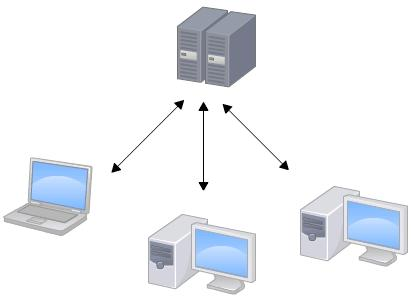
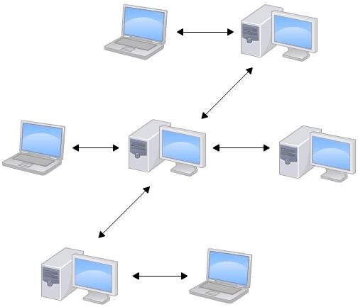
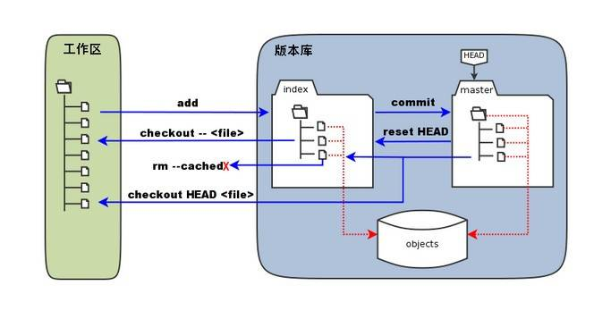

Git 的诞生，集中式 vs 分布式，工作区、暂存区和版本库，Git 与 SVN 的区别。

<!-- more -->

# Git的诞生

很多人都知道，Linus在1991年创建了开源的Linux，从此，Linux系统不断发展，已经成为最大的服务器系统软件了。

Linus虽然创建了Linux，但Linux的壮大是靠全世界热心的志愿者参与的，这么多人在世界各地为Linux编写代码，那Linux的代码是如何管理的呢？

事实是，在2002年以前，世界各地的志愿者把源代码文件通过diff的方式发给Linus，然后由Linus本人通过手工方式合并代码！

你也许会想，为什么Linus不把Linux代码放到版本控制系统里呢？不是有CVS、SVN这些免费的版本控制系统吗？因为Linus坚定地反对CVS和SVN，这些集中式的版本控制系统不但速度慢，而且必须联网才能使用。有一些商用的版本控制系统，虽然比CVS、SVN好用，但那是付费的，和Linux的开源精神不符。

不过，到了2002年，Linux系统已经发展了十年了，代码库之大让Linus很难继续通过手工方式管理了，社区的弟兄们也对这种方式表达了强烈不满，于是Linus选择了一个商业的版本控制系统BitKeeper，BitKeeper的东家BitMover公司出于人道主义精神，授权Linux社区免费使用这个版本控制系统。

安定团结的大好局面在2005年就被打破了，原因是Linux社区牛人聚集，不免沾染了一些梁山好汉的江湖习气。开发Samba的Andrew试图破解BitKeeper的协议（这么干的其实也不只他一个），被BitMover公司发现了（监控工作做得不错！），于是BitMover公司怒了，要收回Linux社区的免费使用权。

Linus可以向BitMover公司道个歉，保证以后严格管教弟兄们，嗯，这是不可能的。实际情况是这样的：

Linus花了两周时间自己用C写了一个分布式版本控制系统，这就是Git！一个月之内，Linux系统的源码已经由Git管理了！牛是怎么定义的呢？大家可以体会一下。

Git迅速成为最流行的分布式版本控制系统，尤其是2008年，GitHub网站上线了，它为开源项目免费提供Git存储，无数开源项目开始迁移至GitHub，包括jQuery，PHP，Ruby等等。

历史就是这么偶然，如果不是当年BitMover公司威胁Linux社区，可能现在我们就没有免费而超级好用的Git了。

# 集中式vs分布式

Linus一直痛恨的CVS及SVN都是集中式的版本控制系统，而Git是分布式版本控制系统，集中式和分布式版本控制系统有什么区别呢？

先说集中式版本控制系统，版本库是集中存放在中央服务器的，而干活的时候，用的都是自己的电脑，所以要先从中央服务器取得最新的版本，然后开始干活，干完活了，再把自己的活推送给中央服务器。中央服务器就好比是一个图书馆，你要改一本书，必须先从图书馆借出来，然后回到家自己改，改完了，再放回图书馆。



集中式版本控制系统最大的毛病就是必须联网才能工作，如果在局域网内还好，带宽够大，速度够快，可如果在互联网上，遇到网速慢的话，可能提交一个10M的文件就需要5分钟，这还不得把人给憋死啊。

那分布式版本控制系统与集中式版本控制系统有何不同呢？首先，分布式版本控制系统根本没有“中央服务器”，每个人的电脑上都是一个完整的版本库，这样，你工作的时候，就不需要联网了，因为版本库就在你自己的电脑上。既然每个人电脑上都有一个完整的版本库，那多个人如何协作呢？比方说你在自己电脑上改了文件A，你的同事也在他的电脑上改了文件A，这时，你们俩之间只需把各自的修改推送给对方，就可以互相看到对方的修改了。

和集中式版本控制系统相比，分布式版本控制系统的安全性要高很多，因为每个人电脑里都有完整的版本库，某一个人的电脑坏掉了不要紧，随便从其他人那里复制一个就可以了。而集中式版本控制系统的中央服务器要是出了问题，所有人都没法干活了。

在实际使用分布式版本控制系统的时候，其实很少在两人之间的电脑上推送版本库的修改，因为可能你们俩不在一个局域网内，两台电脑互相访问不了，也可能今天你的同事病了，他的电脑压根没有开机。因此，分布式版本控制系统通常也有一台充当“中央服务器”的电脑，但这个服务器的作用仅仅是用来方便“交换”大家的修改，没有它大家也一样干活，只是交换修改不方便而已。



当然，Git的优势不单是不必联网这么简单，后面我们还会看到Git极其强大的分支管理，把SVN等远远抛在了后面。

CVS作为最早的开源而且免费的集中式版本控制系统，直到现在还有不少人在用。由于CVS自身设计的问题，会造成提交文件不完整，版本库莫名其妙损坏的情况。同样是开源而且免费的SVN修正了CVS的一些稳定性问题，是目前用得最多的集中式版本库控制系统。

除了免费的外，还有收费的集中式版本控制系统，比如IBM的ClearCase（以前是Rational公司的，被IBM收购了），特点是安装比Windows还大，运行比蜗牛还慢，能用ClearCase的一般是世界500强，他们有个共同的特点是财大气粗，或者人傻钱多。

微软自己也有一个集中式版本控制系统叫VSS，集成在Visual Studio中。由于其反人类的设计，连微软自己都不好意思用了。

分布式版本控制系统除了Git以及促使Git诞生的BitKeeper外，还有类似Git的Mercurial和Bazaar等。这些分布式版本控制系统各有特点，但最快、最简单也最流行的依然是Git！

# 基本概念

我们先来理解下Git 工作区、暂存区和版本库概念
**工作区：** 就是你在电脑里能看到的目录。
**暂存区：** 英文叫stage, 或index。一般存放在"git目录"下的index文件（.git/index）中，所以我们把暂存区有时也叫作索引（index）。
**版本库：** 工作区有一个隐藏目录.git，这个不算工作区，而是Git的版本库。

下面这个图展示了工作区、版本库中的暂存区和版本库之间的关系：



左侧为工作区，右侧为版本库

在版本库中标记为 "index" 的区域是暂存区（stage, index），标记为 "master" 的是 master 分支所代表的目录树。

图中我们可以看出此时 "HEAD" 实际是指向 master 分支的一个"游标"。
所以图示的命令中出现 HEAD 的地方可以用 master 来替换。

图中的 `objects` 标识的区域为 Git 的对象库，实际位于 `.git/objects`目录下，里面包含了创建的各种对象及内容。

当对工作区修改（或新增）的文件执行 `git add` 命令时，暂存区的目录树被更新，同时工作区修改（或新增）的文件内容被写入到对象库中的一个新的对象中，而该对象的ID被记录在暂存区的文件索引中。

当执行提交操作`git commit`时，暂存区的目录树写到版本库（对象库）中，master 分支会做相应的更新。即 master 指向的目录树就是提交时暂存区的目录树。

当执行 `git reset HEAD` 命令时，暂存区的目录树会被重写，被 `master` 分支指向的目录树所替换，但是工作区不受影响。

当执行 `git rm --cached `命令时，会直接从暂存区删除文件，工作区则不做出改变。

当执行 `git checkout .` 或者 `git checkout -- ` 命令时，会用暂存区全部或指定的文件替换工作区的文件。这个操作很危险，会清除工作区中未添加到暂存区的改动。

当执行`git checkout HEAD .` 或者 `git checkout HEAD `命令时，会用 HEAD 指向的 master 分支中的全部或者部分文件替换暂存区和以及工作区中的文件。这个命令也是极具危险性的，因为不但会清除工作区中未提交的改动，也会清除暂存区中未提交的改动。

# Git 与 SVN 区别

GIT不仅仅是个版本控制系统，它也是个内容管理系统(CMS),工作管理系统等。
如果你是一个具有使用SVN背景的人，你需要做一定的思想转换，来适应GIT提供的一些概念和特征。

如果你是一个具有使用SVN背景的人，你需要做一定的思想转换，来适应GIT提供的一些概念和特征。

**Git 与 SVN 区别点：**

1. GIT是分布式的，SVN不是：这是GIT和其它非分布式的版本控制系统，例如SVN，CVS等，最核心的区别。
2. GIT把内容按元数据方式存储，而SVN是按文件：所有的资源控制系统都是把文件的元信息隐藏在一个类似.svn,.cvs等的文件夹里。
3. GIT分支和SVN的分支不同：分支在SVN中一点不特别，就是版本库中的另外的一个目录。
4. GIT没有一个全局的版本号，而SVN有：目前为止这是跟SVN相比GIT缺少的最大的一个特征。
5. GIT的内容完整性要优于SVN：GIT的内容存储使用的是SHA-1哈希算法。这能确保代码内容的完整性，确保在遇到磁盘故障和网络问题时降低对版本库的破坏。

# 常见问题

```shell
gitThere is no tracking information for the current branch.

Please specify which branch you want to merge with.

See git-pull(1) for details

    git pull <remote> <branch>
    
If you wish to set tracking information for this branch you can do so with:

    git branch --set-upstream-to=origin/<branch> merged0.9.6
```

> 新建本地分支后将本地分支推送到远程库, 使用git pull 或者 git push 的时候报错

是因为本地分支和远程分支没有建立联系 (使用git branch -vv 可以查看本地分支和远程分支的关联关系) .根据命令行提示只需要执行以下命令即可

git branch --set-upstream-to=origin/远程分支的名字 本地分支的名字
如：

```shell
git branch --set-upstream master origin/master
```

### Please move or remove them before you can merge

在使用git pull时,经常会遇到报错:
**Please move or remove them before you can merge**

这是因为本地有修改,与云端别人提交的修改冲突,又没有**merge**.

如果确定使用云端的代码,最方便的解决方法是删除本地修改,可以使用以下命令:

```shell
git clean  -d  -fx ""
d  -----删除未被添加到git的路径中的文件
f  -----强制运行
x  -----删除忽略文件已经对git来说不识别的文件
```

注意:该命令会删除本地的修改,最好先备份再使用

```shell
git clean 参数 
-n 显示 将要 删除的 文件 和 目录 
-f 删除 文件，-df 删除 文件 和 目录

git clean -n
git clean -df
git clean -f
```

<h3>the branch XXX is not fully merged</h3>
提示: the branch XXX is not fully merged

**解决方法：** 使用大写的D 强制删除 git branch -D XXX

# .gitignore

**配置语法：**

```
以斜杠“/”开头表示目录；
以星号“*”通配多个字符；
以问号“?”通配单个字符
以方括号“[]”包含单个字符的匹配列表；
以叹号“!”表示不忽略(跟踪)匹配到的文件或目录；
此外，git 对于 .ignore 配置文件是按行从上到下进行规则匹配的，意味着如果前面的规则匹配的范围更大，则后面的规则将不会生效；
```

此外，git 对于`.gitignore`配置文件是按行从上到下进行规则匹配的，如果前面的规则匹配的范围更大，则后面的规则将不会生效；

## 示例：

**忽略目录 fd1 下的全部内容**

```shell
fd1/* 
```

注意，不管是根目录下的 /fd1/ 目录，还是某个子目录 /child/fd1/ 目录，都会被忽略；

**忽略根目录下的 /fd1/ 目录的全部内容
**

```shell
/fd1/* 
```

> 要注意以上两个示例的区别

```shell
/*
!.gitignore
!/fw/bin/
!/fw/sf/
 
```

说明：忽略全部内容，但是不忽略 .gitignore 文件、根目录下的 /fw/bin/ 和 /fw/sf/ 目录

**过滤整个文件夹**

```shell
/mtk/
```

**过滤所有.zip文件**

```shell
*.zip
```

**过滤某个具体文件**

```shell
/mtk/do.c
```

## 注意事项

如果你不慎在创建.gitignore文件之前就push了项目，那么即使你在.gitignore文件中写入新的过滤规则，这些规则也不会起作用，Git仍然会对所有文件进行版本管理。

不要误解了 .gitignore 文件的用途，该文件只能作用于 Untracked Files，也就是那些从来没有被 Git 记录过的文件（自添加以后，从未 add 及 commit 过的文件）。
如果文件曾经被 Git 记录过，那么.gitignore 就对它们完全无效。

## 重置.gitignore规则

```shell
git rm -r --cached .
git add .
git commit -m 'update .gitignore'
```

[《Pro Git》](http://iissnan.com/progit/)学习笔记