本章主要介绍 Java集合框架概述，Collection接口方法，Iterator迭代器接口，Collection子接口一：List，Collection子接口二：Set，Map接口，Collections工具类的使用方法以及相关的 API。

<!-- more -->

## Java集合框架概述

* 一方面， 面向对象语言对事物的体现都是以对象的形式，为了方便对多个对象的操作，就要对对象进行存储。另一方面，使用Array存储对象方面具有`一些弊端`，而Java 集合就像一种容器，可以动态地把多个对象的引用放入容器中。
  * **数组在内存存储方面的特点：**
    * 数组初始化以后，长度就确定了。
    * 数组声明的类型，就决定了进行元素初始化时的类型
  * **数组在存储数据方面的弊端：**
    * 数组初始化以后，长度就不可变了，不便于扩展
    * 数组中提供的属性和方法少，不便于进行添加、删除、插入等操作，且效率不高。同时无法直接获取存储元素的个数
    * 数组存储的数据是有序的、可以重复的。	>存储数据的特点单一
  * Java 集合类可以用于存储数量不等的多个对象，还可用于保存具有映射关系的关联数组。

### Java 集合框架概述：集合的使用场景

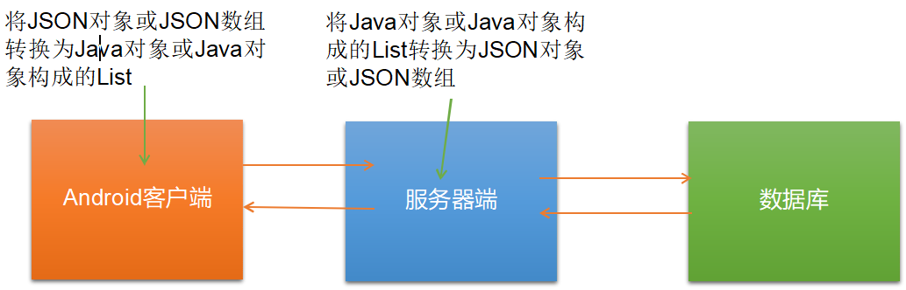

***Java 集合可分为 Collection 和 Map 两种体系***

* `Collection接口：`单列数据，定义了存取一组对象的方法的集合
  * `List：`元素有序、可重复的集合
  * `Set：`元素无序、不可重复的集合

* `Set：`元素无序、不可重复的集合

**Java 集合框架概述：Collection接口继承树**

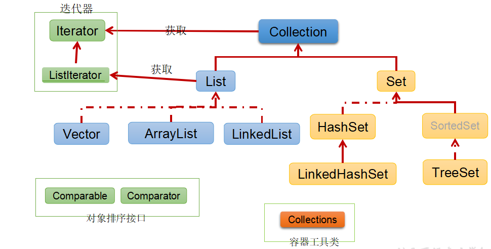

> JDK提供的集合API位于java.util包内

**Java 集合框架概述：Map接口继承树**

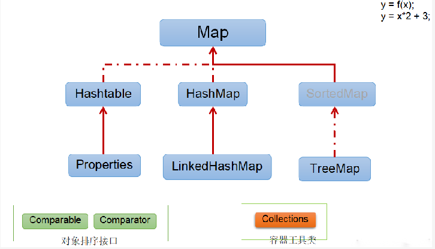

## Collection接口方法

**Collection 接口**

* Collection 接口是 List、Set 和 Queue 接口的父接口，该接口里定义的方法既可用于操作 Set 集合，也可用于操作 List 和 Queue 集合。
* JDK不提供此接口的任何直接实现，而是提供更具体的子接口(如：Set和List)实现。
* 在 Java5 之前，Java 集合会丢失容器中所有对象的数据类型，把所有对象都当成 Object 类型处理；从 JDK 5.0 增加了泛型以后，Java 集合可以记住容器中对象的数据类型。

1. 添加

   add(Object obj)

   addAll(Collection coll) 

2. 获取有效元素的个数

   int size() 

3. 清空集合

   void clear()

4. 是否是空集合

   boolean isEmpty() 

5. 是否包含某个元素

   boolean contains(Object obj)：是通过元素的equals方法来判断是否

   是同一个对象

   boolean containsAll(Collection c)：也是调用元素的equals方法来比较的。拿两个集合的元素挨个比较。

6. 删除

   boolean remove(Object obj) ：通过元素的equals方法判断是否是要删除的那个元素。只会删除找到的第一个元素

   boolean removeAll(Collection coll)：取当前集合的差集

7. 取两个集合的交集

   boolean retainAll(Collection c)：把交集的结果存在当前集合中，不影响c

8. 集合是否相等

   boolean equals(Object obj) 

9. 转成对象数组

   Object[] toArray()

10. 获取集合对象的哈希值

    hashCode() 

11. 遍历

    iterator()：返回迭代器对象，用于集合遍历

## Iterator迭代器接口

**Iterator迭代器接口**

* Iterator对象称为迭代器(设计模式的一种)，主要用于遍历 Collection 集合中的元素。
* GOF给迭代器模式的定义为：提供一种方法访问一个容器(container)对象中各个元素，而又不需暴露该对象的内部细节。迭代器模式，就是为容器而生。类似于“公交车上的售票员”、“火车上的乘务员”、“空姐”。
* Collection接口继承了java.lang.Iterable接口，该接口有一个iterator()方法，那么所有实现了Collection接口的集合类都有一个iterator()方法，用以返回一个实现了Iterator接口的对象。
* `Iterator 仅用于遍历集合`，Iterator 本身并不提供承装对象的能力。如果需要创建Iterator 对象，则必须有一个被迭代的集合。
* `集合对象每次调用iterator()方法都得到一个全新的迭代器对象`，默认游标都在集合的第一个元素之前。

**Iterator接口的方法**

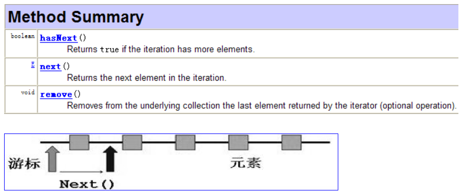

> 在调用it.next()方法之前必须要调用it.hasNext()进行检测。若不调用，且下一条记录无效，直接调用it.next()会抛出NoSuchElementException异常。

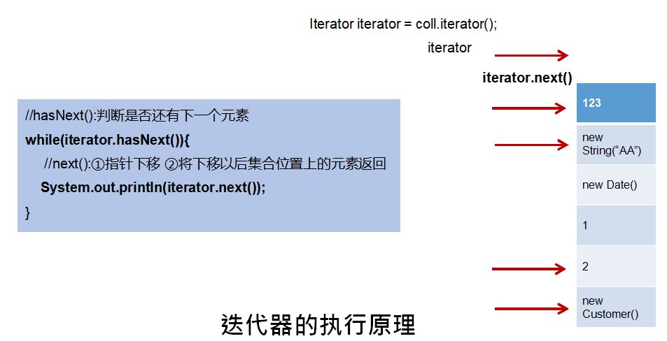

**Iterator接口remove()方法**

```java
Iterator iter = coll.iterator();//回到起点
while(iter.hasNext()){
    Object obj = iter.next();
    if(obj.equals("Tom")){
    	iter.remove();
    }
}
```

* **注意：**
  * Iterator可以删除集合的元素，但是是遍历过程中通过迭代器对象的remove方法，不是集合对象的remove方法。
  * 如果还未调用next()或在上一次调用 next 方法之后已经调用了 remove 方法，再调用remove都会报IllegalStateException。

**使用 foreach 循环遍历集合元素**

* Java 5.0 提供了 foreach 循环迭代访问 Collection和数组。

* 遍历操作不需获取Collection或数组的长度，无需使用索引访问元素。

* `遍历集合的底层调用Iterator完成操作。`

* foreach还可以用来遍历数组。

  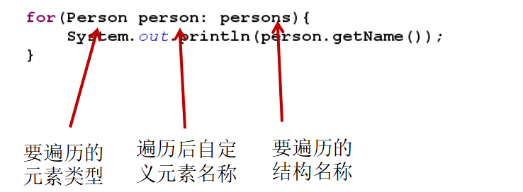

**练习：判断输出结果为何？**

```java
public class ForTest {
    public static void main(String[] args) {
        String[] str = new String[5];
        for (String myStr : str) { 
            myStr = "xianrenqiu ...."; 
            System.out.println(myStr); // xianrenqiu ....
        }
        for (int i = 0; i < str.length; i++) {
        	System.out.println(str[i]); // null ....
        }
    }
}
```

## Collection子接口之一：List接口

**List接口概述**

* 鉴于Java中数组用来存储数据的局限性，我们通常使用List替代数组
* List集合类中元素有序、且可重复，集合中的每个元素都有其对应的顺序索引。
* List容器中的元素都对应一个整数型的序号记载其在容器中的位置，可以根据序号存取容器中的元素。
* JDK API中List接口的实现类常用的有：ArrayList、LinkedList和Vector。

**List接口方法**

* List除了从Collection集合继承的方法外，List 集合里添加了一些根据索引来操作集合元素的方法。
  * void add(int index, Object ele):在index位置插入ele元素
  * boolean addAll(int index, Collection eles):从index位置开始将eles中的所有元素添加进来
  * Object get(int index):获取指定index位置的元素
  * int indexOf(Object obj):返回obj在集合中首次出现的位置
  * int lastIndexOf(Object obj):返回obj在当前集合中末次出现的位置
  * Object remove(int index):移除指定index位置的元素，并返回此元素
  * Object set(int index, Object ele):设置指定index位置的元素为ele
  * List subList(int fromIndex, int toIndex):返回从fromIndex到toIndex位置的子集合

### List实现类之一：ArrayList

* ArrayList 是 List 接口的典型实现类、主要实现类
* 本质上，ArrayList是对象引用的一个”变长”数组
* `ArrayList的JDK1.8之前与之后的实现区别？`
  * JDK1.7：ArrayList像饿汉式，直接创建一个初始容量为10的数组
  * JDK1.8：ArrayList像懒汉式，一开始创建一个长度为0的数组，当添加第一个元素时再创建一个始容量为10的数组

* Arrays.asList(…) 方法返回的 List 集合，既不是 ArrayList 实例，也不是Vector 实例。 Arrays.asList(…)	返回值是一个固定长度的 List 集合

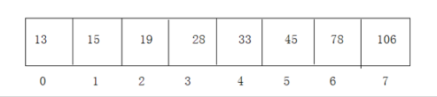

**【面试题】**

```java
/**
* 注意 remove(int index) 和 remove(Object obj);
**/
@Test
public void testListRemove() { 
    List list = new ArrayList(); 
    list.add(1);
    list.add(2);
    list.add(3); 
    updateList(list); 
    System.out.println(list);// [1,2]
}

private static void updateList(List list) {
	list.remove(2);
	//list.remove(new Integer(2));
}
```

### List实现类之二：LinkedList

* 对于频繁的插入或删除元素的操作，建议使用LinkedList类，效率较高。
* `新增方法：`
  * void addFirst(Object obj)
  * void addLast(Object obj)
  * Object getFirst()
  * Object getLast()
  * Object removeFirst()
  * Object removeLast()


* LinkedList：双向链表，内部没有声明数组，而是定义了Node类型的first和last， 用于记录首末元素。同时，定义内部类Node，作为LinkedList中保存数据的基 本结构。Node除了保存数据，还定义了两个变量：
  * prev变量记录前一个元素的位置
  * next变量记录下一个元素的位置

```java
private static class Node<E> { 
    E item;
	Node<E> next;
	Node<E> prev;

	Node(Node<E> prev, E element, Node<E> next) {
		this.item = element; 
        this.next = next; 
        this.prev = prev;
	}
}
```

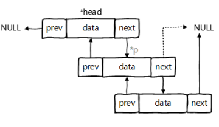

### List 实现类之三：Vector

* Vector 是一个古老的集合，JDK1.0就有了。大多数操作与ArrayList相同，区别之处在于`Vector是线程安全的`。
* 在各种list中，最好把ArrayList作为缺省选择。当插入、删除频繁时，使用LinkedList；Vector总是比ArrayList慢，所以尽量避免使用
* `新增方法：`
  * void addElement(Object obj)
  * void insertElementAt(Object obj,int index)
  * void setElementAt(Object obj,int index)
  * void removeElement(Object obj)
  * void removeAllElements()

**【面试题】：**

请问ArrayList/LinkedList/Vector的异同？谈谈你的理解？ArrayList底层是什么？扩容机制？Vector和ArrayList的最大区别?

1. ArrayList和LinkedList的异同

   二者都线程不安全，相对线程安全的Vector，执行效率高。此外，ArrayList是实现了基于动态数组的数据结构，LinkedList基于链表的数据结构。对于随机访问get和set，ArrayList觉得优于LinkedList，因为LinkedList要移动指针。对于新增和删除操作add(特指插入)和remove，LinkedList比较占优势，因为ArrayList要移动数据。

2. ArrayList和Vector的区别

   Vector和ArrayList几乎是完全相同的,唯一的区别在于Vector是同步类(synchronized)，属于强同步类。因此开销就比ArrayList要大，访问要慢。正常情况下,大多数的Java程序员使用ArrayList而不是Vector,因为同步完全可以由程序员自己来控制。Vector每次扩容请求其大小的2倍空间，而ArrayList是1.5倍。Vector还有一个子类Stack。

## Collection子接口之二：Set接口

**Set 接口概述**

* Set接口是Collection的子接口，set接口没有提供额外的方法
* Set 集合不允许包含相同的元素，如果试把两个相同的元素加入同一个Set 集合中，则添加操作失败。
* Set 判断两个对象是否相同不是使用 == 运算符，而是根据 equals() 方法

### Set实现类之一：HashSet

* HashSet 是 Set 接口的典型实现，大多数时候使用 Set 集合时都使用这个实现类。
* HashSet 按 Hash 算法来存储集合中的元素，因此具有很好的存取、查找、删除性能。
* `HashSet 具有以下特点：`
  * 不能保证元素的排列顺序
  * HashSet 不是线程安全的
  * 集合元素可以是 null

* HashSet 集合判断两个元素相等的标准：两个对象通过 hashCode() 方法比较相等，并且两个对象的 equals() 方法返回值也相等
* 对于存放在Set容器中的对象，对应的类一定要重写equals()和hashCode(Object obj)方法，以实现对象相等规则。即：“相等的对象必须具有相等的散列码”。

* `向HashSet中添加元素的过程：`
  * 当向 HashSet 集合中存入一个元素时，HashSet 会调用该对象的 hashCode() 方法来得到该对象的 hashCode 值，然后根据 hashCode 值，通过某种散列函数决定该对象在 HashSet `底层数组中`的存储位置。（这个散列函数会与底层数组的长度相计算得到在数组中的下标，并且这种散列函数计算还尽可能保证能均匀存储元素，越是散列分布，该散  列函数设计的越好）
  * 如果两个元素的 equals() 方法返回 true，但它们的 hashCode() 返回值不相等，hashSet 将会把它们存储在不同的位置，但依然可以添加成功。

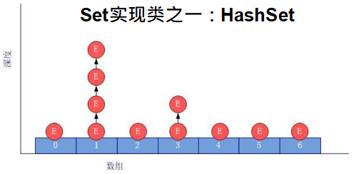

> 底层也是数组，初始容量为16，当如果使用率超过0.75，（16*0.75=12）就会扩大容量为原来的2倍。（16扩容为32，依次为64,128	等）

**重写 hashCode() 方法的基本原则**

* 在程序运行时，同一个对象多次调用 hashCode() 方法应该返回相同的值。
* 当两个对象的 equals() 方法比较返回 true 时，这两个对象的 hashCode()方法的返回值也应相等。
* 对象中用作 equals() 方法比较的 Field，都应该用来计算 hashCode 值。

**重写 equals() 方法的基本原则**

以自定义的Customer类为例，何时需要重写equals()？

* 当一个类有自己特有的“逻辑相等”概念,当改写equals()的时候，总是要改写hashCode()，根据一个类的equals方法（改写后），两个截然不 同的实例有可能在逻辑上是相等的，但是，根据Object.hashCode()方法， 它们仅仅是两个对象。

* 因此，违反了`“相等的对象必须具有相等的散列码”`。
* 结论：复写 equals 方法的时候一般都需要同时腹泻 hashCode 方法。`通常参与计算机 hashCode 的对象的属性也应该参与到 equals() 中进行计算`。

**Eclipse/IDEA 工具里 hashCode() 的重写**

以Eclipse/IDEA为例，在自定义类中可以调用工具自动重写equals和hashCode问题：`为什么用Eclipse/IDEA复写hashCode方法，有31这个数字？`

1. 选择系数的时候要选择尽量大的系数。因为如果计算出来的hash地址越大，所谓的“冲突”就越少，查找起来效率也会提高。（减少冲突）
2. 并且31只占用5bits,相乘造成数据溢出的概率较小。
3. 31可以 由i*31== (i<<5)-1来表示,现在很多虚拟机里面都有做相关优化。（提高算法效率）
4. 31是一个素数，素数作用就是如果我用一个数字来乘以这个素数，那么最终出来的结果只能被素数本身和被乘数还有1来整除！(减少冲突)

### Set实现类之二：LinkedHashSet

* LinkedHashSet 是 HashSet 的子类
* LinkedHashSet 根据元素的 hashCode 值来决定元素的存储位置， 但它同时使用双向链表维护元素的次序，这使得元素看起来是以`插入顺序保存`的。
* `LinkedHashSet插入性能略低于 HashSet`，但在迭代访问 Set 里的全部元素时有很好的性能。
* LinkedHashSet 不允许集合元素重复。

```java
Set set = new LinkedHashSet(); 
set.add(new String("AA")); 
set.add(456);
set.add(456);
set.add(new Customer("刘德华", 1001));
```

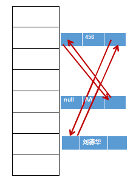

> LinkedHashSet底层结构

### Set实现类之三：TreeSet

* TreeSet 是 SortedSet 接口的实现类，TreeSet 可以确保集合元素处于排序状态。
* TreeSet底层使用`红黑树`结构存储数据
* 新增的方法如下：（了解）
  * Comparator comparator()
  * Object first()
  * Object last()
  * Object lower(Object e)
  * Object higher(Object e)
  * SortedSet subSet(fromElement, toElement)
  * SortedSet headSet(toElement)
  * SortedSet tailSet(fromElement)

* TreeSet 两种排序方法：`自然排序`和`定制排序`。默认情况下，TreeSet 采用自然排序。

* TreeSet 和后面要讲的TreeMap采用红黑树的存储结构

* 特点：有序，查找速度比List 快

  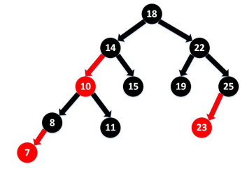

[具体的可以参看]: http://www.cnblogs.com/yangecnu/p/Introduce-Red-Black-Tree.html

**排序-自然排序**

* `自然排序：`TreeSet 会调用集合元素的 compareTo(Object obj) 方法来比较元素之间的大小关系，然后将集合元素按升序(默认情况)排列
* `如果试图把一个对象添加到 TreeSet 时，则该对象的类必须实现 Comparable接口。`
  * 实现 Comparable 的类必须实现 compareTo(Object obj) 方法，两个对象即通过compareTo(Object obj) 方法的返回值来比较大小。

* Comparable 的典型实现：
  * BigDecimal、BigInteger 以及所有的数值型对应的包装类：按它们对应的数值大小进行比较
  * Character：按字符的 unicode值来进行比较
  * Boolean：true 对应的包装类实例大于 false 对应的包装类实例
  * String：按字符串中字符的 unicode 值进行比较
  * Date、Time：后边的时间、日期比前面的时间、日期大

* 向 TreeSet 中添加元素时，只有第一个元素无须比较compareTo()方法，后面添加的所有元素都会调用compareTo()方法进行比较。
* **因为只有相同类的两个实例才会比较大小，所以向 TreeSet 中添加的应该是同一个类的对象。**
* 对于 TreeSet 集合而言，它判断两个对象是否相等的唯一标准是：两个对象通过 compareTo(Object obj) 方法比较返回值。
* 当需要把一个对象放入 TreeSet 中，重写该对象对应的 equals() 方法时，应保证该方法与compareTo(Object obj) 方法有一致的结果：如果两个对象通过equals() 方法比较返回 true，则通过 compareTo(Object obj) 方法比较应返回 0。否则，让人难以理解。

`排序-定制排序`

* TreeSet的自然排序要求元素所属的类实现Comparable接口，如果元素所属的类没有实现Comparable接口，或不希望按照升序(默认情况)的方式排列元素或希望按照其它属性大小进行排序，则考虑使用定制排序。定制排序，通过Comparator接口来实现。需要重写compare(T o1,T o2)方法。

* 利用int compare(T o1,T o2)方法，比较o1和o2的大小：如果方法返回正整数，则表示o1大于o2；如果返回0，表示相等；返回负整数，表示o1小于o2。
* 要实现定制排序，需要将实现Comparator接口的实例作为形参传递给TreeSet的构造器。
* 此时，`仍然只能向TreeSet中添加类型相同的对象`。否则发生ClassCastException异常。
* 使用定制排序`判断两个元素相等的标准`是：通过Comparator比较两个元素返回了0。

【面试题】

```java
/**
 * 注意先 用 hashCode 判断 hash 值是否相等， 然后再用 equals 作比较。
 */
@Test
public void test3(){
    HashSet set = new HashSet();
    Person p1 = new Person(1001,"AA");
    Person p2 = new Person(1002,"BB");

    set.add(p1);
    set.add(p2);
    System.out.println(set);

    p1.name = "CC";
    set.remove(p1);
    System.out.println(set);
    set.add(new Person(1001,"CC"));
    System.out.println(set);
    set.add(new Person(1001,"AA"));
    System.out.println(set);

}
```

**练习：在List内去除重复数字值，要求尽量简单**

```java
//在List内去除重复数字值，要求尽量简单
public static List duplicateList(List list) { 
    HashSet set = new HashSet(); 
    set.addAll(list);
    return new ArrayList(set);
}
public static void main(String[] args) { 
    List list = new ArrayList(); 
    list.add(new Integer(1)); 
    list.add(new Integer(2)); 
    list.add(new Integer(2)); 
    list.add(new Integer(4)); 
    list.add(new Integer(4));
	List list2 = duplicateList(list);
    for (Object integer : list2) {
    	System.out.println(integer);
    }
}

```

## Map接口

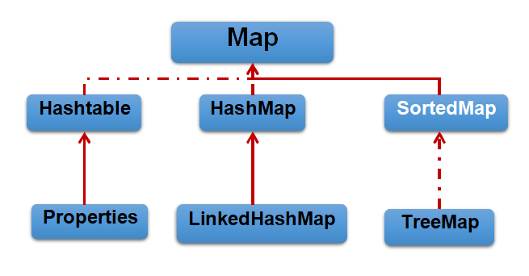

**Map接口概述**

**y=f(x)**

(x1,y1) (x2,y2),…

* Map与Collection并列存在。用于保存具有`映射关系`的数据:key-value
* Map 中的 key 和 value 都可以是任何引用类型的数据
* Map 中的 `key 用Set来存放，不允许重复`，即同一个 Map 对象所对应的类，须重写hashCode()和equals()方法
* 常用String类作为Map的“键”
* key 和 value 之间存在单向一对一关系，即通过指定的 key 总能找到唯一的、确定的 value
* Map接口的常用实现类：HashMap、TreeMap、LinkedHashMap和Properties。其中，`HashMap是 Map 接口使用频率最高的实现类`

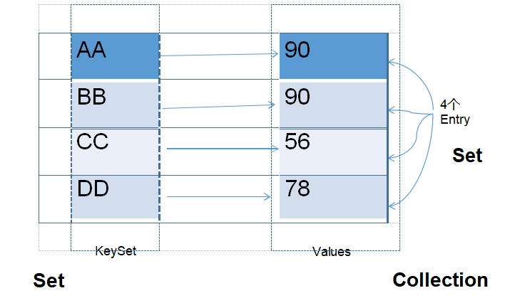

**Map 接口：常用方法**

* `添加、删除、修改操作：`
  * Object put(Object key,Object value)：将指定key-value添加到(或修改)当前map对象中
  * void putAll(Map m):将m中的所有key-value对，存放到当前map中
  * Object remove(Object key)：移除指定key的key-value对，并返回value
  * void clear()：清空当前map中的所有数据

* `元素查询的操作：`
  * Object get(Object key)：获取指定key对应的value
  * boolean containsKey(Object key)：是否包含指定的key
  * boolean containsValue(Object value)：是否包含指定的value
  * Int size()：返回map中key-value对的个数
  * boolean isEmpty()：判断当前map是否为空
  * boolean equals(Object obj)：判断当前map和参数对象obj是否相等

* `元视图操作的方法:`

  * Set keySet()：返回所有key构成的Set集合

  * Collection values()：返回所有value构成的Collection集合

  * Set entrySet()：返回所有key-value对构成的Set集合

    ```java
    Map map = new HashMap();
    //map.put(..,..)省略
    System.out.println("map的所有key:"); 
    Set keys = map.keySet();// HashSet
    for (Object key : keys) {
    	System.out.println(key + "->" + map.get(key));
    }
    ------------------------------------------------------------
    System.out.println("map的所有的value："); 
    Collection values = map.values();
    Iterator iter = values.iterator();
    while (iter.hasNext()) {
    	System.out.println(iter.next());
    }
    -------------------------------------------------------------
    System.out.println("map所有的映射关系：");
    // 映射关系的类型是Map.Entry类型，它是Map接口的内部接口
    Set mappings = map.entrySet();
    for (Object mapping : mappings) {
    	Map.Entry entry = (Map.Entry) mapping;
        System.out.println("key是：" + entry.getKey() + "，value是：" + entry.getValue());
    }
    ```

### Map实现类之一：HashMap

* `HashMap是 Map 接口使用频率最高的实现类`。
* 允许使用null键和null值，与HashSet一样，不保证映射的顺序。
* 所有的key构成的集合是Set:无序的、不可重复的。所以，key所在的类要重写：equals()和hashCode()
* 所有的value构成的集合是Collection:无序的、可以重复的。所以，value所在的类要重写：equals()
* 一个key-value构成一个entry
* 所有的entry构成的集合是Set:无序的、不可重复的
* HashMap `判断两个 key 相等的标准`是：两个 key 通过 equals() 方法返回 true， hashCode 值也相等。
* HashMap `判断两个 value相等的标准`是：两个 value 通过 equals() 方法返回 true。

**HashMap的存储结构**

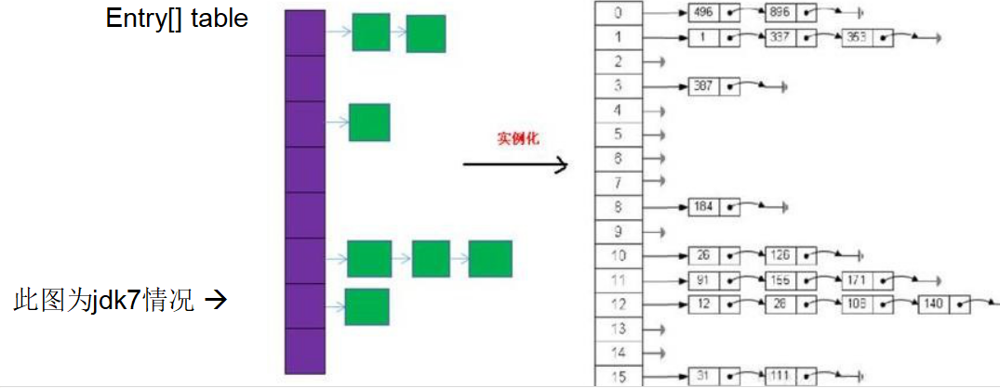


> **JDK 7及以前版本：HashMap是数组+链表结构(即为链地址法)** 
>
> **JDK 8版本发布以后：HashMap是数组+链表+红黑树实现。**

**HashMap源码中的重要常量**

* DEFAULT_INITIAL_CAPACITY : HashMap 的默认容量，16
* MAXIMUM_CAPACITY ： HashMap 的最大支持容量 ，2^30
* DEFAULT_LOAD_FACTOR：HashMap的默认加载因子
* TREEIFY_THRESHOLD：Bucket中链表长度大于该默认值，转化为红黑树
* UNTREEIFY_THRESHOLD：Bucket中红黑树存储的Node小于该默认值，转化为链表
* MIN_TREEIFY_CAPACITY：桶中的Node被树化时最小的hash表容量。（当桶中Node的数量大到需要变红黑树时，若hash表容量小于MIN_TREEIFY_CAPACITY时，此时应执行 resize扩容操作这个MIN_TREEIFY_CAPACITY的值至少是TREEIFY_THRESHOLD的4倍。）   
* table：存储元素的数组，总是2的n次幂
* entrySet：存储具体元素的集size：HashMap中存储的键值对的数量
* modCount：HashMap扩容和结构改变的次数。
* threshold：扩容的临界值，=容量*填充因子

#### HashMap的存储结构：JDK 1.8之前

* HashMap的内部存储结构其实是`数组和链表的结合`。当实例化一个HashMap时， 系统会创建一个长度为Capacity的Entry数组，这个长度在哈希表中被称为容量(Capacity)，在这个数组中可以存放元素的位置我们称之为“桶”(bucket)，每个bucket都有自己的索引，系统可以根据索引快速的查找bucket中的元素。HashMap的内部存储结构其实是数组和链表的结合。当实例化一个HashMap时， 系统会创建一个长度为Capacity的Entry数组，这个长度在哈希表中被称为容量(Capacity)，在这个数组中可以存放元素的位置我们称之为“桶”(bucket)，每个bucket都有自己的索引，系统可以根据索引快速的查找bucket中的元素。

* 每个bucket中存储一个元素，即一个Entry对象，但每一个Entry对象可以带一个引 用变量，用于指向下一个元素，因此，在一个桶中，就有可能生成一个Entry链。而且`新添加的元素作为链表的head`。
* **添加的元素过程：**
  * 向HashMap中添加entry1(key，value)，需要首先计算entry1中key的哈希值(根据key所在类的hashCode()计算得到)，此哈希值经过处理以后，得到在底层Entry[]数组中要存储的位置i。如果位置i上没有元素，则entry1直接添加成功。如果位置i上已经存在entry2(或还有链表存在的entry3，entry4)，则需要通过循环的方法，依次比较entry1中key和其他的entry。如果彼此hash值不同，则直接添加成功。如果hash值不同，继续比较二者是否equals。如果返回值为true，则使用entry1的value 去替换equals为true的entry的value。如果遍历一遍以后，发现所有的equals返回都为false,则entry1仍可添加成功。entry1指向原有的entry元素。

* **HashMap的扩容:**
  * 当HashMap中的元素越来越多的时候，hash冲突的几率也就越来越高，因为数组的长度是固定的。所以为了提高查询的效率，就要对HashMap的数组进行扩容，`而在HashMap数组扩容之后，最消耗性能的点就出现了：原数组中的数据必须重新计算其在新数组中的位置，并放进去，这就是resize`。

* **那么HashMap什么时候进行扩容呢？**
  * 当HashMap 中的元素个数超过数组大小( 数组总大小length, 不是数组中个数size) * loadFactor	时 ， 就 会 进 行 数 组 扩 容 ， loadFactor	的 默 认 值(DEFAULT_LOAD_FACTOR)为0.75，这是一个折中的取值。也就是说，默认情况 下，数组大小(DEFAULT_INITIAL_CAPACITY)为16，那么当HashMap中元素个数 超过16 * 0.75=12（这个值就是代码中的threshold值，也叫做临界值）的时候，就把 数组的大小扩展为 2 * 16=32，即扩大一倍，然后重新计算每个元素在数组中的位置， 而这是一个非常消耗性能的操作，`所以如果我们已经预知HashMap中元素的个数， 那么预设元素的个数能够有效的提高HashMap的性能。`

#### HashMap的存储结构：JDK 1.8

* HashMap 的内部存储结构其实是 `数组+链表+树的结合`。当实例化一个 HashMap 时，会初始化 initl ialCapacity的Node数组，这个长度在哈希表中被称为容量(Capacity)，在这个数组中可以存放元素的位置我们称之为 “桶”(bucket)，每个bucket都有自己的索引，系统可以根据索引快速的查找bucket中的元素。
* `每个bucket中存储一个元素，即一个Node对象`，但每一个Node对象可以带一个引用变量next，用于指向下一个元素，因此，`在一个桶中，就有可能生成一个Node链。也可能是一个一个TreeNode对象`，每一个TreeNode对象可以有两个叶子结点left和right，因此，在一个桶中，就有可能生成一个TreeNode树。而新添加的元素作为链表的last，或树的叶子结点。

* **那么HashMap什么时候进行扩容和树形化呢？**
  * 当HashMap中的元素个数超过数组大小(数组总大小length,不是数组中个数size) * loadFactor 时 ， 就 会 进 行 数 组 扩 容 ， loadFactor 的 默 认 值(DEFAULT_LOAD_FACTOR)为0.75，这是一个折中的取值。也就是说，默认 情况下，数组大小(DEFAULT_INITIAL_CAPACITY)为16，那么当HashMap中 元素个数超过16 * 0.75=12（这个值就是代码中的threshold值，也叫做临界值） 的时候，就把数组的大小扩展为 2 * 16=32，即扩大一倍，然后重新计算每个元素在数组中的位置，而这是一个非常消耗性能的操作，所以如果我们已经预知HashMap中元素的个数，那么预设元素的个数能够有效的提高HashMap的性能。
  * 当HashMap中的其中一个链的对象个数如果达到了8个，此时如果capacity没有达到64，那么HashMap会先扩容解决，如果已经达到了64，那么这个链会变成树，结点类型由Node变成TreeNode类型。当然，如果当映射关系被移除后， 下次resize方法时判断树的结点个数低于6个，也会把树再转为链表。

* `关于映射关系的key是否可以修改？answer：不要修改`
  * 映射关系存储到HashMap中会存储key的hash值，这样就不用在每次查找时重新计算每一个Entry或Node（TreeNode）的hash值了，因此如果已经put到Map中的映射关 系，再修改key的属性，而这个属性又参与hashcode值的计算，那么会导致匹配不上。

**总结：JDK1.8相较于之前的变化：**

1. HashMap map = new HashMap();//默认情况下，先不创建长度为16的数组
2. 当首次调用map.put()时，再创建长度为16的数组
3. .数组为Node类型，在jdk7中称为Entry类型
4. 形成链表结构时，新添加的key-value对在链表的尾部（七上八下）
5. 当数组指定索引位置的链表长度>8时，且map中的数组的长度> 64时，此索引位置上的所有key-value对使用红黑树进行存储

【面试题：】

`谈谈你对HashMap中put/get方法的认识？如果了解再谈谈HashMap的扩容机制？默认大小是多少？什么是负载因子( 或填充比)？什么是吞吐临界值(或阈值、threshold)？`

```java
/**
 * 一、Map的实现类的结构：
 *  |----Map:双列数据，存储key-value对的数据   ---类似于高中的函数：y = f(x)
 *         |----HashMap:作为Map的主要实现类；线程不安全的，效率高；存储null的key和value
 *              |----LinkedHashMap:保证在遍历map元素时，可以按照添加的顺序实现遍历。
 *                      原因：在原有的HashMap底层结构基础上，添加了一对指针，指向前一个和后一个元素。
 *                      对于频繁的遍历操作，此类执行效率高于HashMap。
 *         |----TreeMap:保证按照添加的key-value对进行排序，实现排序遍历。此时考虑key的自然排序或定制排序
 *                      底层使用红黑树
 *         |----Hashtable:作为古老的实现类；线程安全的，效率低；不能存储null的key和value
 *              |----Properties:常用来处理配置文件。key和value都是String类型
 *
 *
 *      HashMap的底层：数组+链表  （jdk7及之前）
 *                    数组+链表+红黑树 （jdk 8）
 *
 *
 *  面试题：
 *  1. HashMap的底层实现原理？
 *  2. HashMap 和 Hashtable的异同？
 *  3. CurrentHashMap 与 Hashtable的异同？（暂时不讲）
 *
 *  二、Map结构的理解：
 *    Map中的key:无序的、不可重复的，使用Set存储所有的key  ---> key所在的类要重写equals()和hashCode() （以HashMap为例）
 *    Map中的value:无序的、可重复的，使用Collection存储所有的value --->value所在的类要重写equals()
 *    一个键值对：key-value构成了一个Entry对象。
 *    Map中的entry:无序的、不可重复的，使用Set存储所有的entry
 *
 *  三、HashMap的底层实现原理？以jdk7为例说明：
 *      HashMap map = new HashMap():
 *      在实例化以后，底层创建了长度是16的一维数组Entry[] table。
 *      ...可能已经执行过多次put...
 *      map.put(key1,value1):
 *      首先，调用key1所在类的hashCode()计算key1哈希值，此哈希值经过某种算法计算以后，得到在Entry数组中的存放位置。
 *      如果此位置上的数据为空，此时的key1-value1添加成功。 ----情况1
 *      如果此位置上的数据不为空，(意味着此位置上存在一个或多个数据(以链表形式存在)),比较key1和已经存在的一个或多个数据
 *      的哈希值：
 *              如果key1的哈希值与已经存在的数据的哈希值都不相同，此时key1-value1添加成功。----情况2
 *              如果key1的哈希值和已经存在的某一个数据(key2-value2)的哈希值相同，继续比较：调用key1所在类的equals(key2)方法，比较：
 *                      如果equals()返回false:此时key1-value1添加成功。----情况3
 *                      如果equals()返回true:使用value1替换value2。
 *
 *       补充：关于情况2和情况3：此时key1-value1和原来的数据以链表的方式存储。
 *
 *      在不断的添加过程中，会涉及到扩容问题，当超出临界值(且要存放的位置非空)时，扩容。默认的扩容方式：扩容为原来容量的2倍，并将原有的数据复制过来。
 *
 *      jdk8 相较于jdk7在底层实现方面的不同：
 *      1. new HashMap():底层没有创建一个长度为16的数组
 *      2. jdk 8底层的数组是：Node[],而非Entry[]
 *      3. 首次调用put()方法时，底层创建长度为16的数组
 *      4. jdk7底层结构只有：数组+链表。jdk8中底层结构：数组+链表+红黑树。
 *         4.1 形成链表时，七上八下（jdk7:新的元素指向旧的元素。jdk8：旧的元素指向新的元素）
           4.2 当数组的某一个索引位置上的元素以链表形式存在的数据个数 > 8 且当前数组的长度 > 64时，此时此索引位置上的所数据改为使用红黑树存储。
 *
 *      DEFAULT_INITIAL_CAPACITY : HashMap的默认容量，16
 *      DEFAULT_LOAD_FACTOR：HashMap的默认加载因子：0.75
 *      threshold：扩容的临界值，=容量*填充因子：16 * 0.75 => 12
 *      TREEIFY_THRESHOLD：Bucket中链表长度大于该默认值，转化为红黑树:8
 *      MIN_TREEIFY_CAPACITY：桶中的Node被树化时最小的hash表容量:64
 *
 *  四、LinkedHashMap的底层实现原理（了解）
 *      源码中：
 *      static class Entry<K,V> extends HashMap.Node<K,V> {
             Entry<K,V> before, after;//能够记录添加的元素的先后顺序
             Entry(int hash, K key, V value, Node<K,V> next) {
                super(hash, key, value, next);
             }
         }
 *
 *
 *   五、Map中定义的方法：
 添加、删除、修改操作：
 Object put(Object key,Object value)：将指定key-value添加到(或修改)当前map对象中
 void putAll(Map m):将m中的所有key-value对存放到当前map中
 Object remove(Object key)：移除指定key的key-value对，并返回value
 void clear()：清空当前map中的所有数据
 元素查询的操作：
 Object get(Object key)：获取指定key对应的value
 boolean containsKey(Object key)：是否包含指定的key
 boolean containsValue(Object value)：是否包含指定的value
 int size()：返回map中key-value对的个数
 boolean isEmpty()：判断当前map是否为空
 boolean equals(Object obj)：判断当前map和参数对象obj是否相等
 元视图操作的方法：
 Set keySet()：返回所有key构成的Set集合
 Collection values()：返回所有value构成的Collection集合
 Set entrySet()：返回所有key-value对构成的Set集合

 *总结：常用方法：
 * 添加：put(Object key,Object value)
 * 删除：remove(Object key)
 * 修改：put(Object key,Object value)
 * 查询：get(Object key)
 * 长度：size()
 * 遍历：keySet() / values() / entrySet()
 *
 *
 * @author shkstart
 * @create 2019 上午 11:15
 */
public class MapTest {

    /*
 元视图操作的方法：
 Set keySet()：返回所有key构成的Set集合
 Collection values()：返回所有value构成的Collection集合
 Set entrySet()：返回所有key-value对构成的Set集合

     */


    @Test
    public void test5(){
        Map map = new HashMap();
        map.put("AA",123);
        map.put(45,1234);
        map.put("BB",56);

        //遍历所有的key集：keySet()
        Set set = map.keySet();
            Iterator iterator = set.iterator();
            while(iterator.hasNext()){
                System.out.println(iterator.next());
        }
        System.out.println();
        //遍历所有的value集：values()
        Collection values = map.values();
        for(Object obj : values){
            System.out.println(obj);
        }
        System.out.println();
        //遍历所有的key-value
        //方式一：entrySet()
        Set entrySet = map.entrySet();
        Iterator iterator1 = entrySet.iterator();
        while (iterator1.hasNext()){
            Object obj = iterator1.next();
            //entrySet集合中的元素都是entry
            Map.Entry entry = (Map.Entry) obj;
            System.out.println(entry.getKey() + "---->" + entry.getValue());

        }
        System.out.println();
        //方式二：
        Set keySet = map.keySet();
        Iterator iterator2 = keySet.iterator();
        while(iterator2.hasNext()){
            Object key = iterator2.next();
            Object value = map.get(key);
            System.out.println(key + "=====" + value);

        }

    }


    /*
 元素查询的操作：
 Object get(Object key)：获取指定key对应的value
 boolean containsKey(Object key)：是否包含指定的key
 boolean containsValue(Object value)：是否包含指定的value
 int size()：返回map中key-value对的个数
 boolean isEmpty()：判断当前map是否为空
 boolean equals(Object obj)：判断当前map和参数对象obj是否相等
     */
    @Test
    public void test4(){
        Map map = new HashMap();
        map.put("AA",123);
        map.put(45,123);
        map.put("BB",56);
        // Object get(Object key)
        System.out.println(map.get(45));
        //containsKey(Object key)
        boolean isExist = map.containsKey("BB");
        System.out.println(isExist);

        isExist = map.containsValue(123);
        System.out.println(isExist);

        map.clear();

        System.out.println(map.isEmpty());

    }

    /*
     添加、删除、修改操作：
 Object put(Object key,Object value)：将指定key-value添加到(或修改)当前map对象中
 void putAll(Map m):将m中的所有key-value对存放到当前map中
 Object remove(Object key)：移除指定key的key-value对，并返回value
 void clear()：清空当前map中的所有数据
     */
    @Test
    public void test3(){
        Map map = new HashMap();
        //添加
        map.put("AA",123);
        map.put(45,123);
        map.put("BB",56);
        //修改
        map.put("AA",87);

        System.out.println(map);

        Map map1 = new HashMap();
        map1.put("CC",123);
        map1.put("DD",123);

        map.putAll(map1);

        System.out.println(map);

        //remove(Object key)
        Object value = map.remove("CC");
        System.out.println(value);
        System.out.println(map);

        //clear()
        map.clear();//与map = null操作不同
        System.out.println(map.size());
        System.out.println(map);
    }

    @Test
    public void test2(){
        Map map = new HashMap();
        map = new LinkedHashMap();
        map.put(123,"AA");
        map.put(345,"BB");
        map.put(12,"CC");

        System.out.println(map);
    }


    @Test
    public void test1(){
        Map map = new HashMap();
//        map = new Hashtable();
        map.put(null,123);

    }
}
```

`负载因子值的大小，对HashMap有什么影响？`

* 负载因子的大小决定了HashMap的数据密度。
* 负载因子越大密度越大，发生碰撞的几率越高，数组中的链表越容易长, 造成查询或插入时的比较次数增多，性能会下降。
* 负载因子越小，就越容易触发扩容，数据密度也越小，意味着发生碰撞的几率越小，数组中的链表也就越短，查询和插入时比较的次数也越小，性能会更高。但是会浪费一定的内容空间。而且经常扩容也会影响性能，建议初始化预设大一点的空间。
* 按照其他语言的参考及研究经验，会考虑将负载因子设置为0.7~0.75，此时平均检索长度接近于常数。

### Map实现类之二：LinkedHashMap

* LinkedHashMap 是 HashMap 的子类
* 在HashMap存储结构的基础上，使用了一对双向链表来记录添加元素的顺序
* 与LinkedHashSet类似，LinkedHashMap 可以维护 Map 的迭代顺序：迭代顺序与 Key-Value 对的插入顺序一致

**HashMap中的内部类：Node**

```java
static class Node<K,V> implements Map.Entry<K,V> {
    final int hash;
    final K key;
    V value; 
    Node<K,V> next;
}
```

**LinkedHashMap中的内部类：Entry**

```java
static class Entry<K,V> extends HashMap.Node<K,V> { 
	Entry<K,V> before, after;s
    Entry(int hash, K key, V value, Node<K,V> next) {
    	super(hash, key, value, next);
    }
}
```

### Map实现类之三：TreeMap

* TreeMap存储 Key-Value 对时，需要根据 key-value 对进行排序。TreeMap 可以保证所有的 Key-Value 对处于`有序`状态。

* TreeMap底层使用红黑树结构存储数据
*  TreeMap 的 Key 的排序：
  * `自然排序`：TreeMap 的所有的 Key 必须实现 Comparable 接口，而且所有的 Key 应该是同一个类的对象，否则将会抛出 ClasssCastException
  * `定制排序`：创建 TreeMap 时，传入一个 Comparator 对象，该对象负责对TreeMap 中的所有 key 进行排序。此时不需要 Map 的 Key 实现Comparable 接口

* TreeMap判断`两个key相等的标准`：两个key通过compareTo()方法或者compare()方法返回0。

### Map实现类之四：Hashtable

* Hashtable是个古老的 Map 实现类，JDK1.0就提供了。不同于HashMap，Hashtable是线程安全的。
* Hashtable实现原理和HashMap相同，功能相同。底层都使用哈希表结构，查询速度快，很多情况下可以互用。
* 与HashMap不同，Hashtable 不允许使用 null 作为 key 和 value
* 与HashMap一样，Hashtable 也不能保证其中 Key-Value 对的顺序
* Hashtable判断两个key相等、两个value相等的标准，与HashMap一致。

### Map实现类之五：Properties

* Properties 类是 Hashtable 的子类，该对象用于处理属性文件
* 由于属性文件里的 key、value 都是字符串类型，所以 Properties 里的 key和 value 都是字符串类型
* 存取数据时，建议使用setProperty(String key,String value)方法和getProperty(String key)方法

```java
Properties pros = new Properties();
pros.load(new FileInputStream("jdbc.properties")); 
String user = pros.getProperty("user"); 
System.out.println(user);
```

## Collections工具类

* Collections 是一个操作 Set、List 和 Map 等集合的工具类
* Collections 中提供了一系列静态的方法对集合元素进行排序、查询和修改等操作，还提供了对集合对象设置不可变、对集合对象实现同步控制等方法

* `排序操作：（均为static方法）`
  * reverse(List)：反转 List 中元素的顺序
  * shuffle(List)：对 List 集合元素进行随机排序
  * sort(List)：根据元素的自然顺序对指定 List 集合元素按升序排序
  * sort(List，Comparator)：根据指定的 Comparator 产生的顺序对 List 集合元素进行排序
  * swap(List，int， int)：将指定 list 集合中的 i 处元素和 j 处元素进行交换

### Collections常用方法

**查找、替换**

* Object max(Collection)：根据元素的自然顺序，返回给定集合中的最大元素
* Object max(Collection，Comparator)：根据 Comparator 指定的顺序，返回给定集合中的最大元素
* Object min(Collection)
* Object min(Collection，Comparator)
* int frequency(Collection，Object)：返回指定集合中指定元素的出现次数
* void copy(List dest,List src)：将src中的内容复制到dest中
* boolean replaceAll(List list，Object oldVal，Object newVal)：使用新值替换List 对象的所有旧值

### Collections常用方法：同步控制

* Collections 类中提供了多个 synchronizedXxx() 方法，该方法可使将指定集合包装成线程同步的集合，从而可以解决多线程并发访问集合时的线程安全问题

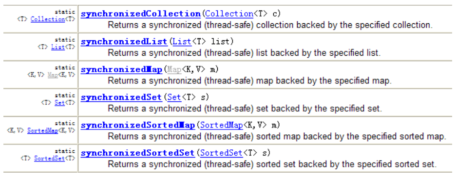

**补充：Enumeration**

* Enumeration 接口是 Iterator 迭代器的 “古老版本”

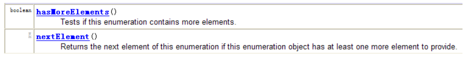

```java
Enumeration stringEnum = new StringTokenizer("a-b*c-d-e-g", "-");
while(stringEnum.hasMoreElements()){
	Object obj = stringEnum.nextElement(); 
	System.out.println(obj);
}
```

**练习**

1. 请从键盘随机输入10个整数保存到List中，并按倒序、从大到小的顺序显示出来。

2. 请把学生名与考试分数录入到集合中，并按分数显示前三名成绩学员的名字。

**练习**

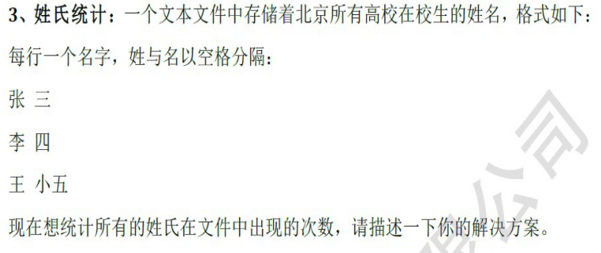

**练习**

4. 对一个Java源文件中的关键字进行计数。

提示：Java源文件中的每一个单词，需要确定该单词是否是一个关键字。为了高效处理这个问题，将所有的关键字保存在一个HashSet中。用contains() 来测试。

```java
File file = new File("Test.java"); 
Scanner scanner = new Scanner(file); 
while(scanner.hasNext()){
    String word = scanner.next();
    System.out.println(word);
}
```

