 Vagrant是一款由HashiCorp公司提供的，用于快速构建虚拟机环境的软件。本节我们将使用Vagrant结合Oracle VM VirtualBox快速地在win10环境下构建CentOS7虚拟机。在此之前需要先安装好 [Vagrant](https://www.vagrantup.com/downloads.html) 和 [VirtualBox](https://www.virtualbox.org/)。 

<!-- more -->

## 构建CentOS7虚拟机

 在 https://app.vagrantup.com/boxes/search   下搜索centos： 

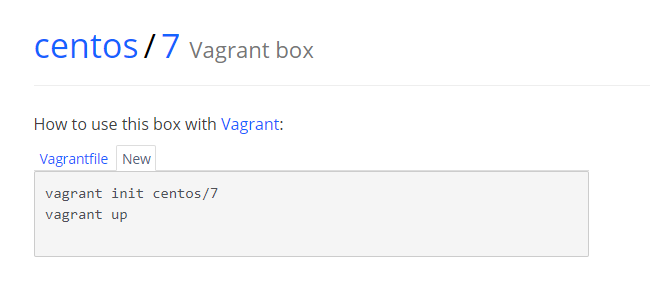

 然后在win10任意盘符下创建vagrant_vm目录（注意目录最好不要有中文和空格），然后在该目录下使用cmd执行`vagrant init centos/7`命令： 

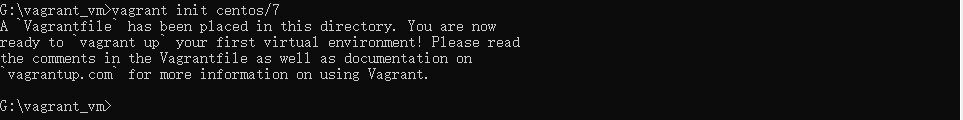

然后执行  `vagrant up`启动（这时候最好也打开VirtualBox）： 

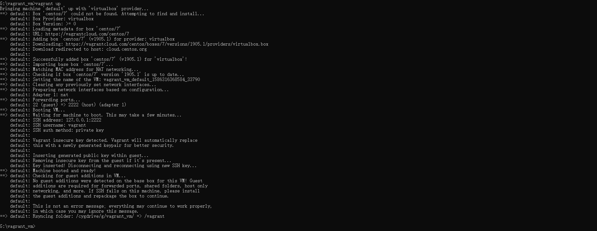

 构建完毕，这时候VirtualBox的列表里会出现一台正在运行的虚拟机： 

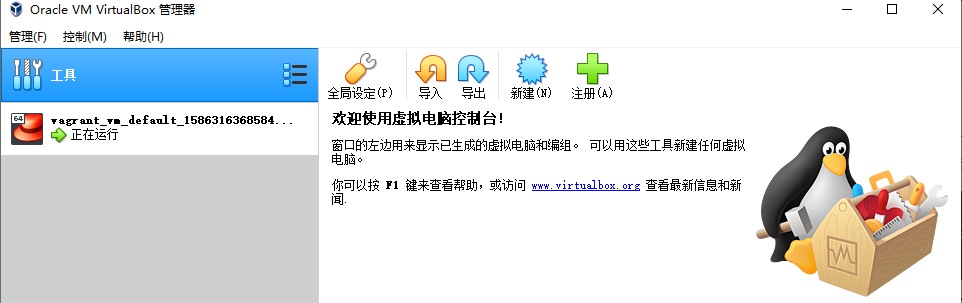

 这就是我们刚刚通过Vagrant构建的CentOS7虚拟机了。 

如果当你执行`vagrant up`命令后，虚拟机文件下载非常的慢的话，可以使用下面这种方式来构建：

在上面的日志中可以找到这么一行：

```yaml
Downloading: https://vagrantcloud.com/centos/boxes/7/versions/1902.01/providers/virtualbox.box
```

 后面这个URL就是下载地址了，将它黏贴到迅雷等下载工具下载即可。然后将下载好后的xxx.box文件复制到vagrant_vm目录下，并且重命名为centos7.box（删除centos7.box之外的文件和目录，只保留centos7.box一个文件）。 

 接着运行`vagrant box add -name 'centos/7' centos7.box`命令： 

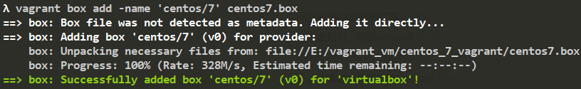

 添加成功后执行`vagrant init centos/7`初始化： 

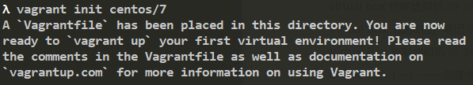

 初始化成功后执行`vagrant up`启动： 

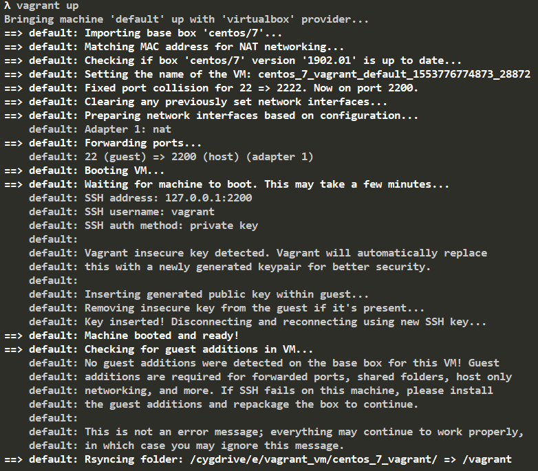

 构建成功，效果和一开始在线下载构建是一样的。 

## 连接虚拟机

我们先用  `vagrant status`命令查看一下虚拟机的状态： 

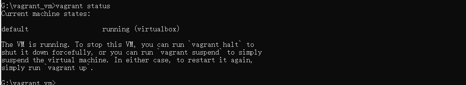

 可以看到虚拟机是运行中的状态，我们可以执行`vagrant halt`来关闭虚拟机： 

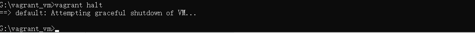

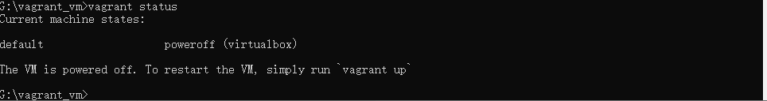

 启动虚拟机的命令为`vagrant up`，我们也可以使用`vagrant suspend`命令来暂停运行中的虚拟机，以保持它的运行状态： 

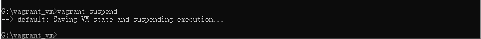

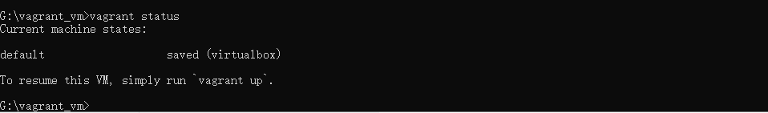

 暂停后可以使用`vagrant resume`命令来恢复虚拟机： 

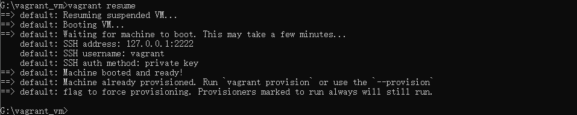

 连接正在运行中的虚拟机的命令为`vagrant ssh`： 

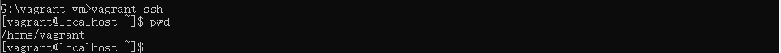

 重启虚拟机使用的命令为`vagrant reload`。如果你不想要这个虚拟机的话可以使用`vagrant distroy`命令进行销毁。 

## 目录共享

 Vagrant的根目录（就是我们一开始创建的vagrant_vm）和虚拟机里的/vagrant目录是共享的。我们在vagrant_vm目录下新建一个hello.txt文件，内容为hello： 


 然后连接虚拟机，查看虚拟机/vagrant目录下有什么内容（必须重启虚拟机才能看到共享文件）: 

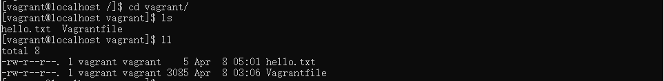

说明同步成功。

我们也可以自定义共享路劲，编辑vagrant_vm文件夹下的Vagrantfile文件：

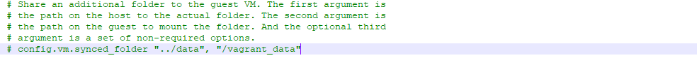

在这行下面添加如下配置：

```yaml
config.vm.synced_folder "./data", "/vagrant_data", create:true, owner: "root", group: "root"
```

这个配置的意思是将当前路径下的data文件夹和虚拟机的/share目录共享，拥有者为root，群组为root，如果路径不存在则创建。

修改了Vagrantfile文件需要执行 `vagrant reload`重启。重启后我们在data文件夹下新建一个hello.txt文件，然后连接虚拟机看看是否共享成功：

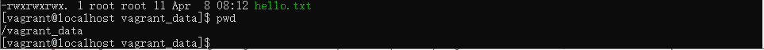

共享成功！

在这途中，遇到了如下问题:

```yaml
Vagrant was unable to mount VirtualBox shared folders. This is usually
because the filesystem "vboxsf" is not available. This filesystem is
made available via the VirtualBox Guest Additions and kernel module.
Please verify that these guest additions are properly installed in the
guest. This is not a bug in Vagrant and is usually caused by a faulty
Vagrant box. For context, the command attempted was:

mount -t vboxsf -o uid=0,gid=0 vagrant_data /vagrant_data

The error output from the command was:

mount: unknown filesystem type 'vboxsf'
```

 安装下面这个插件可解决问题： 

```yaml
vagrant plugin install vagrant-vbguest
```

## 网络配置

### 虚拟机私有网络

在Vagrantfile里打开下面这行配置：

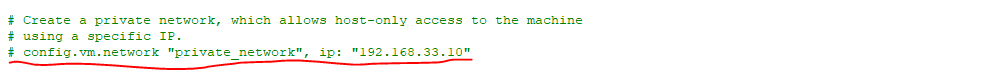

修改成和自己IP在同一网段

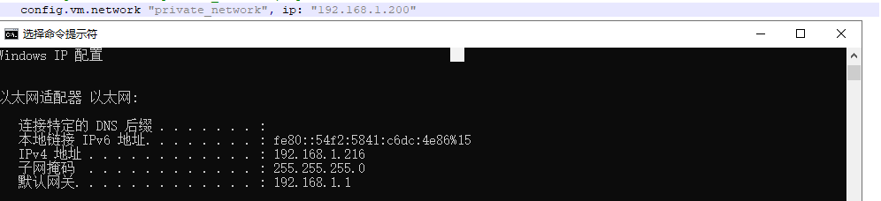

 然后使用命令`vagrant reload`重启虚拟机，重启后我们使用`ping`命令看是否可以在windows上访问到这个ip： 

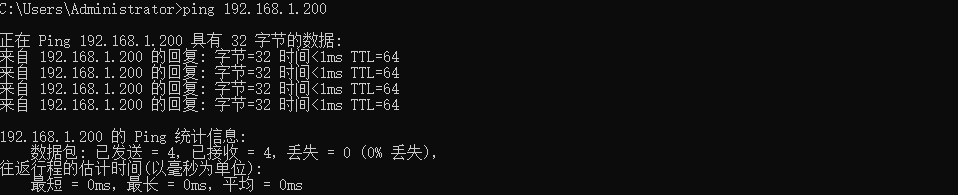

 访问成功，连接虚拟机，使用`ip addr`查看其IP： 

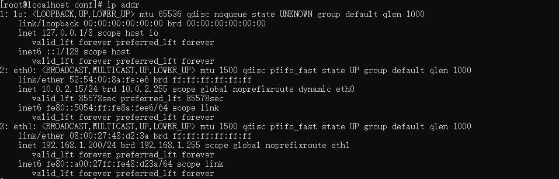

 正是我们刚刚配置的那个IP。 

### 虚拟机公有网络

 编辑Vagrantfile，将我们刚刚开启的私有网络配置注释，然后开启下面这行配置： 

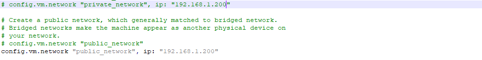

> `虚拟机IP要和本机IP在同一网段`

然后重启虚拟机，重启过程中会根据当前网络环境选择：

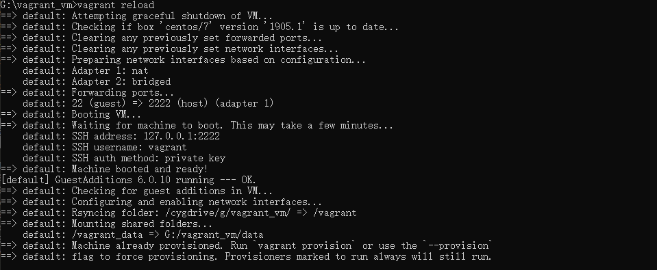

如果是连接的无线网选择第四个选项，重启好后连接虚拟机，查看其IP： 

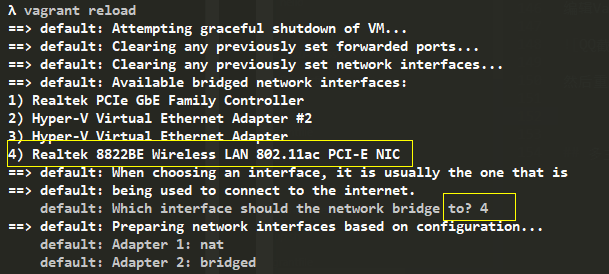


新开一个cmd窗口，ping 这个地址看是否能通:


公有网络和私有网络的区别是：（公有网络）在同一个局域网、wifi网络下的其他设备也是可以访问这个IP地址的。

比如我们在windows浏览器里输入http://192.168.1.200/：

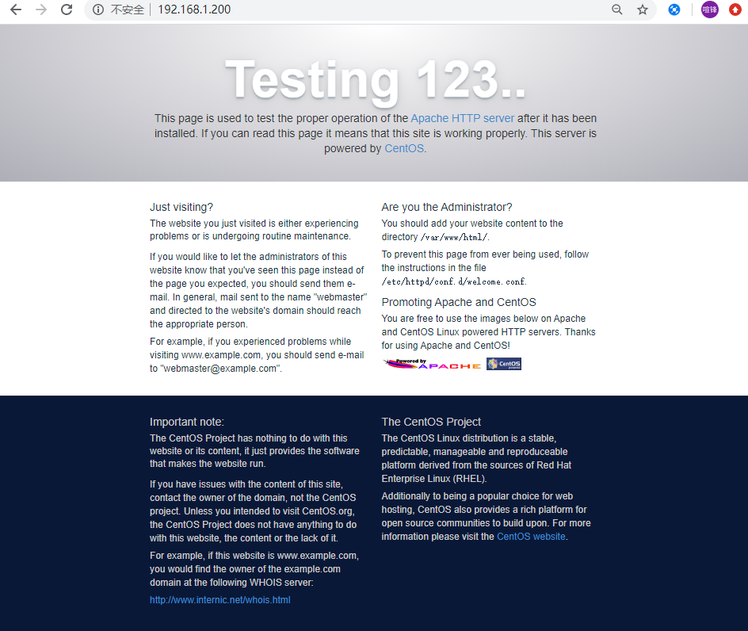


> `如果centos 中没有安装 httpd 服务器 运行一下命令进行安装启动`
>
> `yum -y install httpd`
>
> `systemctl start httpd.service`

 然后让手机连接和电脑相同的wifi网络，并且访问http://192.168.1.200/： 

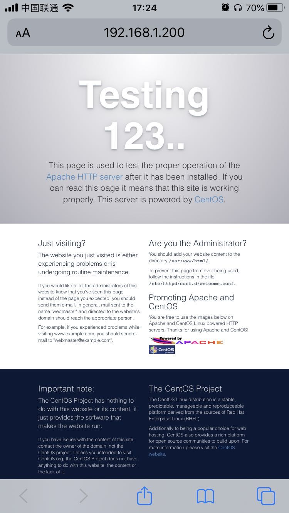

 结果说明公有网络配置成功。 


## 多主机配置

使用Vagrant可以轻松地创建多台虚拟主机。下面我们开始通过Vagrant来创建两台新的虚拟主机“prod”和“dev”。

在vagrant_vm目录下新建一个目录，名称为multi，然后通过现有的box来初始化一个Vagrantfile配置：

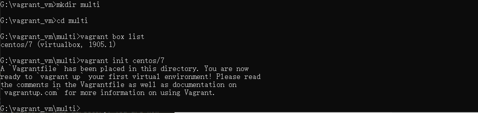

 接着编辑multi目录下的Vagrantfile文件，新增下面两项配置： 

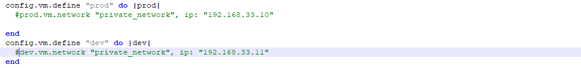

 运行`vagrant status`： 

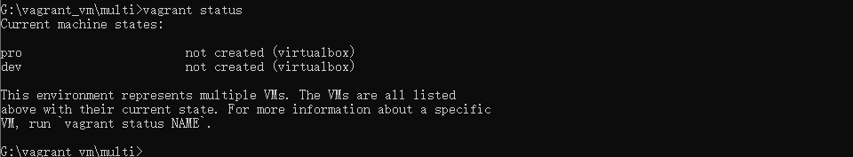

 可以看到多了两台状态为`not created`的虚拟机，名称分别为“prod”和“dev”。 

 我们可以使用`vagrant up`来启动两台主机，也可以通过`vagrant up prod`来单独启动“prod”这台虚拟主机。 

 启动后（第一次启动耗时可能比较长），使用`vagrant status`来查看它们的状态： 

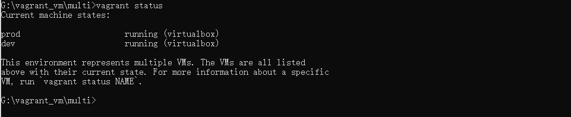

 通过`vagrant ssh 主机名`就可以连接上它们了。 

### 网络配置

 接下来开始配置网络，让它们之间可以通讯。 

 我们按照上面介绍网络配置的方式来为这两台虚拟主机配置私有网络： 

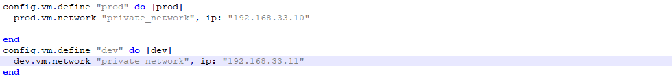

值得注意的是，在配置私有网络的时候，IP网段不能和Windows主机相同。 

配置好后重启这两台虚拟机，然后分别连接这两台虚拟机，看是否能够ping通： 

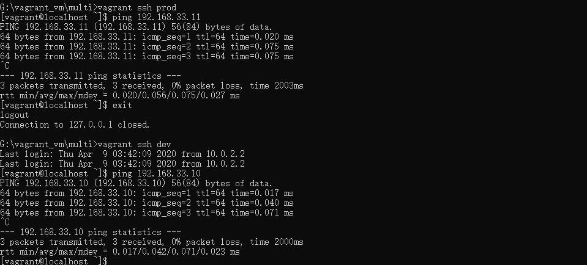

 配置成功。 

### 自定义主机名

编辑Vagrantfile，添加如下配置：

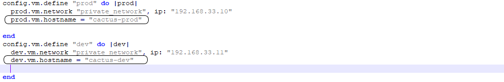

 重启后，连接虚拟机，可以看到hostname已经修改为我们设置的名称了： 

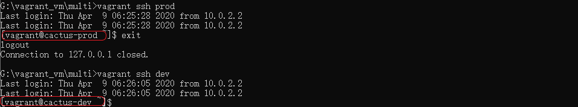

### 多主机的共享目录

默认的这两台虚拟主机的/vagrant和当前目录multi/是共享的。我们也可以分别为它们设置不同的共享目录。

编辑Vagrantfile，添加如下配置：

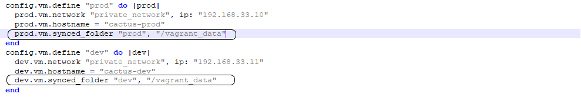

然后重启这两台虚拟主机就好了。

> `如果没有创建文件需要配置自动创建，拥有者为root，群组为root： create:true, owner: "root", group: "root"`

更多Vagrant的配置可以查看官方文档：https://www.vagrantup.com/docs/