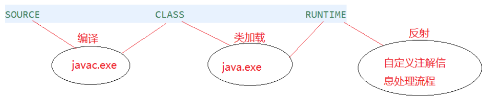
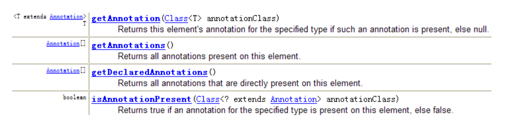
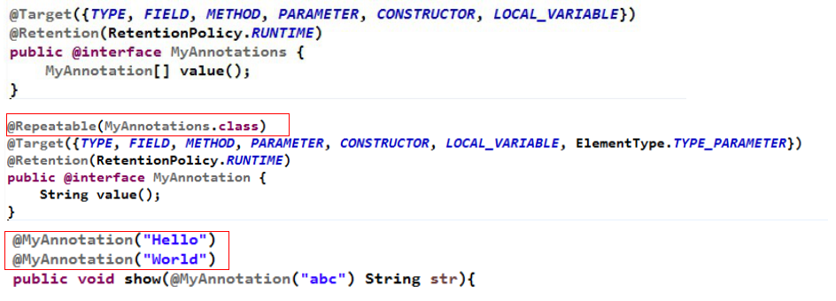

主要记录枚举类与注解使用的方法，及相关使用的 API。

<!-- more -->

## 枚举类的使用

**主要内容**

* 如何自定义枚举类
* 如何使用关键字enum定义枚举类
* Enum类的主要方法
* 实现接口的枚举类

**常见的使用方式及场景：**

* 类的对象只有有限个，确定的。举例如下：
  * 星期：Monday(星期一)、...、Sunday(星期天)
  * 性别：Man(男)、Woman(女)
  * 季节：Spring(春节).	Winter(冬天)
  * 支付方式：Cash（现金）、WeChatPay（微信）、Alipay(支付宝)、BankCard(银  行卡)、CreditCard(信用卡)
  * 就职状态：Busy、Free、Vocation、Dimission
  * 订单状态：Nonpayment（未付款）、Paid（已付款）、Delivered（已发货）、Return（退货）、Checked（已确认）Fulfilled（已配货）
  * 线程状态：创建、就绪、运行、阻塞、死亡

> 当需要定义一组常量时，强烈建议使用枚举类

* 枚举类的实现
  * JDK1.5之前需要自定义枚举类
  * JDK 1.5 新增的 enum 关键字用于定义枚举类

* 若枚举只有一个对象, 则可以作为一种单例模式的实现方式。
* 枚举类的属性
  * 枚举类对象的属性不应允许被改动, 所以应该使用 private final 修饰
  * 枚举类的使用 private final 修饰的属性应该在构造器中为其赋值
  * 若枚举类显式的定义了带参数的构造器, 则在列出枚举值时也必须对应的传入参数

### 自定义枚举类

1. 私有化类的构造器，保证不能在类的外部创建其对象
2. 在类的内部创建枚举类的实例。声明为：public static final
3. 对象如果有实例变量，应该声明为private final，并在构造器中初始化

```java
class Season{
    private final String SEASONNAME;//季节的名称
    private final String SEASONDESC;//季节的描述
    private Season(String seasonName,String seasonDesc){
        this.SEASONNAME = seasonName; 
        this.SEASONDESC = seasonDesc;
    }
    public static final Season SPRING = new Season("春天", "春暖花开"); 
    public static final Season SUMMER = new Season("夏天", "夏日炎炎"); 
    public static final Season AUTUMN = new Season("秋天", "秋高气爽"); 
    public static final Season WINTER = new Season("冬天", "白雪皑皑");
}
```

### 使用enum定义枚举类

* 使用说明
  * 使用 enum 定义的枚举类默认继承了 java.lang.Enum类，因此不能再继承其他类
  * 枚举类的构造器只能使用 private 权限修饰符
  * 枚举类的所有实例必须在枚举类中显式列出(, 分隔	; 结尾)。列出的实例系统会自动添加 public static final 修饰
  * 必须在枚举类的第一行声明枚举类对象
  * JDK 1.5 中可以在 switch 表达式中使用Enum定义的枚举类的对象作为表达式, case 子句可以直接使用枚举值的名字, 无需添加枚举类作为限定。

```java
public enum SeasonEnum {
    SPRING("春天","春风又绿江南岸"),
    SUMMER("夏天","映日荷花别样红"),
    AUTUMN("秋天","秋水共长天一色"),
    WINTER("冬天","窗含西岭千秋雪");
	private final String seasonName; 
	private final String seasonDesc;
	private SeasonEnum(String seasonName, String seasonDesc) { 
        this.seasonName =seasonName;
        this.seasonDesc = seasonDesc;
	}
    public String getSeasonName() { 
    	return seasonName;
    }
    public String getSeasonDesc() {
    	return seasonDesc;
	}
}
```

**测试使用示例：**

```java
/**
 * 一、枚举类的使用
 * 1.枚举类的理解：类的对象只有有限个，确定的。我们称此类为枚举类
 * 2.当需要定义一组常量时，强烈建议使用枚举类
 * 3.如果枚举类中只有一个对象，则可以作为单例模式的实现方式。
 *
 * 二、如何定义枚举类
 * 方式一：jdk5.0之前，自定义枚举类
 * 方式二：jdk5.0，可以使用enum关键字定义枚举类
 *
 * 三、Enum类中的常用方法：
 *    values()方法：返回枚举类型的对象数组。该方法可以很方便地遍历所有的枚举值。
 *    valueOf(String str)：可以把一个字符串转为对应的枚举类对象。要求字符串必须是枚举类对象的“名字”。如不是，会有运行时异常：IllegalArgumentException。
 *    toString()：返回当前枚举类对象常量的名称
 *
 * 四、使用enum关键字定义的枚举类实现接口的情况
 *   情况一：实现接口，在enum类中实现抽象方法
 *   情况二：让枚举类的对象分别实现接口中的抽象方法
 */
public class SeasonTest {

    public static void main(String[] args) {
        Season spring = Season.SPRING;
        System.out.println(spring);

    }

}
//自定义枚举类
class Season{
    //1.声明Season对象的属性:private final修饰
    private final String seasonName;
    private final String seasonDesc;

    //2.私有化类的构造器,并给对象属性赋值
    private Season(String seasonName,String seasonDesc){
        this.seasonName = seasonName;
        this.seasonDesc = seasonDesc;
    }

    //3.提供当前枚举类的多个对象：public static final的
    public static final Season SPRING = new Season("春天","春暖花开");
    public static final Season SUMMER = new Season("夏天","夏日炎炎");
    public static final Season AUTUMN = new Season("秋天","秋高气爽");
    public static final Season WINTER = new Season("冬天","冰天雪地");

    //4.其他诉求1：获取枚举类对象的属性
    public String getSeasonName() {
        return seasonName;
    }

    public String getSeasonDesc() {
        return seasonDesc;
    }
    //4.其他诉求1：提供toString()
    @Override
    public String toString() {
        return "Season{" +
                "seasonName='" + seasonName + '\'' +
                ", seasonDesc='" + seasonDesc + '\'' +
                '}';
    }
}
```

| 方法名            | 详细描述                                                     |
| ----------------- | ------------------------------------------------------------ |
| valueOf           | 传递枚举类型的Class对象和枚举常量名称給静态方法valueOf,会得到与参数匹配的枚举常量。 |
| toString          | 得到当前枚举常量的名称。你可以通过重写这个方法来使得到的结果更易读。 |
| equals            | 在枚举类型中可以直接使用"=="来比较两个枚举常量是否相等。Enum提供的这个equals0方法，也是直接使用“==“实现的。它的存在是为了在Set、List和Map中使用。注意，equals()是不 可变的。 |
| hashCode          | Enum实现了hashCode0来和equals0保持一致。 它也是不可变的。    |
| getDeclaringClass | getDeclaringClass得到枚举 常量所属枚举类型的Class 对象。可以用它来判断两个枚举常量是否属于同一个枚举类型。 |
| name              | 得到当前枚举常量的名称。建议优先使用toString0。              |
| ordinal           | 得到当前枚举常量的次序。                                     |
| compareTo         | 枚举类型实现了Comparable接口，这样可以比较两个枚举常量的大小(按照声明的顺序排列) |
| clone             | 枚举类型不能被Clone.为了防止子类实现克隆方法，Enum实现了一个仅抛出CloneNotSupportedException 异常的不变Clone0。 |

* Enum类的主要方法：
  * values()方法：返回枚举类型的对象数组。该方法可以很方便地遍历所有的
    枚举值。
  * valueOf(String str)：可以把一个字符串转为对应的枚举类对象。要求字符串必须是枚举类对象的“名字”。如不是，会有运行时异常： IllegalArgumentException。
  * toString()：返回当前枚举类对象常量的名称

### 实现接口的枚举类

* 和普通 Java 类一样，枚举类可以实现一个或多个接口
* 若每个枚举值在调用实现的接口方法呈现相同的行为方式，则只要统一实现该方法即可。
* 若需要每个枚举值在调用实现的接口方法呈现出不同的行为方式,则可以让每个枚举值分别来实现该方法

```java
/**
 * 使用enum关键字定义枚举类
 * 说明：定义的枚举类默认继承于java.lang.Enum类
 *
 * @author shkstart
 * @create 2019 上午 10:35
 */
public class SeasonTest1 {
    public static void main(String[] args) {
        Season1 summer = Season1.SUMMER;
        //toString():返回枚举类对象的名称
        System.out.println(summer.toString());

//        System.out.println(Season1.class.getSuperclass());
        System.out.println("****************");
        //values():返回所有的枚举类对象构成的数组
        Season1[] values = Season1.values();
        for(int i = 0;i < values.length;i++){
            System.out.println(values[i]);
            values[i].show();
        }
        System.out.println("****************");
        Thread.State[] values1 = Thread.State.values();
        for (int i = 0; i < values1.length; i++) {
            System.out.println(values1[i]);
        }

        //valueOf(String objName):返回枚举类中对象名是objName的对象。
        Season1 winter = Season1.valueOf("WINTER");
        //如果没有objName的枚举类对象，则抛异常：IllegalArgumentException
//        Season1 winter = Season1.valueOf("WINTER1");
        System.out.println(winter);
        winter.show();
    }
}

interface Info{
    void show();
}

//使用enum关键字枚举类
enum Season1 implements Info{
    //1.提供当前枚举类的对象，多个对象之间用","隔开，末尾对象";"结束
    SPRING("春天","春暖花开"){
        @Override
        public void show() {
            System.out.println("春天在哪里？");
        }
    },
    SUMMER("夏天","夏日炎炎"){
        @Override
        public void show() {
            System.out.println("宁夏");
        }
    },
    AUTUMN("秋天","秋高气爽"){
        @Override
        public void show() {
            System.out.println("秋天不回来");
        }
    },
    WINTER("冬天","冰天雪地"){
        @Override
        public void show() {
            System.out.println("大约在冬季");
        }
    };

    //2.声明Season对象的属性:private final修饰
    private final String seasonName;
    private final String seasonDesc;

    //2.私有化类的构造器,并给对象属性赋值

    private Season1(String seasonName,String seasonDesc){
        this.seasonName = seasonName;
        this.seasonDesc = seasonDesc;
    }

    //4.其他诉求1：获取枚举类对象的属性
    public String getSeasonName() {
        return seasonName;
    }

    public String getSeasonDesc() {
        return seasonDesc;
    }
//    //4.其他诉求1：提供toString()
//
//    @Override
//    public String toString() {
//        return "Season1{" +
//                "seasonName='" + seasonName + '\'' +
//                ", seasonDesc='" + seasonDesc + '\'' +
//                '}';
//    }
//    @Override
//    public void show() {
//        System.out.println("这是一个季节");
//    }
}
```

## 注解（Annotation）

**主要内容：**

* 注解(Annotation)概述

* 常见的Annotation示例

* 自定义Annotation

* JDK中的元注解

* 利用反射获取注解信息（在反射部分涉及）

* JDK 8中注解的新特性

* 从 JDK 5.0 开始，java 增加了对元数据（MetaData）的支持也就是Annotation(注解)

* Annotation 其实就是代码里的`特殊标记`，这些标记可以在编译，类加载，运行时被读取，并执行相应的处理。通过使用 Annotation, 程序员可以在不改变原有逻辑的情况下, 在源文件中嵌入一些补充信息。代码分析工具、开发工具和部署工具可以通过这些补充信息进行验证或者进行部署。

* Annotation 可以像修饰符一样被使用, 可用于 `修饰包，类，构造器，方法，成员变量，参数，局部变量的声明，`这些信息被保存在 Annotation的“name = value” 对中。

* 在JavaSE中，注解的使用目的比较简单，例如标记过时的功能， 忽略警告等。在JavaEE/Android中注解占据了更重要的角色，例如用来配置应用程序的任何切面，代替JavaEE旧版中所遗留的繁冗代码和XML配置等。

* 未来的开发模式都是基于注解的，JPA是基于注解的，Spring2.5以上都是基于注解的，Hibernate3.x以后也是基于注解的，现在的Struts2有一部分也是基于注解的了，注解是一种趋势，一定程度上可以说：`框架 = 注解 + 反射 + 设计模式。`

* 使用 Annotation 时要在其前面增加 @符号，`并把该 Annotation 当成一个修饰符使用`。用于修饰它支持的程序元素。

* **示例一：生成文档相关的注解**

  * @author 标明开发该类模块的作者，多个作者之间使用,分割
  * @version 标明该类模块的版本
  * @see 参考转向，也就是相关主题
  * @since 从哪个版本开始增加的
  * @param 对方法中某参数的说明，如果没有参数就不能写
  * @return 对方法返回值的说明，如果方法的返回值类型是void就不能写
  * @exception 对方法可能抛出的异常进行说明，如果方法没有用throws显式抛出的异常就不能写

  其中：@param @return 和 @exception 这三个标记都是只用于方法的。

  ​			@param的格式要求：@param 形参名形参类型 形参说明

  ​			@return 的格式要求：@return 返回值类型返回值说明

  ​			@exception的格式要求：@exception 异常类型 异常说明

  ​		    @param和@exception可以并列多个

  ```java
  package com.annotation.javadoc;
  /**
  *@author 仙人球
  *@version 1.0
  *@see Math.java
  */
  public class JavadocTest {
      /**
      *程序的主方法，程序的入口
      *@param args String[] 命令行参数
      */
      public static void main(String[] args) {
      }
      /**
      *求圆面积的方法
      *@param radius double 半径值
      *@return double 圆的面积
      */
      public static double getArea(double radius){
      	return Math.PI * radius * radius;
      }
  }
  
  ```

* 示例二：在编译时进行格式检查(JDK内置的三个基本注解)
  * @Override: 限定重写父类方法, 该注解只能用于方法
  * @Deprecated: 用于表示所修饰的元素(类, 方法等)已过时。通常是因为所修饰的结构危险或存在更好的选择
  * @SuppressWarnings: 抑制编译器警告

```java
package com.annotation.javadoc;
public class AnnotationTest{

    public static void main(String[] args) { 
        @SuppressWarnings("unused")
        int a = 10;
    }
    @Deprecated
    public void print(){
    	System.out.println("过时的方法");
    }
    @Override
    public String toString() {
    	return "重写的toString方法()";
    }
}

```

* 示例三：跟踪代码依赖性，实现替代配置文件功能

  * Servlet3.0提供了注解(annotation),使得不再需要在web.xml文件中进行Servlet的部署。

    ```
    @WebServlet("/login")
    public class LoginServlet extends HttpServlet {
        private static final long serialVersionUID = 1L;
        protected void doGet(HttpServletRequest request, HttpServletResponse response) throws
        ServletException, IOException { }
        protected void doPost(HttpServletRequest request, HttpServletResponse response) throws
        ServletException, IOException { doGet(request, response);
    }
    <servlet>
        <servlet-name>LoginServlet</servlet-name>
        <servlet-class>com.servlet.LoginServlet</servlet-class>
    </servlet>
    <servlet-mapping>
        <servlet-name>LoginServlet</servlet-name>
        <url-pattern>/login</url-pattern>
    </servlet-mapping>
    ```

  * spring框架中关于“事务”的管理

    ```java
    @Transactional(propagation=Propagation.REQUIRES_NEW,isolation=Isolation.READ_COMMITTED,readOnly=false,timeout=3)
    public void buyBook(String username, String isbn) {
        //1.查询书的单价
        int price = bookShopDao.findBookPriceByIsbn(isbn);
        //2. 更新库存
        bookShopDao.updateBookStock(isbn);
        //3. 更新用户的余额
        bookShopDao.updateUserAccount(username, price);
    }
    
    <!-- 配置事务属性 -->
    <tx:advice transaction-manager="dataSourceTransactionManager" id="txAdvice">
    <tx:attributes>
    <!-- 配置每个方法使用的事务属性-->
    <tx:method name="buyBook" propagation="REQUIRES_NEW" isolation="READ_COMMITTED" read-only="false" timeout="3" />
    </tx:attributes>
    </tx:advice>
    ```

### 自定义 Annotation

* 定义新的 Annotation 类型使用 `@interface` 关键字
* 自定义注解自动继承了 java.lang.annotation.Annotation 接口
* Annotation 的成员变量在 Annotation 定义中以无参数方法的形式来声明。其方法名和返回值定义了该成员的名字和类型。我们称为配置参数。`类型只能是八种基本数据类型、String类型、Class类型、enum类型、Annotation类型、以上所有类型的数组。`
* 可以在定义 Annotation 的成员变量时为其指定初始值，指定成员变量的初始值可以使用 default 关键字
* 如果 只有一个参数成员，建议使用参`数名为 value`
* 如果定义的注解含有配置参数，那么使用时必须指定参数值，除非它有默认值。格式是“参数名 = 参数值”，如果只有一个参数成员，且名称为value， 可以省略“value=”
* 没有成员定义的 Annotation 称为`标记`；包含成员变量的 Annotation 称为元数据 Annotation

> 注意：`自定义注解必须配上注解的信息处理流程才有意义。`

```java
@MyAnnotation(value="尚硅谷")
public class MyAnnotationTest {
    public static void main(String[] args) {
        Class clazz = MyAnnotationTest.class;
        Annotation a = clazz.getAnnotation(MyAnnotation.class);
        MyAnnotation m = (MyAnnotation) a; 
        String info = m.value(); 
        System.out.println(info);
  }

}
---------------------------------------------------------
@Retention(RetentionPolicy.RUNTIME)
@Target(ElementType.TYPE) 
@interface MyAnnotation{
	String value() default "xianrenqiu";
}
```

### JDK 中的元注解

* JDK 的元 Annotation 用于修饰其他 Annotation 定义
* JDK5.0 提供了4个标准的 meta-annotation 类型，分别是：
  * Retention
  * Target
  * Documented
  * Inherited

> 元数据的理解：String name = "xianrenqiu";

* @Retention: 只能用于修饰一个 Annotation 定义, 用于指定该 Annotation 的生命周期, @Rentention 包含一个 `RetentionPolicy` 类型的成员变量, 使用@Rentention 时必须为该 value 成员变量指定值:
  * `RetentionPolicy.SOURCE:` 在源文件中有效（即源文件保留），编译器直接丢弃这种策略的
  * `RetentionPolicy.CLASS:`在class文件中有效（即class保留） ， 当运行 Java 程序时, JVM不会保留注解。 这是默认值
  * `RetentionPolicy.RUNTIME:`在运行时有效（即运行时保留），`当运行 Java 程序时, JVM 会保留注释。程序可以通过反射获取该注释。`



```java
public enum RetentionPolicy{ 
    SOURCE,
	CLASS,
	RUNTIME
}
@Retention(RetentionPolicy.SOURCE)
@interface MyAnnotation1{	}

@Retention(RetentionPolicy.RUNTIME)
@interface MyAnnotation2{	}
```

* @Target: 用于修饰 Annotation 定义, 用于指定被修饰的 Annotation 能用于修饰哪些程序元素。@Target 也包含一个名为 value 的成员变量。

| 取值(ElementType) |                  | 取值(ElementType) |                                          |
| ----------------- | ---------------- | ----------------- | ---------------------------------------- |
| CONSTRUCTOR       | 用于描述构造器   | PACKAGE           | 用于描述包                               |
| FIELD             | 用于描述域       | PARAMETER         | 用于描述参数                             |
| LOCAL_ VARIABLE   | 用于描述局部变量 | TYPE              | 用于描述类、接口(包括注解类型)或enum声明 |
| METHOD            | 用于描述方法     |                   |                                          |

* @Documented: 用于指定被该元 Annotation 修饰的 Annotation 类将被javadoc 工具提取成文档。默认情况下，javadoc是不包括注解的。
  * 定义为Documented的注解必须设置Retention值为RUNTIME。

*  @Inherited: 被它修饰的 Annotation 将具有`继承性`。如果某个类使用了被@Inherited 修饰的 Annotation, 则其子类将自动具有该注解。
  *  比如：如果把标有@Inherited注解的自定义的注解标注在类级别上，子类则可以继承父类类级别的注解
  *  实际应用中，使用较少

**练习**

1.  编写一个Person类，使用Override注解它的toString方法
2. 自定义一个名为“MyTiger”的注解类型，它只可以使用在方法上，带一个String类型的value属性，然后第1题中的Person类上正确使用。

### 利用反射获取注解信息

* JDK 5.0 在 java.lang.reflect 包下新增了` AnnotatedElement 接口, 该接口代表程序中可以接受注解的程序元素`
* `当一个Annotation 类型被定义为运行时Annotation 后, 该注解才是运行时可见,` 当 class 文件被载入时保存在 class 文件中的 Annotation 才会被虚拟机读取
* 程序可以调用 AnnotatedElement对象的如下方法来访问 Annotation 信息



### JDK8 中注解的特新性

Java 8对注解处理提供了两点改进：`可重复的注解`及`可用于类型的注解`。此外， 反射也得到了加强，在Java8中能够得到方法参数的名称。这会简化标注在方法参数上的注解。

**可重复注解示例：**



**类型注解：**

* JDK1.8之后,关于元注解@Target的参数类型ElementType枚举值多了两:`TYPE_PARAMETER,TYPE_USE`。

* 在Java 8之前，注解只能是在声明的地方所使用，Java8开始，注解可以应用在任何地方

  * ElementType.TYPE_PARAMETER 表示该注解能写在类型变量的声明语句中（如：泛型声明）。

  * ElementType.TYPE_USE 表示该注解能写在使用类型的任何语句中。

    ```java
    public class TestTypeDefine<@TypeDefine() U> {
        private U u;
        public <@TypeDefine() T> void test(T t){
        }
    }
    -----------------------------------------------
    @Target({ElementType.TYPE_PARAMETER})
    @interface TypeDefine{
    }
    ```

    ```java
    @MyAnnotation
    public class AnnotationTest<U> {
        @MyAnnotation
        private String name;
        public static void main(String[] args) {
            AnnotationTest<@MyAnnotation String> t = null;
            int a = (@MyAnnotation int) 2L;
            @MyAnnotation
            int b = 10;
        }
        public static <@MyAnnotation T> void method(T t) {
        }
        public static void test(@MyAnnotation String arg) 
        	throws @MyAnnotation Exception {
        }
    }
    
    @Target(ElementType.TYPE_USE) 
    @interface MyAnnotation {
    
    }
    ```

```java
/**
 * 注解的使用
 *
 * 1. 理解Annotation:
 * ① jdk 5.0 新增的功能
 *
 * ② Annotation 其实就是代码里的特殊标记, 这些标记可以在编译, 类加载, 运行时被读取, 并执行相应的处理。通过使用 Annotation,
 * 程序员可以在不改变原有逻辑的情况下, 在源文件中嵌入一些补充信息。
 *
 * ③在JavaSE中，注解的使用目的比较简单，例如标记过时的功能，忽略警告等。在JavaEE/Android
 * 中注解占据了更重要的角色，例如用来配置应用程序的任何切面，代替JavaEE旧版中所遗留的繁冗
 * 代码和XML配置等。
 *
 * 2. Annocation的使用示例
 * 示例一：生成文档相关的注解
 * 示例二：在编译时进行格式检查(JDK内置的三个基本注解)
     @Override: 限定重写父类方法, 该注解只能用于方法
     @Deprecated: 用于表示所修饰的元素(类, 方法等)已过时。通常是因为所修饰的结构危险或存在更好的选择
     @SuppressWarnings: 抑制编译器警告

  * 示例三：跟踪代码依赖性，实现替代配置文件功能
  *
  * 3. 如何自定义注解：参照@SuppressWarnings定义
      * ① 注解声明为：@interface
      * ② 内部定义成员，通常使用value表示
      * ③ 可以指定成员的默认值，使用default定义
      * ④ 如果自定义注解没有成员，表明是一个标识作用。

     如果注解有成员，在使用注解时，需要指明成员的值。
     自定义注解必须配上注解的信息处理流程(使用反射)才有意义。
     自定义注解通过都会指明两个元注解：Retention、Target

     4. jdk 提供的4种元注解
       元注解：对现有的注解进行解释说明的注解
     Retention：指定所修饰的 Annotation 的生命周期：SOURCE\CLASS（默认行为）\RUNTIME
            只有声明为RUNTIME生命周期的注解，才能通过反射获取。
     Target:用于指定被修饰的 Annotation 能用于修饰哪些程序元素
     *******出现的频率较低*******
     Documented:表示所修饰的注解在被javadoc解析时，保留下来。
     Inherited:被它修饰的 Annotation 将具有继承性。

     5.通过反射获取注解信息 ---到反射内容时系统讲解

     6. jdk 8 中注解的新特性：可重复注解、类型注解

     6.1 可重复注解：① 在MyAnnotation上声明@Repeatable，成员值为MyAnnotations.class
                   ② MyAnnotation的Target和Retention等元注解与MyAnnotations相同。

     6.2 类型注解：
     ElementType.TYPE_PARAMETER 表示该注解能写在类型变量的声明语句中（如：泛型声明）。
     ElementType.TYPE_USE 表示该注解能写在使用类型的任何语句中。

 */
public class AnnotationTest {

    public static void main(String[] args) {
        Person p = new Student();
        p.walk();

        Date date = new Date(2020, 10, 11);
        System.out.println(date);

        @SuppressWarnings("unused")
        int num = 10;

//        System.out.println(num);

        @SuppressWarnings({ "unused", "rawtypes" })
        ArrayList list = new ArrayList();
    }

    @Test
    public void testGetAnnotation(){
        Class clazz = Student.class;
        Annotation[] annotations = clazz.getAnnotations();
        for(int i = 0;i < annotations.length;i++){
            System.out.println(annotations[i]);
        }
    }
}


//jdk 8之前的写法：
//@MyAnnotations({@MyAnnotation(value="hi"),@MyAnnotation(value="hi")})
@MyAnnotation(value="hi")
@MyAnnotation(value="abc")
class Person{
    private String name;
    private int age;

    public Person() {
    }
    @MyAnnotation
    public Person(String name, int age) {
        this.name = name;
        this.age = age;
    }
    @MyAnnotation
    public void walk(){
        System.out.println("人走路");
    }
    public void eat(){
        System.out.println("人吃饭");
    }
}

interface Info{
    void show();
}

class Student extends Person implements Info{

    @Override
    public void walk() {
        System.out.println("学生走路");
    }

    public void show() {

    }
}

class Generic<@MyAnnotation T>{

    public void show() throws @MyAnnotation RuntimeException{

        ArrayList<@MyAnnotation String> list = new ArrayList<>();

        int num = (@MyAnnotation int) 10L;
    }

}
----------------------------------------------------------------------
@Inherited
@Repeatable(MyAnnotations.class)
@Retention(RetentionPolicy.RUNTIME)
@Target({TYPE, FIELD, METHOD, PARAMETER, CONSTRUCTOR, LOCAL_VARIABLE,TYPE_PARAMETER,TYPE_USE})
public @interface MyAnnotation {

    String value() default "hello";
}
----------------------------------------------------------------------
@Inherited
@Retention(RetentionPolicy.RUNTIME)
@Target({TYPE, FIELD, METHOD, PARAMETER, CONSTRUCTOR, LOCAL_VARIABLE})
public @interface MyAnnotations {

    MyAnnotation[] value();
}

```

